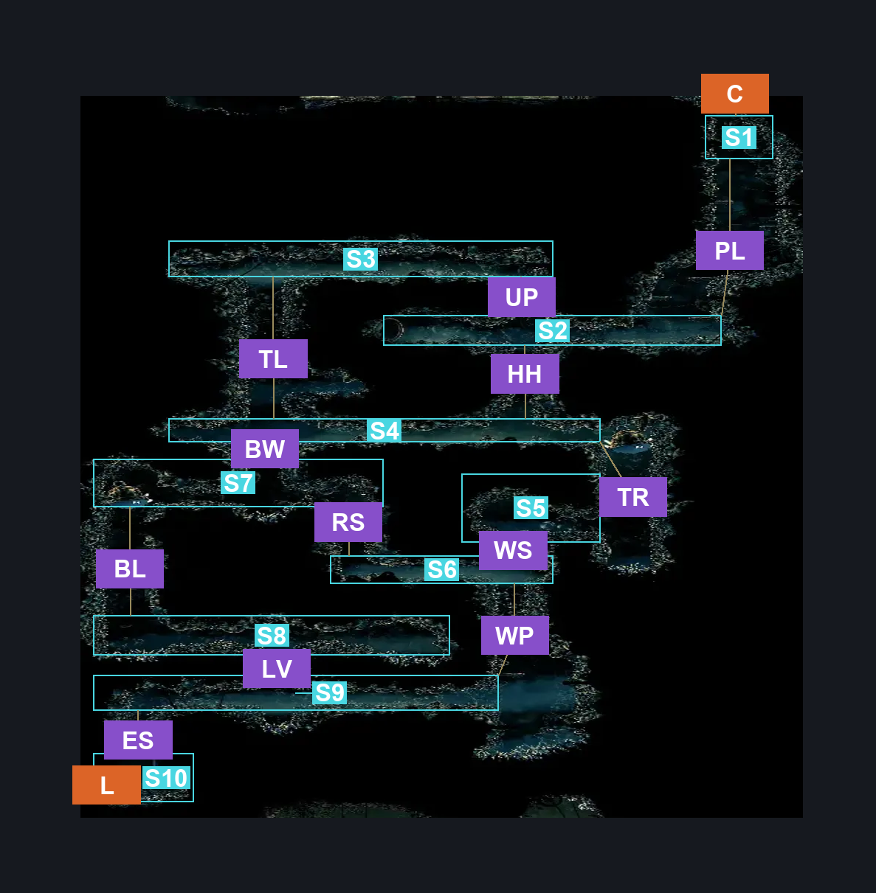
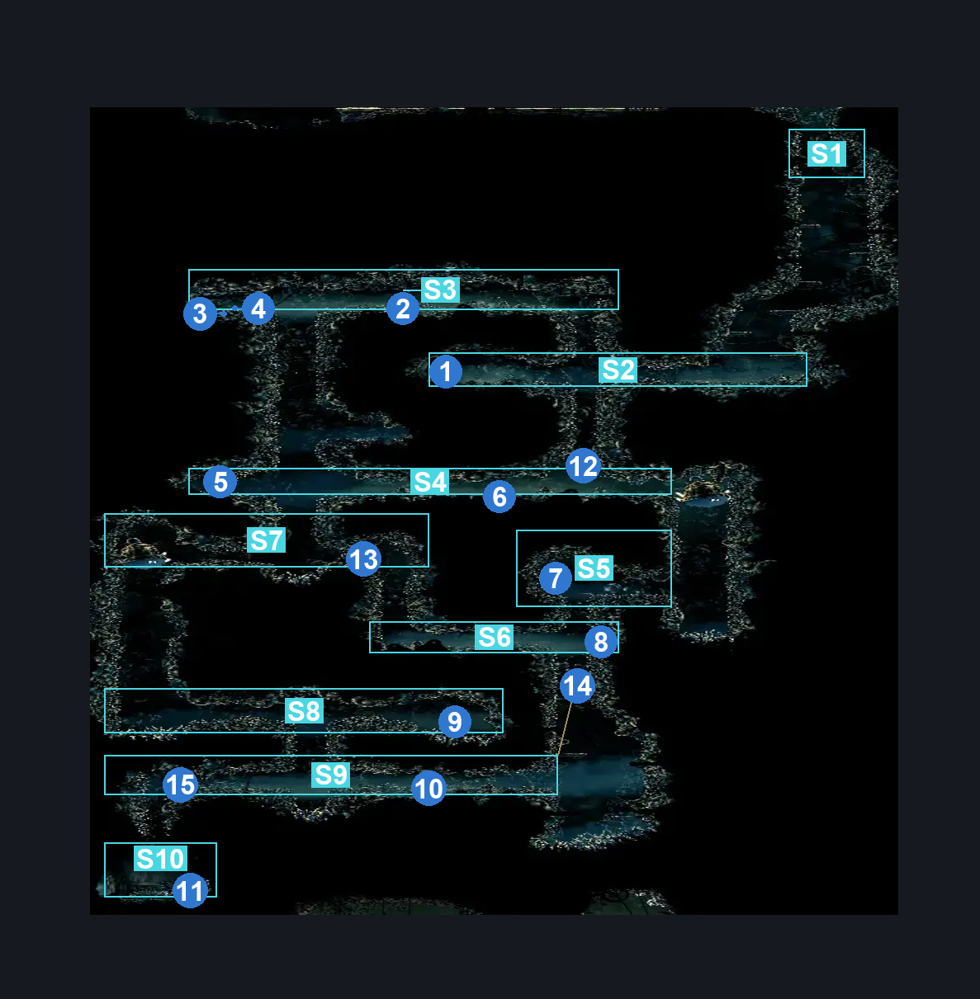
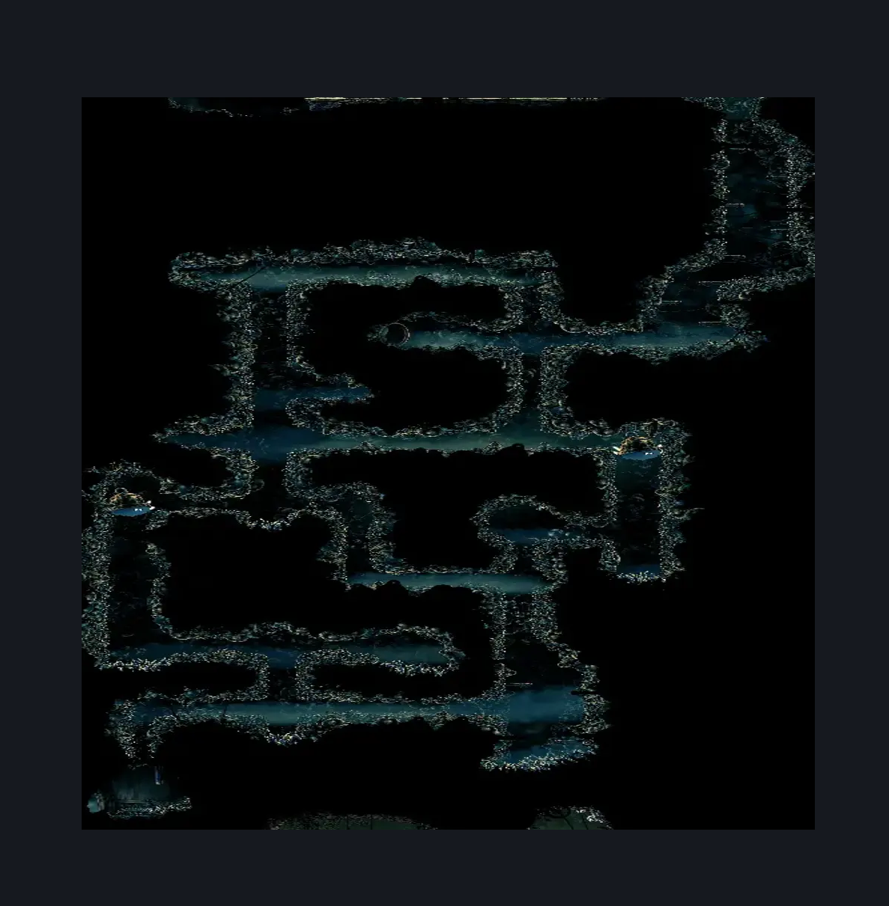

# Bellhart Lower (Belltown_basement_03)

**Game ID:** Belltown_basement_03

**Contributors:** Pyxl

## Subrooms

| No. | Subroom | Annotated |
| --- | --- | --- |
| S1 | Top Exit | ✓ |
| S2 | Hermit | ✓ |
| S3 | Upper Hall | ✓ |
| S4 | Under Hermit Hall | ✓ |
| S5 | Rosary Room | ✓ |
| S6 | Passage below rosary | ✓ |
| S7 | Breakable Wall Passage | ✓ |
| S8 | Lower Passage 1 | ✓ |
| S9 | Lower Passage 2 | ✓ |
| S10 | Bottom Exit | ✓ |

## Room Transitions

| Alias | Name | From subroom | Destination | Destination alias | Requirements | TODO | Verification | Annotated | Notes |
| --- | --- | --- | --- | --- | --- | --- | --- | --- | --- |
| C | top1 | Top Exit | [Bellhart Bellway (Belltown_basement)](bellhart-bellway.md) | F | None |  | Verified | ✓ |  |
| L | left1 | Bottom Exit | [The Marrow Jail Pathway (Bone_08)](../the-marrow/the-marrow-jail-pathway.md) | UR | None |  | Verified | ✓ |  |

## Subroom Connections

| Alias | Name | Source | Destination | Requirements | TODO | Verification | Annotated | Notes |
| --- | --- | --- | --- | --- | --- | --- | --- | --- |
| PL | Platforms Upper | Top Exit | Hermit | None |  | Verified | ✓ |  |
| PL | Platforms Upper | Hermit | Top Exit | Clawline OR Ledge Grab OR easy Shaman Crest pogo OR ( Dash AND Scuttlebrace ) OR Faydown Cloak OR Silk Soar OR  Cling Grip |  | Verified | ✓ |  |
| UP | Upper Hall | Hermit | Upper Hall | Cling Grip OR Silk Soar OR ( Scuttlebrace AND Dash ) |  | Verified | ✓ |  |
| UP | Upper Hall | Upper Hall | Hermit | None |  | Verified | ✓ |  |
| TL | Tall Passage Left | Upper Hall | Under Hermit Hall | None |  | Verified | ✓ |  |
| TL | Tall Passage Left | Under Hermit Hall | Upper Hall | Cling Grip OR ( Scuttlebrace AND Dash ) |  | Verified | ✓ |  |
| HH | Hermit Hole | Hermit | Under Hermit Hall | prereq Hermit hole breakable wall |  | Verified | ✓ |  |
| HH | Hermit Hole | Under Hermit Hall | Hermit | prereq Hermit hole breakable wall  AND ( Cling Grip OR Silk Soar OR Scuttlebrace ) |  | Verified | ✓ |  |
| TR | Tall Passage Right | Under Hermit Hall | Rosary Room | None |  | Verified | ✓ |  |
| TR | Tall Passage Right | Rosary Room | Under Hermit Hall | Cling Grip OR ( Scuttlebrace AND Dash ) |  | Verified | ✓ |  |
| WS | Wide Shaft | Rosary Room | Passage below rosary | None |  | Verified | ✓ |  |
| WS | Wide Shaft | Passage below rosary | Rosary Room | Cling Grip OR Silk Soar OR ( Scuttlebrace AND Dash ) |  | Verified | ✓ |  |
| RS | Shaft near Rosary Cache | Passage below rosary | Breakable Wall Passage | Cling Grip OR Silk Soar OR ( Scuttlebrace AND Dash ) |  | Verified | ✓ |  |
| RS | Shaft near Rosary Cache | Breakable Wall Passage | Passage below rosary | None |  | Verified | ✓ |  |
| BW | Broken Floor Shaft | Breakable Wall Passage | Under Hermit Hall | prereq Breakable Wall Passage Breakable Wall AND ( Cling Grip OR Scuttlebrace ) |  | Verified | ✓ |  |
| BW | Broken Floor Shaft | Under Hermit Hall | Breakable Wall Passage | prereq Breakable Wall Passage Breakable Wall |  | Verified | ✓ |  |
| BL | Tall Passage Bottom Left | Breakable Wall Passage | Lower Passage 1 | None |  | Verified | ✓ |  |
| BL | Tall Passage Bottom Left | Lower Passage 1 | Breakable Wall Passage | Cling Grip OR ( Scuttlebrace AND Dash ) |  | Verified | ✓ |  |
| LV | Lower Passages Shaft | Lower Passage 1 | Lower Passage 2 | None |  | Verified | ✓ |  |
| LV | Lower Passages Shaft | Lower Passage 2 | Lower Passage 1 | Cling Grip OR ( Scuttlebrace AND Dash ) |  | Verified | ✓ |  |
| WP | Wide Platform Shaft | Lower Passage 2 | Passage below rosary | prereq Lower Passage 2 Breakable Wall AND ( Cling Grip OR Silk Soar OR ( Dash AND Scuttlebrace AND ( Ledge Grab OR Clawline OR Faydown Cloak OR Sharpdart OR easy Beast Crest pogo ) ) ) |  | Verified | ✓ |  |
| WP | Wide Platform Shaft | Passage below rosary | Lower Passage 2 | prereq Lower Passage 2 Breakable Wall AND ( Dash OR Sprint OR Ledge grab OR Clawline OR Drifters Cloak OR Faydown Cloak OR Cling grip OR easy Shaman Crest pogo OR easy Architect Crest pogo OR easy Beast Crest pogo ) |  | Verified | ✓ |  |
| ES | Exit Shaft | Lower Passage 2 | Bottom Exit | prereq Lower Passage 2 Breakable  Wall To Exit |  | Verified | ✓ |  |
| ES | Exit Shaft | Bottom Exit | Lower Passage 2 | prereq Lower Passage 2 Breakable  Wall To Exit AND ( Cling Grip OR Silk Soar ( Dash AND Scuttlebrace AND Faydown Cloak ) ) |  | Verified | ✓ |  |

## Check Locations

| No. | Check | Subroom | Requirements | TODO | Verification | Location Type | Annotated | Notes |
| --- | --- | --- | --- | --- | --- | --- | --- | --- |
| 1 | Hermits Soul | Hermit | prereq Wish: Silk And Soul Started |  | Verified | collectible | ✓ |  |
| 2 | Silver Bell Spawn Location #6 | Upper Hall | prereq Wish: Silver Bells Started |  | Verified | collectible | ✓ |  |
| 3 | Rosary Cache: Bellhart #6 | Upper Hall | None |  | Verified | collectible | ✓ |  |
| 4 | Silver Bell Spawn Location #7 | Upper Hall | prereq Wish: Silver Bells Started |  | Verified | collectible | ✓ |  |
| 5 | Silver Bell Spawn Location #8 | Under Hermit Hall | prereq Wish: Silver Bells Started |  | Verified | collectible | ✓ |  |
| 6 | Silver Bell Spawn Location #12 | Under Hermit Hall | prereq Wish: Silver Bells Started |  | Verified | collectible | ✓ |  |
| 7 | Rosary Cache: Bellhart #7 | Rosary Room | None |  | Verified | collectible | ✓ |  |
| 8 | Silver Bell Spawn Location #9 | Passage below rosary | prereq Wish: Silver Bells Started |  | Verified | collectible | ✓ |  |
| 9 | Silver Bell Spawn Location #10 | Lower Passage 1 | prereq Wish: Silver Bells Started |  | Verified | collectible | ✓ |  |
| 10 | Silver Bell Spawn Location #11 | Lower Passage 2 | prereq Wish: Silver Bells Started |  | Verified | collectible | ✓ |  |
| 11 | Rosary Cache: Bellhart #5 | Bottom Exit | None |  | Verified | collectible | ✓ |  |
| 12 | Hermit Hole Breakable Wall | Under Hermit Hall | None |  | Verified | blockade | ✓ |  |
| 13 | Breakable Wall Passage Breakable Wall | Breakable Wall Passage | None |  | Verified | blockade | ✓ |  |
| 14 | Lower Passage 2 Breakable Wall | Lower Passage 2 | None |  | Verified | blockade | ✓ |  |
| 15 | Lower Passage 2 Breakable  Wall To Exit | Lower Passage 2 | None |  | Verified | blockade | ✓ |  |
| 16 | Wish: Silver Bells Started | Top Exit | None |  | Verified | event |  |  |
| 17 | Wish: Silk And Soul Started | Top Exit | None |  | Verified | event |  |  |

## Room Images

### Connections

### Checks

### Scene

