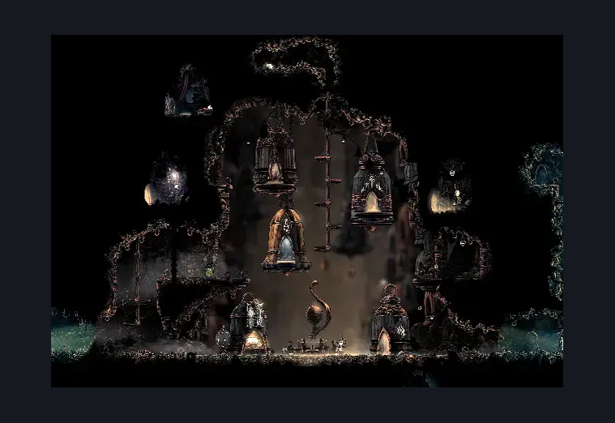
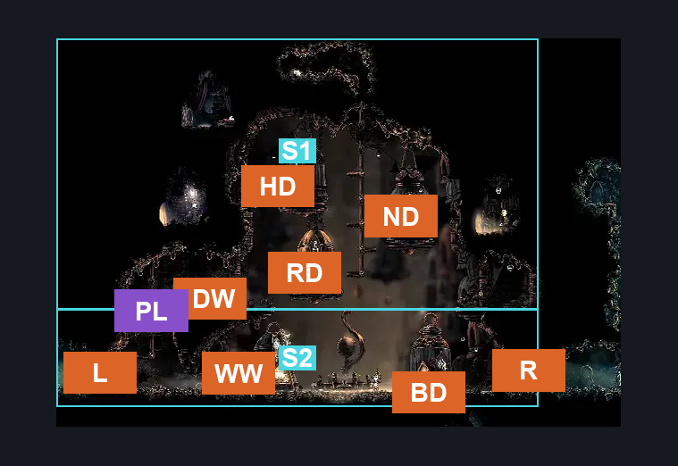
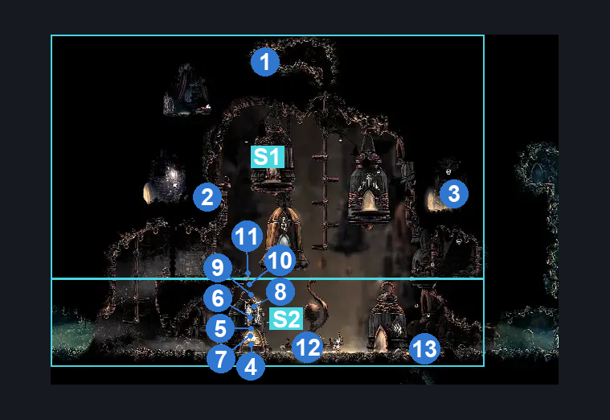

# Belltown (Belltown)

**Game ID:** Belltown

**Contributors:** Pyxl

## Subrooms

| No. | Subroom | Annotated |
| --- | --- | --- |
| S1 | Upper Area | ✓ |
| S2 | Lower Area | ✓ |

## Room Transitions

| Alias | Name | From subroom | Destination | Destination alias | Requirements | TODO | Verification | Annotated | Notes |
| --- | --- | --- | --- | --- | --- | --- | --- | --- | --- |
| RD | door4 | Upper Area | [Bellhart Relic Shop (Belltown_Room_Relic)](bellhart-relic-shop.md) | L | defeat THE boss widow |  | Verified | ✓ |  |
| HD | door5 | Upper Area | [Bellhome (Belltown_room_spare)](bellhome.md) | L | none |  | Verified | ✓ | the randomizer makes this always accessible |
| ND | door3 | Upper Area | [Bellhart Pinsmith (Belltown_Room_pinsmith)](bellhart-pinsmith.md) | L | defeat THE boss widow |  | Verified | ✓ |  |
| L | left3 | Lower Area | [Bellhart Hallway to Shellwood (Belltown_07)](bellhart-hallway-to-shellwood.md) | R | None |  | Verified | ✓ |  |
| R | right2 | Lower Area | [Bellhart Right Entrance (Belltown_06)](bellhart-right-entrance.md) | LL | None |  | Verified | ✓ |  |
| BD | door1 | Lower Area | [Bellhart Bellway (Belltown_basement)](bellhart-bellway.md) | L | None |  | Verified | ✓ |  |
| WW | wish wall | Lower Area | [Bellhart Wish Wall](../wish-menus/bellhart-wish-wall.md) | BH | defeat THE boss widow |  | Verified | ✓ |  |
| DW | delivery wishes | Upper Area | [Bellhart Deliveries](../wish-menus/bellhart-deliveries.md) | BH | complete THE my missing brother wish granted |  | Verified | ✓ |  |

## Subroom Connections

| Alias | Name | Source | Destination | Requirements | TODO | Verification | Annotated | Notes |
| --- | --- | --- | --- | --- | --- | --- | --- | --- |
| PL | Platforms | Lower Area | Upper Area | Ledge grab OR Dash OR Clawline OR Silksoar OR Faydown Cloak OR Sharpdart OR easy Shaman Crest pogo OR Cling Grip |  | Verified | ✓ |  |
| PL | Platforms | Upper Area | Lower Area | None |  | Verified | ✓ |  |

## Check Locations

| No. | Check | Subroom | Requirements | TODO | Verification | Location Type | Annotated | Notes |
| --- | --- | --- | --- | --- | --- | --- | --- | --- |
| 1 | Memory Locket: Bellhart Roof | Upper Area | Silk Soar |  | Verified | collectible | ✓ |  |
| 2 | Couriers Rasher | Upper Area | complete THE Great Taste of Pharloom Wish Promised |  | Verified | logic-point | ✓ |  |
| 3 | Map: Bellhart | Upper Area | None |  | Verified | collectible | ✓ |  |
| 4 | Memory Locket (Frey) | Lower Area | Rosaries 330 |  | Verified | event | ✓ |  |
| 5 | Spool Fragment (Frey) | Lower Area | prereq THE My Missing Courier Wish Granted AND Rosaries 270 |  | Verified | event | ✓ |  |
| 6 | Multibinder | Lower Area | prereq THE My Missing Courier Wish Granted AND Rosaries 800 |  | Verified | collectible | ✓ |  |
| 7 | Desk | Lower Area | Rosaries 380 |  | Verified | collectible | ✓ |  |
| 8 | Gleamlights | Lower Area | Rosaries 320 |  | Verified | collectible | ✓ |  |
| 9 | Bell Lacquer | Lower Area | Rosaries 520 |  | Verified | collectible | ✓ |  |
| 10 | Personal Spa | Lower Area | Bellhome Items 2 AND Rosaries 11000 |  | Verified | collectible | ✓ |  |
| 11 | Gramophone | Lower Area | sold pslam cylinders 6 AND Rosaries 490 |  | Verified | collectible | ✓ |  |
| 12 | Bench | Lower Area | none |  | Verified | bench | ✓ |  |
| 13 | Craw Summons | Lower Area | Craw Summons Ready |  | Verified | collectible | ✓ |  |

## Room Images

### Scene

### Connections

### Checks

