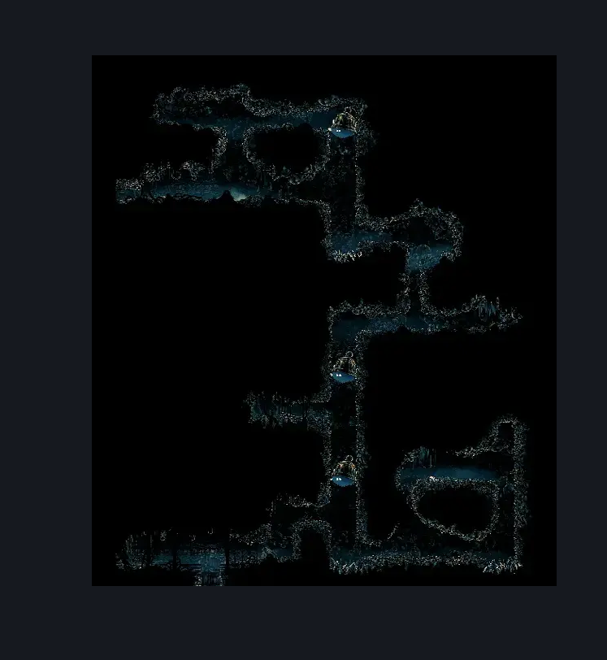
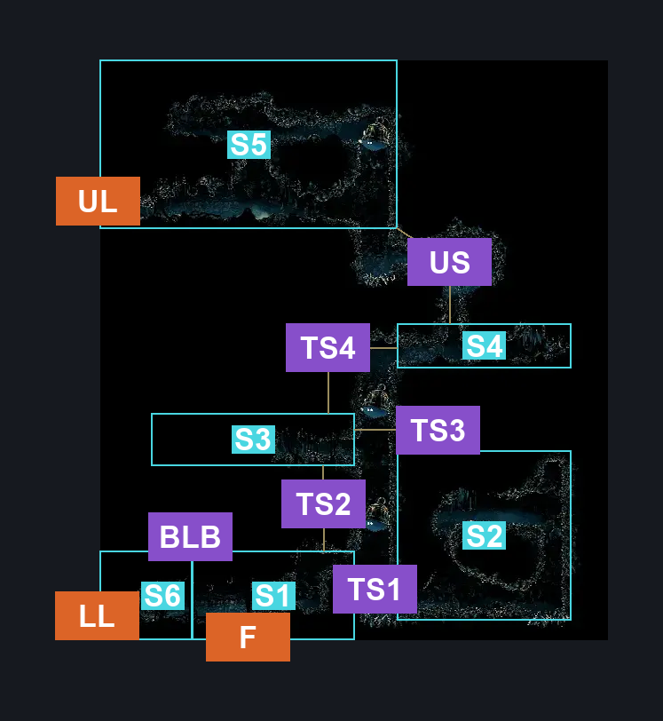
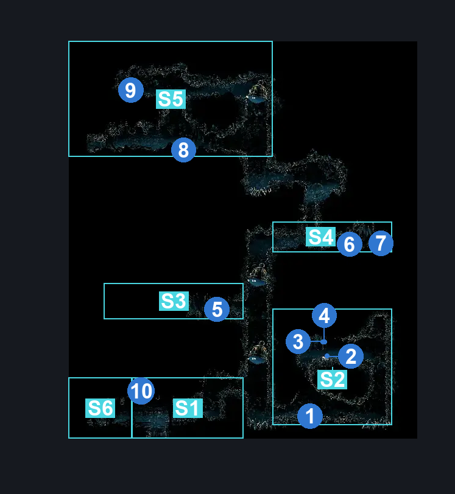

# Upper Bellhart (Belltown_04)

**Game ID:** Belltown_04

**Contributors:** Pyxl

## Subrooms

| No. | Subroom | Annotated |
| --- | --- | --- |
| S1 | Lower Exits | ✓ |
| S2 | Lower Big Room | ✓ |
| S3 | Silver Bell Cubby | ✓ |
| S4 | Central Passage | ✓ |
| S5 | Upper Big room | ✓ |
| S6 | Unsafe Lower Left Landing | ✓ |

- **Unsafe Lower Left Landing:** [Unsafe] The lower left blockade makes entering from the other side drop you into the void.

## Room Transitions

| Alias | Name | From subroom | Destination | Destination alias | Requirements | TODO | Verification | Annotated | Notes |
| --- | --- | --- | --- | --- | --- | --- | --- | --- | --- |
| UL | left1 | Upper Big room | [Shellwood Upper Bellhart Entrance (Shellwood_13)](../shellwood/shellwood-upper-bellhart-entrance.md) | R | None |  | Verified | ✓ |  |
| LL | left2 | Unsafe Lower Left Landing | [Shellwood Hidden Bellhart Connection (Shellwood_15)](../shellwood/shellwood-hidden-bellhart-connection.md) | R | clear Lower Left Bell Blockade |  | Verified | ✓ | [UNSAFE ARRIVAL] the blockade does NOT block the inverse exit in shellwood, but does prevent getting into the room safely |
| F | bot1 | Lower Exits | [Widow Boss Fight (Belltown_Shrine)](widow-boss-fight.md) | C | none |  | Verified | ✓ |  |

## Subroom Connections

| Alias | Name | Source | Destination | Requirements | TODO | Verification | Annotated | Notes |
| --- | --- | --- | --- | --- | --- | --- | --- | --- |
| TS1 | Tall Shaft1 | Lower Exits | Lower Big Room | ( Ledge Grab OR Clawline OR Faydown Cloak OR ( Dash AND Scuttlebrace ) OR Cling Grip ) |  | Verified | ✓ |  |
| TS1 | Tall Shaft1 | Lower Big Room | Lower Exits | ( Ledge Grab OR Clawline OR Faydown Cloak OR ( Dash AND Scuttlebrace ) OR Cling grip ) |  | Verified | ✓ |  |
| TS2 | Tall Shaft2 | Lower Exits | Silver Bell Cubby | ( Cling Grip OR ( Dash AND Scuttlebrace ) ) |  | Verified | ✓ |  |
| TS2 | Tall Shaft2 | Silver Bell Cubby | Lower Exits | None |  | Verified | ✓ |  |
| TS3 | Tall Shaft3 | Lower Big Room | Silver Bell Cubby | Cling Grip OR Scuttlebrace |  | Verified | ✓ |  |
| TS3 | Tall Shaft3 | Silver Bell Cubby | Lower Big Room | None |  | Verified | ✓ |  |
| TS4 | Tall Shaft4 | Silver Bell Cubby | Central Passage | Cling Grip OR ( Dash AND Scuttlebrace ) |  | Verified | ✓ |  |
| TS4 | Tall Shaft4 | Central Passage | Silver Bell Cubby | None |  | Verified | ✓ |  |
| US | Upper Shafts | Central Passage | Upper Big room | ( Cling Grip OR ( Dash AND Scuttlebrace ) ) |  | Verified | ✓ |  |
| US | Upper Shafts | Upper Big room | Central Passage | None |  | Verified | ✓ |  |
| BLB | Break Lower Blockade | Lower Exits | Unsafe Lower Left Landing | clear Lower Left Bell Blockade |  | Verified | ✓ |  |
| BLB | Break Lower Blockade | Unsafe Lower Left Landing | Lower Exits | clear Lower Left Bell Blockade |  | Verified | ✓ |  |

## Check Locations

| No. | Check | Subroom | Requirements | TODO | Verification | Location Type | Annotated | Notes |
| --- | --- | --- | --- | --- | --- | --- | --- | --- |
| 1 | Silver Bell Spawn Location #1 | Lower Big Room | None |  | Verified | collectible | ✓ |  |
| 2 | Silver Bell Spawn Location #2 | Lower Big Room | Cling Grip OR Silk Soar OR ( Dash AND Scuttlebrace ) |  | Verified | collectible | ✓ |  |
| 3 | Rosary Cache: Bellhart #1 | Lower Big Room | Cling Grip OR Silk Soar OR ( Dash AND Scuttlebrace ) |  | Verified | collectible | ✓ |  |
| 4 | Rosary Cache: Bellhart #2 | Lower Big Room | Cling Grip OR Silk Soar OR ( Dash AND Scuttlebrace ) |  | Verified | collectible | ✓ |  |
| 5 | Silver Bell Spawn Location #3 | Silver Bell Cubby | None |  | Verified | collectible | ✓ |  |
| 6 | Silver Bell Spawn Location #4 | Central Passage | None |  | Verified | collectible | ✓ |  |
| 7 | Rosary Cache: Bellhart #3 | Central Passage | None |  | Verified | collectible | ✓ |  |
| 8 | Silver Bell Spawn Location #5 | Upper Big room | None |  | Verified | collectible | ✓ |  |
| 9 | Flea: Bellhart | Upper Big room | Silk Soar OR Cling Grip OR ( Dash AND Scuttlebrace ) OR ( Easy enemy pogo AND ( Faydown Cloak OR Drifters Cloak ) ) |  | Verified | collectible | ✓ |  |
| 10 | Lower Left Bell Blockade | Lower Exits | Break Wall Left |  | Verified | blockade | ✓ | can also be broken from the right while falling into the void - hero, 9/30 |

## Room Images

### Scene

### Connections

### Checks

