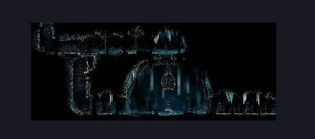
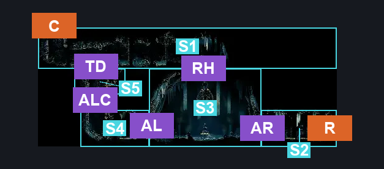
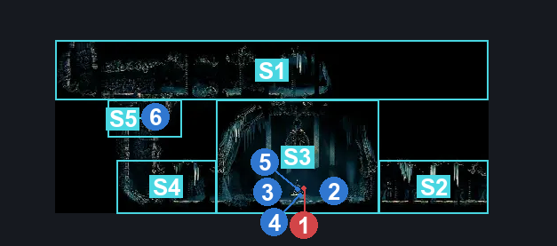

# Widow Boss Fight (Belltown_Shrine)

**Game ID:** Belltown_Shrine

**Contributors:** Pyxl

## Subrooms

| No. | Subroom | Annotated |
| --- | --- | --- |
| S1 | Upper | ✓ |
| S2 | Arena Right | ✓ |
| S3 | Arena | ✓ |
| S4 | Arena Left | ✓ |
| S5 | Trapdoor Switch Ledge | ✓ |

## Room Transitions

| Alias | Name | From subroom | Destination | Destination alias | Requirements | TODO | Verification | Annotated | Notes |
| --- | --- | --- | --- | --- | --- | --- | --- | --- | --- |
| R | right1 | Arena Right | [Bellhart Right Entrance (Belltown_06)](bellhart-right-entrance.md) | UL | None |  | Verified | ✓ |  |
| C | top1 | Upper | [Upper Bellhart (Belltown_04)](upper-bellhart.md) | F | Silk Soar OR Cling Grip OR ( Dash AND Scuttlebrace ) OR ( Easy Heal Stall AND ( Faydown Cloak OR Drifters Cloak ) ) |  | Verified | ✓ |  |

## Subroom Connections

| Alias | Name | Source | Destination | Requirements | TODO | Verification | Annotated | Notes |
| --- | --- | --- | --- | --- | --- | --- | --- | --- |
| RH | Roof Hole | Arena | Upper | Silk Soar OR ( Cling Grip AND Faydown Cloak AND ( Clawline OR Sharpdart ) ) |  | Verified | ✓ |  |
| RH | Roof Hole | Upper | Arena | None |  | Verified | ✓ |  |
| AR | Exit Arena Right | Arena | Arena Right | Activate Bellshrine Lever |  | Verified | ✓ |  |
| AR | Exit Arena Right | Arena Right | Arena | Activate Bellshrine Lever |  | Verified | ✓ |  |
| AL | Exit Arena Left | Arena Left | Arena | Activate Bellshrine Lever |  | Verified | ✓ |  |
| AL | Exit Arena Left | Arena | Arena Left | Activate Bellshrine Lever |  | Verified | ✓ |  |
| TD | Trapdoor | Trapdoor Switch Ledge | Upper | activate Trapdoor Lever AND (  Ledge Grab  OR Cling Grip  OR Silk Soar  OR Scuttlebrace ) |  | Verified | ✓ |  |
| TD | Trapdoor | Upper | Trapdoor Switch Ledge | activate Trapdoor Lever |  | Verified | ✓ |  |
| ALC | Arena Left Climb | Arena Left | Trapdoor Switch Ledge | Cling Grip OR Silk Soar OR Scuttlebrace |  | Verified | ✓ |  |
| ALC | Arena Left Climb | Trapdoor Switch Ledge | Arena Left | None (Falling) |  | Verified | ✓ |  |

## Check Locations

| No. | Check | Subroom | Requirements | TODO | Verification | Location Type | Annotated | Notes |
| --- | --- | --- | --- | --- | --- | --- | --- | --- |
| 1 | Boss: Widow | Arena | None |  | Verified | boss | ✓ |  |
| 2 | Bell: Bellhart | Arena | Activate Bellshrine Lever |  | Verified | collectible | ✓ |  |
| 3 | Needolin | Arena | Defeat Boss Widow |  | Verified | collectible | ✓ |  |
| 4 | Bellshrine Lever | Arena | Defeat Boss Widow |  | Verified | switch | ✓ |  |
| 5 | Bench | Arena | Activate Bellshrine Lever |  | Verified | bench | ✓ |  |
| 6 | Trapdoor Lever | Trapdoor Switch Ledge | Flip Switch Down |  | Verified | switch | ✓ |  |

## Room Images

### Scene

### Connections

### Checks

