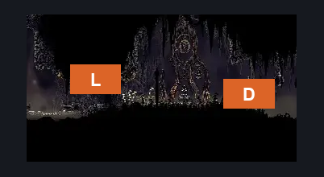
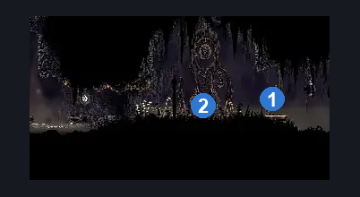
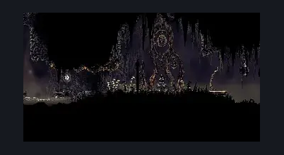

# Bilewater Bellway (Bellway_Shadow)

**Game ID:** Bellway_Shadow

**Contributors:** Herchey

## Subrooms

No subrooms defined.

## Room Transitions

| Alias | Name | From subroom | Destination | Destination alias | Requirements | TODO | Verification | Annotated | Notes |
| --- | --- | --- | --- | --- | --- | --- | --- | --- | --- |
| D | door |  | [Bellway Menu](../fast-travel/bellway-menu.md) | BW | none |  | Verified | ✓ |  |
| L | left |  | [Bilewater Organ Entrance (Shadow_04)](bilewater-organ-entrance.md) | LR | none |  | Verified | ✓ |  |

## Subroom Connections

No subroom connections defined.

## Check Locations

| No. | Check | Subroom | Requirements | TODO | Verification | Location Type | Annotated | Notes |
| --- | --- | --- | --- | --- | --- | --- | --- | --- |
| 1 | Bilewater - Bellway |  | spend 60 rosaries |  | Verified | travel | ✓ |  |
| 2 | Bilewater Bellway Bench |  | none |  | Verified | bench | ✓ |  |
| 3 | Craw Summons |  | craw summons ready |  | Verified | collectible |  |  |

## Room Images

### Connections

### Checks

### Scene

