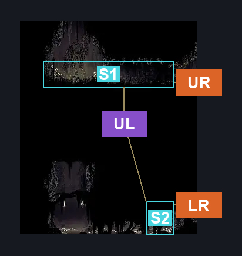
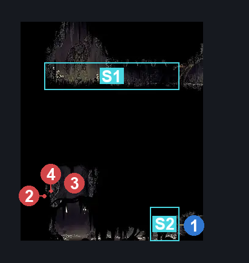
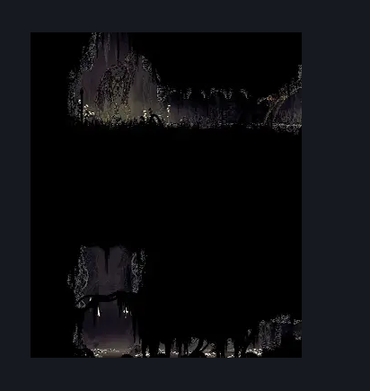

# Bilewater Bullshit Bench (Shadow_15)

**Game ID:** Shadow_15

**Contributors:** Herchey and The Black Dahlia Murder (band)

## Subrooms

| No. | Subroom | Annotated |
| --- | --- | --- |
| S1 | upper | ✓ |
| S2 | lower | ✓ |

## Room Transitions

| Alias | Name | From subroom | Destination | Destination alias | Requirements | TODO | Verification | Annotated | Notes |
| --- | --- | --- | --- | --- | --- | --- | --- | --- | --- |
| LR | lower right | lower | [Bilewater Upper Bloatroach Tower (Shadow_01)](bilewater-upper-bloatroach-tower.md) | ML | none |  | Verified | ✓ |  |
| UR | upper right | upper | [Bilewater Upper Bloatroach Tower (Shadow_01)](bilewater-upper-bloatroach-tower.md) | UL | none |  | Verified | ✓ |  |

## Subroom Connections

| Alias | Name | Source | Destination | Requirements | TODO | Verification | Annotated | Notes |
| --- | --- | --- | --- | --- | --- | --- | --- | --- |
| UL | upper to lower | upper | lower | swim |  | Verified | ✓ |  |
| UL | upper to lower | lower | upper | invalid |  | Verified | ✓ | Going back up to upper is impossible. One way connection. |

## Check Locations

| No. | Check | Subroom | Requirements | TODO | Verification | Location Type | Annotated | Notes |
| --- | --- | --- | --- | --- | --- | --- | --- | --- |
| 1 | Bilewater Bullshit Bench Exit Wall | lower | break wall right |  | Verified | blockade | ✓ |  |

## Room Images

### Connections

### Checks

### Scene

