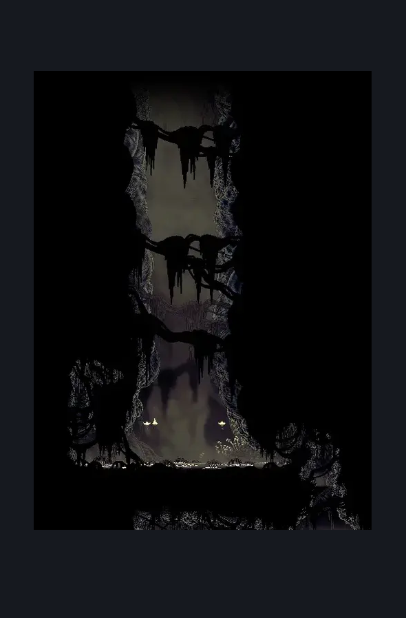
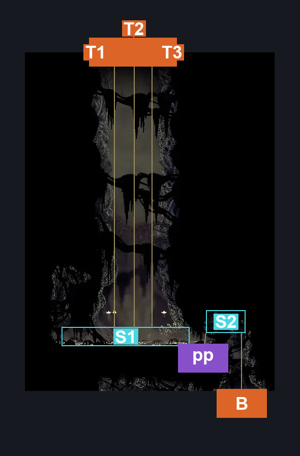
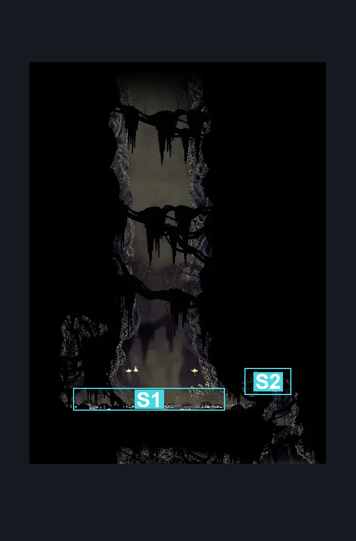

# Bilewater Citadel Exit (Shadow_22)

**Game ID:** Shadow_22

**Contributors:** herchey all by himself this time like a big, strong man

## Subrooms

| No. | Subroom | Annotated |
| --- | --- | --- |
| S1 | pond | ✓ |
| S2 | platform | ✓ |

## Room Transitions

| Alias | Name | From subroom | Destination | Destination alias | Requirements | TODO | Verification | Annotated | Notes |
| --- | --- | --- | --- | --- | --- | --- | --- | --- | --- |
| T1 | top1 | pond | [Whispering Vaults Totally Not White Palace (Library_07)](../whispering-vaults/whispering-vaults-totally-not-white-palace.md) | B1 | invalid |  | Verified | ✓ |  |
| T2 | top2 | pond | [Whispering Vaults Totally Not White Palace (Library_07)](../whispering-vaults/whispering-vaults-totally-not-white-palace.md) | B2 | invalid |  | Verified | ✓ |  |
| T3 | top3 | pond | [Whispering Vaults Totally Not White Palace (Library_07)](../whispering-vaults/whispering-vaults-totally-not-white-palace.md) | B3 | invalid |  | Verified | ✓ |  |
| B | bot1 | platform | [Bilewater West Secret Rooms (Shadow_20)](bilewater-west-secret-rooms.md) | C | nada |  | Verified | ✓ |  |

## Subroom Connections

| Alias | Name | Source | Destination | Requirements | TODO | Verification | Annotated | Notes |
| --- | --- | --- | --- | --- | --- | --- | --- | --- |
| pp | pond and platform | pond | platform | swim AND ( cling grip OR ledge grab OR faydown cloak ) |  | Verified | ✓ |  |
| pp | pond and platform | platform | pond | swim |  | Verified | ✓ |  |

## Check Locations

No check locations defined.

## Room Images

### Scene

### Connections

### Checks

