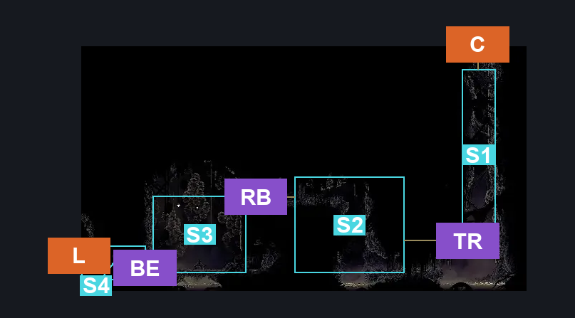
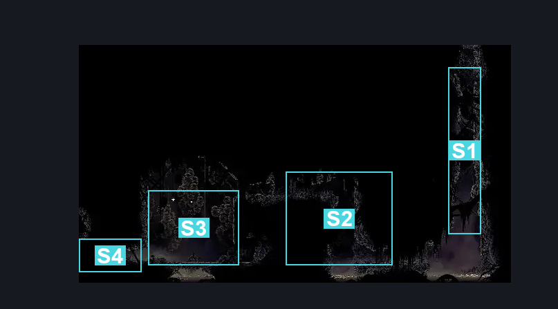
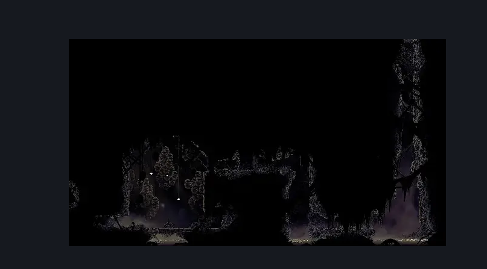

# Bilewater East Bench (Shadow_08)

**Game ID:** Shadow_08

**Contributors:** Herchey and Sadako Yamamura

## Subrooms

| No. | Subroom | Annotated |
| --- | --- | --- |
| S1 | top right | ✓ |
| S2 | right room | ✓ |
| S3 | bench room | ✓ |
| S4 | bench entrance | ✓ |

## Room Transitions

| Alias | Name | From subroom | Destination | Destination alias | Requirements | TODO | Verification | Annotated | Notes |
| --- | --- | --- | --- | --- | --- | --- | --- | --- | --- |
| C | ceiling | top right | [Bilewater Lower Trap Gauntlet Hall (Shadow_10)](bilewater-lower-trap-gauntlet-hall.md) | LR | none |  | Verified | ✓ |  |
| L | left | bench entrance | [Bilewater Mothleaf Hall (Shadow_27)](bilewater-mothleaf-hall.md) | R | none |  | Verified | ✓ |  |

## Subroom Connections

| Alias | Name | Source | Destination | Requirements | TODO | Verification | Annotated | Notes |
| --- | --- | --- | --- | --- | --- | --- | --- | --- |
| RB | right to bench | right room | bench room | (cling grip OR scuttlebrace) AND (swim OR clawline OR sharpdart OR drifter's cloak OR faydown cloak) AND break wall left |  | Verified | ✓ | breakable wall |
| RB | right to bench | bench room | right room | break wall right AND (cling grip OR silk soar OR scuttlebrace) |  | Verified | ✓ | breakable wall |
| BE | bench entrance to bench room | bench entrance | bench room | break wall right |  | Verified | ✓ | breakable wall |
| BE | bench entrance to bench room | bench room | bench entrance | break wall left |  | Verified | ✓ | breakable wall |
| TR | top right to right | top right | right room | none |  | Verified | ✓ |  |
| TR | top right to right | right room | top right | cling grip AND faydown cloak |  | Verified | ✓ |  |

## Check Locations

| No. | Check | Subroom | Requirements | TODO | Verification | Location Type | Annotated | Notes |
| --- | --- | --- | --- | --- | --- | --- | --- | --- |
| 1 | Bilewater - Storeroom Record | bench room | none |  | Verified | lore |  |  |
| 2 | Bilewater East Bench | bench room | none |  | Verified | bench |  |  |
| 3 | Bilewater East Bench Left Exit Wall | bench entrance | break wall left |  | Verified | blockade |  |  |

## Room Images

### Connections

### Checks

### Scene

