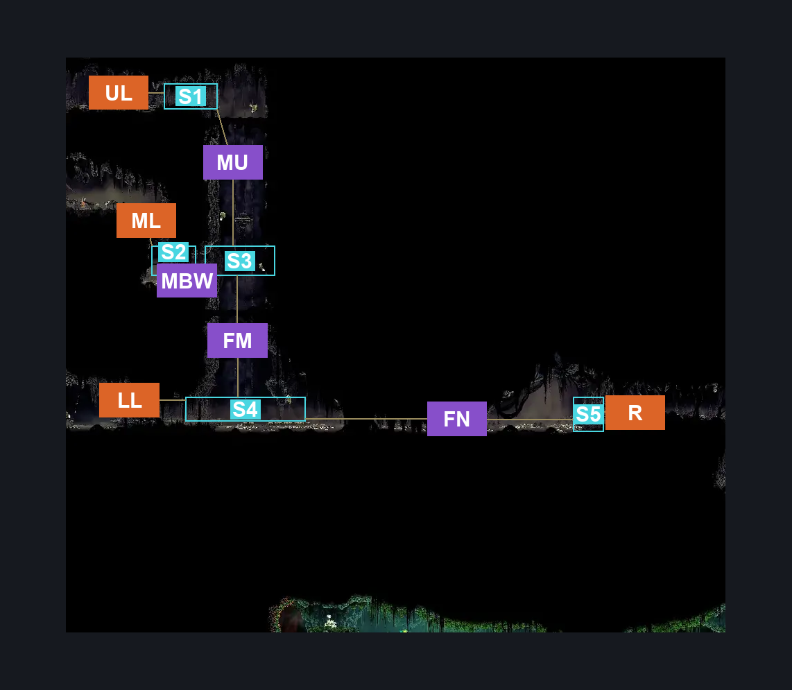
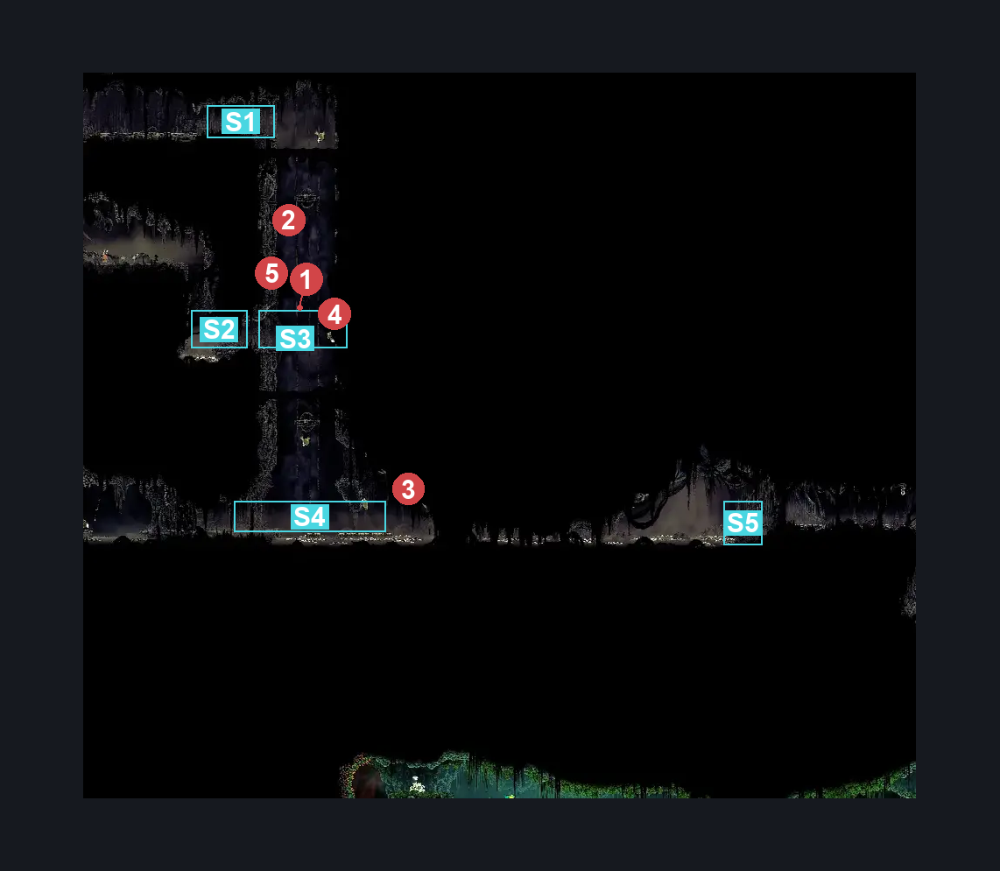
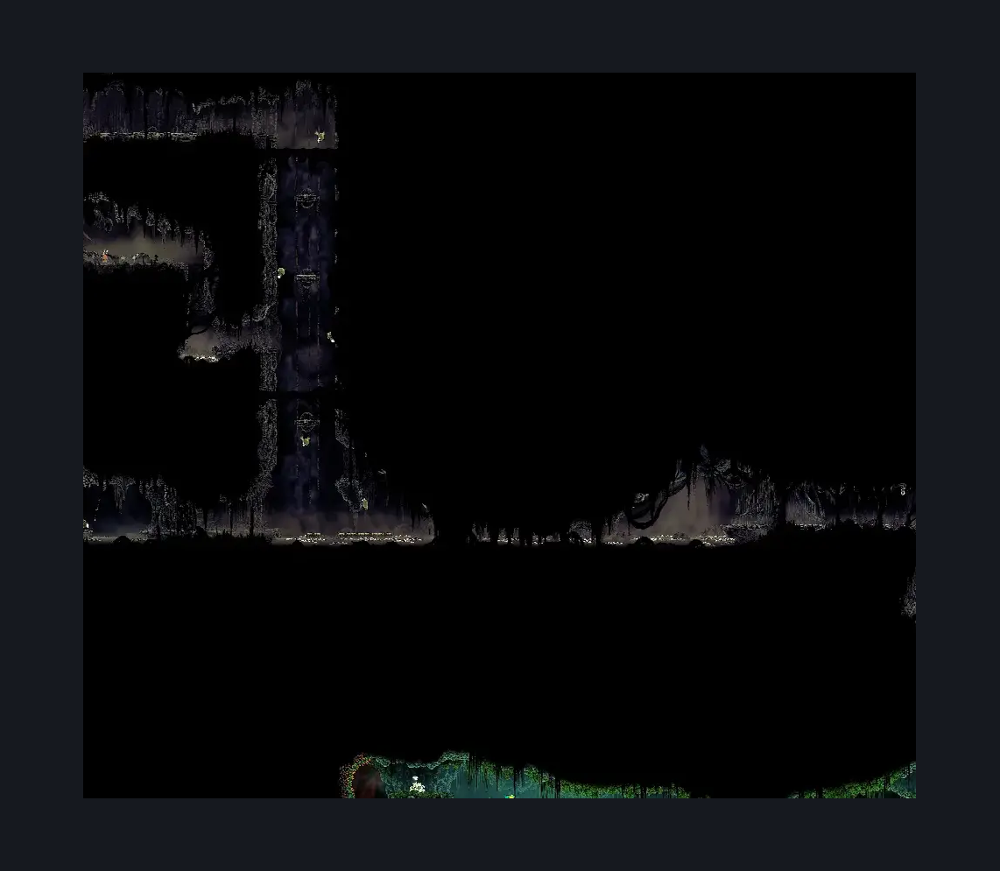

# Bilewater East Column (Shadow_09)

**Game ID:** Shadow_09

**Contributors:** Herchey Man

## Subrooms

| No. | Subroom | Annotated |
| --- | --- | --- |
| S1 | upper | ✓ |
| S2 | behind wall | ✓ |
| S3 | middle | ✓ |
| S4 | floor | ✓ |
| S5 | nest | ✓ |

## Room Transitions

| Alias | Name | From subroom | Destination | Destination alias | Requirements | TODO | Verification | Annotated | Notes |
| --- | --- | --- | --- | --- | --- | --- | --- | --- | --- |
| R | right | nest | [Bilewater Weavenest Murglin (Shadow_Weavehome)](bilewater-weavenest-murglin.md) | L | needolin |  | Verified | ✓ |  |
| ML | middle left | behind wall | [Bilewater Flea Rescue (Shadow_28)](bilewater-flea-rescue.md) | R | break wall left |  | Verified | ✓ | breakable wall depending on entrance direction |
| UL | upper left | upper | [Bilewater Lower East Hall (Shadow_03)](bilewater-lower-east-hall.md) | R | none |  | Verified | ✓ |  |
| LL | lower left | floor | [Bilewater Sinner's Entrance (Shadow_05)](bilewater-sinner-s-entrance.md) | R | none |  | Verified | ✓ |  |

## Subroom Connections

| Alias | Name | Source | Destination | Requirements | TODO | Verification | Annotated | Notes |
| --- | --- | --- | --- | --- | --- | --- | --- | --- |
| FM | Floor to middle | floor | middle | Silk soar OR ((cling grip OR scuttlebrace) AND (clawline OR sharpdart OR faydown cloak)) OR (cling grip AND drifter’s cloak) |  | Verified | ✓ |  |
| FM | Floor to middle | middle | floor | none |  | Verified | ✓ |  |
| MU | middle to upper | middle | upper | Silk soar OR ((cling grip OR scuttlebrace) AND (clawline OR sharpdart OR faydown cloak)) OR (cling grip AND drifter’s cloak) |  | Verified | ✓ |  |
| MU | middle to upper | upper | middle | none |  | Verified | ✓ |  |
| FN | floor to nest | floor | nest | swim |  | Verified | ✓ |  |
| FN | floor to nest | nest | floor | swim |  | Verified | ✓ |  |
| MBW | middle to behind wall | middle | behind wall | break wall left |  | Verified | ✓ |  |
| MBW | middle to behind wall | behind wall | middle | break wall right |  | Verified | ✓ |  |

## Check Locations

| No. | Check | Subroom | Requirements | TODO | Verification | Location Type | Annotated | Notes |
| --- | --- | --- | --- | --- | --- | --- | --- | --- |
| 1 | Swamp Squit 1 |  |  |  |  | enemy | ✓ |  |
| 2 | Swamp Squit 2 |  |  |  |  | enemy | ✓ |  |
| 3 | Swamp Squit 3 |  |  |  |  | enemy | ✓ |  |
| 4 | Miremite 1 |  |  |  |  | enemy | ✓ |  |
| 5 | Miremite 2 |  |  |  |  | enemy | ✓ |  |

## Room Images

### Connections

### Checks

### Scene

