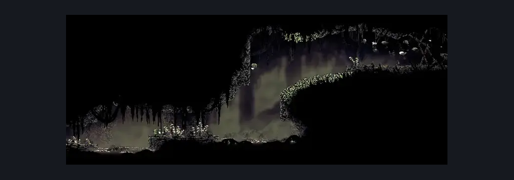
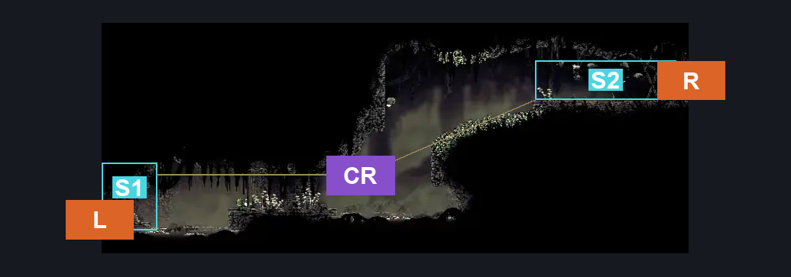
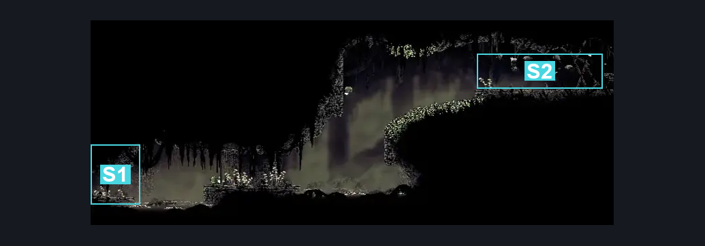

# Bilewater Hanging Corpse Room (Shadow_16)

**Game ID:** Shadow_16

**Contributors:** Herchey and Dude (his neighbor's cat)

## Subrooms

| No. | Subroom | Annotated |
| --- | --- | --- |
| S1 | left | ✓ |
| S2 | right | ✓ |

## Room Transitions

| Alias | Name | From subroom | Destination | Destination alias | Requirements | TODO | Verification | Annotated | Notes |
| --- | --- | --- | --- | --- | --- | --- | --- | --- | --- |
| R | right | right | [Bilewater Lower Trap Gauntlet Hall (Shadow_10)](bilewater-lower-trap-gauntlet-hall.md) | L | none |  | Verified | ✓ |  |
| L | left | left | [Bilewater Upper Bloatroach Tower (Shadow_01)](bilewater-upper-bloatroach-tower.md) | MR | none |  | Verified | ✓ |  |

## Subroom Connections

| Alias | Name | Source | Destination | Requirements | TODO | Verification | Annotated | Notes |
| --- | --- | --- | --- | --- | --- | --- | --- | --- |
| CR | cross the room | left | right | cling grip AND (clawline OR (faydown cloak AND (drifter's cloak OR (sharpdart AND dash)))) |  | Verified | ✓ |  |
| CR | cross the room | right | left | drifter's cloak OR clawline OR (faydown AND (run OR sharpdart OR easy beast pogo)) OR (sharpdart AND (swim OR easy beast pogo)) |  | Verified | ✓ |  |

## Check Locations

No check locations defined.

## Room Images

### Scene

### Connections

### Checks

