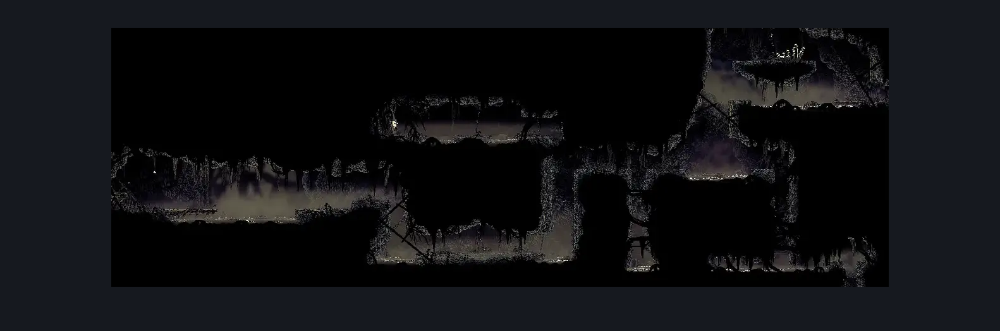
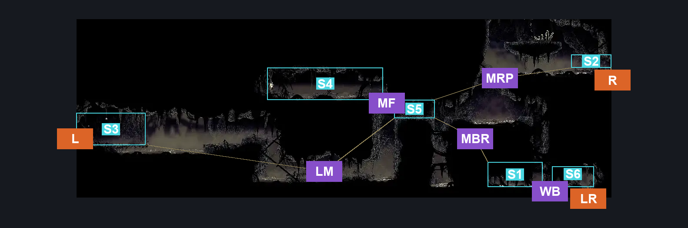
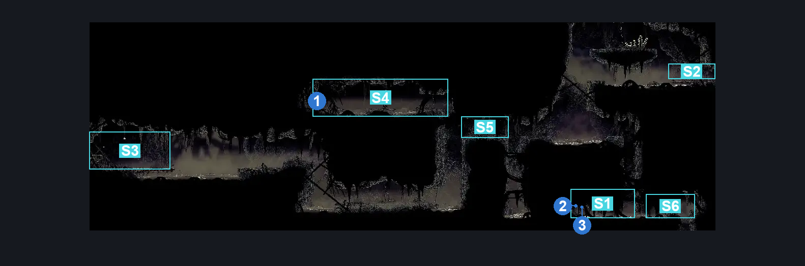

# Bilewater Lower Trap Gauntlet Hall (Shadow_10)

**Game ID:** Shadow_10

**Contributors:** Herchey and Leon Sexgod Kennedy

## Subrooms

| No. | Subroom | Annotated |
| --- | --- | --- |
| S1 | bottom | ✓ |
| S2 | right door plat | ✓ |
| S3 | left door plat | ✓ |
| S4 | flea room | ✓ |
| S5 | below flea | ✓ |
| S6 | bottom right | ✓ |

## Room Transitions

| Alias | Name | From subroom | Destination | Destination alias | Requirements | TODO | Verification | Annotated | Notes |
| --- | --- | --- | --- | --- | --- | --- | --- | --- | --- |
| LR | lower right | bottom right | [Bilewater East Bench (Shadow_08)](bilewater-east-bench.md) | C | none |  | Verified | ✓ | breakable wall |
| L | left | left door plat | [Bilewater Hanging Corpse Room (Shadow_16)](bilewater-hanging-corpse-room.md) | R | none |  | Verified | ✓ |  |
| R | right | right door plat | [Bilewater Vertical Sac Pogo Room (Shadow_19)](bilewater-vertical-sac-pogo-room.md) | LL | none |  | Verified | ✓ |  |

## Subroom Connections

| Alias | Name | Source | Destination | Requirements | TODO | Verification | Annotated | Notes |
| --- | --- | --- | --- | --- | --- | --- | --- | --- |
| LM | left to mid | left door plat | below flea | (cling grip OR scuttlebrace) AND (swim OR dash OR clawline OR sharpdart OR faydown cloak OR drifter's cloak) |  | Verified | ✓ |  |
| LM | left to mid | below flea | left door plat | (cling grip OR scuttlebrace) AND (swim OR run OR clawline OR sharpdart OR faydown cloak OR drifter's cloak OR easy beast pogo) |  | Verified | ✓ |  |
| MF | mid to flea | below flea | flea room | cling grip OR scuttlebrace |  | Verified | ✓ |  |
| MF | mid to flea | flea room | below flea | none |  | Verified | ✓ |  |
| MBR | mid to bottom right | below flea | bottom | break wall right |  | Verified | ✓ |  |
| MBR | mid to bottom right | bottom | below flea | cling grip OR scuttlebrace |  | Verified | ✓ |  |
| MRP | mid to right plat | below flea | right door plat | faydown cloak AND cling grip |  | Verified | ✓ |  |
| MRP | mid to right plat | right door plat | below flea | none |  | Verified | ✓ | falling |
| WB | wall breakthrough | bottom | bottom right | break wall right |  | Verified | ✓ |  |
| WB | wall breakthrough | bottom right | bottom | break wall left |  | Verified | ✓ |  |

## Check Locations

| No. | Check | Subroom | Requirements | TODO | Verification | Location Type | Annotated | Notes |
| --- | --- | --- | --- | --- | --- | --- | --- | --- |
| 1 | Flea: Bilehaven | flea room | break vines left |  | Verified | collectible | ✓ |  |
| 2 | Bilewater - Shell Shard Cache #1 | bottom | attack up AND swim |  | Verified | collectible | ✓ |  |
| 3 | Bilewater - Shell Shard Cache #2 | bottom | attack up AND swim |  | Verified | collectible | ✓ |  |

## Room Images

### Scene

### Connections

### Checks

