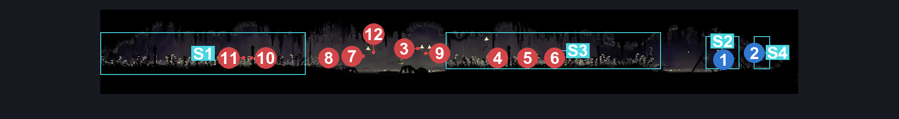
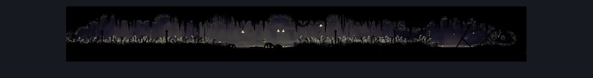

# Bilewater Mothleaf Hall (Shadow_27)

**Game ID:** Shadow_27

**Contributors:** Herchey and Sherma (he was very helpful)

## Subrooms

| No. | Subroom | Annotated |
| --- | --- | --- |
| S1 | left | ✓ |
| S2 | right | ✓ |
| S3 | center ground | ✓ |
| S4 | behind wall | ✓ |

## Room Transitions

| Alias | Name | From subroom | Destination | Destination alias | Requirements | TODO | Verification | Annotated | Notes |
| --- | --- | --- | --- | --- | --- | --- | --- | --- | --- |
| L | left | left | [Bilewater Upper East Column (Shadow_26)](bilewater-upper-east-column.md) | UR | none |  | Verified | ✓ |  |
| R | right | behind wall | [Bilewater East Bench (Shadow_08)](bilewater-east-bench.md) | L | none |  | Verified | ✓ | Only opens when breaking the left wall in shadow_08 |

## Subroom Connections

| Alias | Name | Source | Destination | Requirements | TODO | Verification | Annotated | Notes |
| --- | --- | --- | --- | --- | --- | --- | --- | --- |
| LC | left to center | left | center ground | swim OR (clawline OR enemy pogo) |  | Verified | ✓ |  |
| LC | left to center | center ground | left | swim OR (clawline OR enemy pogo) |  | Verified | ✓ |  |
| RC | right to center | right | center ground | (drifter's cloak OR faydown cloak OR clawline OR sharpdart) OR swim |  | Verified | ✓ |  |
| RC | right to center | center ground | right | (drifter's cloak OR faydown cloak OR clawline OR sharpdart) OR swim |  | Verified | ✓ |  |
| RW | right to wall | right | behind wall | prereq Bilewater East - Breakable Wall |  | Verified | ✓ |  |
| RW | right to wall | behind wall | right | prereq Bilewater East - Breakable Wall |  | Verified | ✓ |  |

## Check Locations

| No. | Check | Subroom | Requirements | TODO | Verification | Location Type | Annotated | Notes |
| --- | --- | --- | --- | --- | --- | --- | --- | --- |
| 1 | Bilewater East - Memory Locket | right | none |  | Verified | collectible | ✓ |  |
| 2 | Bilewater East - Breakable Wall | behind wall | prereq Bilewater East Bench Left Exit Wall IN Bilewater East Bench |  | Verified | blockade | ✓ |  |
| 3 | Mothleaf Lagnia 1 |  |  |  |  | enemy | ✓ |  |
| 4 | Mothleaf Lagnia 2 |  |  |  |  | enemy | ✓ |  |
| 5 | Mothleaf Lagnia 3 |  |  |  |  | enemy | ✓ |  |
| 6 | Mothleaf Lagnia 4 |  |  |  |  | enemy | ✓ |  |
| 7 | Mothleaf Lagnia 5 |  |  |  |  | enemy | ✓ |  |
| 8 | Mothleaf Lagnia 6 |  |  |  |  | enemy | ✓ |  |
| 9 | Mothleaf Lagnia 7 |  |  |  |  | enemy | ✓ |  |
| 10 | Mothleaf Lagnia 8 |  |  |  |  | enemy | ✓ |  |
| 11 | Mothleaf Lagnia 9 |  |  |  |  | enemy | ✓ |  |
| 12 | Mothleaf Lagnia 10 |  |  |  |  | enemy | ✓ |  |

## Room Images

### Connections

### Checks

### Scene

