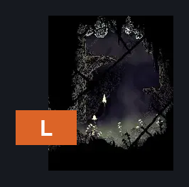
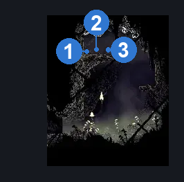
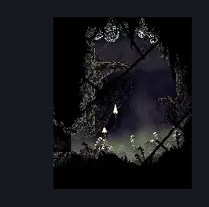

# Bilewater Northeast Tiny Room (Shadow_25)

**Game ID:** Shadow_25

**Contributors:** Herchey and NOT 8bitdo (awful ass controller firmware)

## Subrooms

No subrooms defined.

## Room Transitions

| Alias | Name | From subroom | Destination | Destination alias | Requirements | TODO | Verification | Annotated | Notes |
| --- | --- | --- | --- | --- | --- | --- | --- | --- | --- |
| L | left |  | [Bilewater Vertical Sac Pogo Room (Shadow_19)](bilewater-vertical-sac-pogo-room.md) | LR | none |  | Verified | ✓ |  |

## Subroom Connections

No subroom connections defined.

## Check Locations

| No. | Check | Subroom | Requirements | TODO | Verification | Location Type | Annotated | Notes |
| --- | --- | --- | --- | --- | --- | --- | --- | --- |
| 1 | Bilewater - Shell Shard Cache #5 |  | silk soar OR faydown cloak OR (ledge grab AND (sharpdart OR clawline)) OR (cling grip AND easy beast pogo) |  | Verified | resource | ✓ |  |
| 2 | Bilewater - Shell Shard Cache #6 |  | silk soar OR faydown cloak OR (ledge grab AND (sharpdart OR clawline)) OR (cling grip AND easy beast pogo) |  | Verified | resource | ✓ |  |
| 3 | Bilewater - Shell Shard Cache #7 |  | silk soar OR faydown cloak OR (ledge grab AND (sharpdart OR clawline)) OR (cling grip AND easy beast pogo) |  | Verified | resource | ✓ |  |

## Room Images

### Connections

### Checks

### Scene

