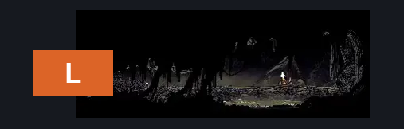
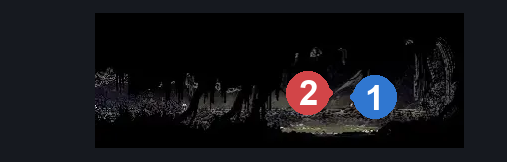
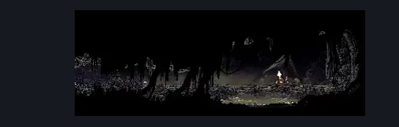

# Bilewater Shakra Room (Shadow_23)

**Game ID:** Shadow_23

**Contributors:** Herchey ft. Lil Jon

## Subrooms

No subrooms defined.

## Room Transitions

| Alias | Name | From subroom | Destination | Destination alias | Requirements | TODO | Verification | Annotated | Notes |
| --- | --- | --- | --- | --- | --- | --- | --- | --- | --- |
| L | left |  | [Bilewater Lower Bloatroach Tower (Shadow_02)](bilewater-lower-bloatroach-tower.md) | MR | none |  | Verified | ✓ |  |

## Subroom Connections

No subroom connections defined.

## Check Locations

| No. | Check | Subroom | Requirements | TODO | Verification | Location Type | Annotated | Notes |
| --- | --- | --- | --- | --- | --- | --- | --- | --- |
| 1 | Bilewater - Map Purchase |  | none |  | Verified | collectible | ✓ |  |
| 2 | Covetous Pilgrim 1 |  |  |  |  | enemy | ✓ |  |

## Room Images

### Connections

### Checks

### Scene

