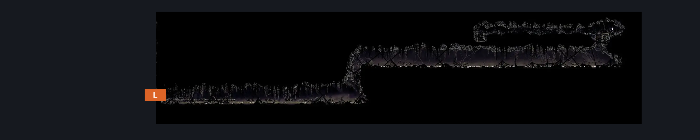
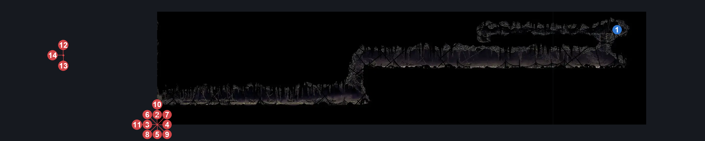
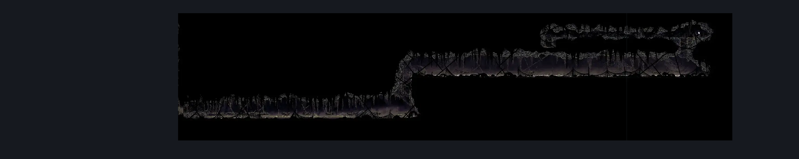

# Bilewater Slubberlug River (Shadow_13)

**Game ID:** Shadow_13

**Contributors:** Herchey and pannenkoek2012

## Subrooms

No subrooms defined.

## Room Transitions

| Alias | Name | From subroom | Destination | Destination alias | Requirements | TODO | Verification | Annotated | Notes |
| --- | --- | --- | --- | --- | --- | --- | --- | --- | --- |
| L | left |  | [Bilewater Spike Ball Ceiling Trap Room (Shadow_11)](bilewater-spike-ball-ceiling-trap-room.md) | R | none |  | Verified | ✓ |  |

## Subroom Connections

No subroom connections defined.

## Check Locations

| No. | Check | Subroom | Requirements | TODO | Verification | Location Type | Annotated | Notes |
| --- | --- | --- | --- | --- | --- | --- | --- | --- |
| 1 | Bilewater - Mask Shard |  | cling grip AND (clawline OR (sharpdart AND (faydown cloaK OR enemy pogo)) OR (faydown cloak AND drifter's cloak)) |  | Verified | collectible | ✓ |  |

## Room Images

### Connections

### Checks

### Scene

