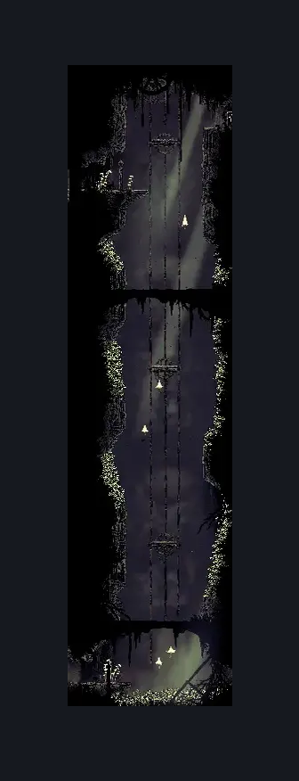
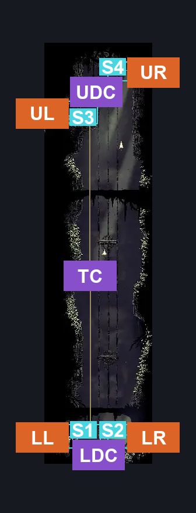
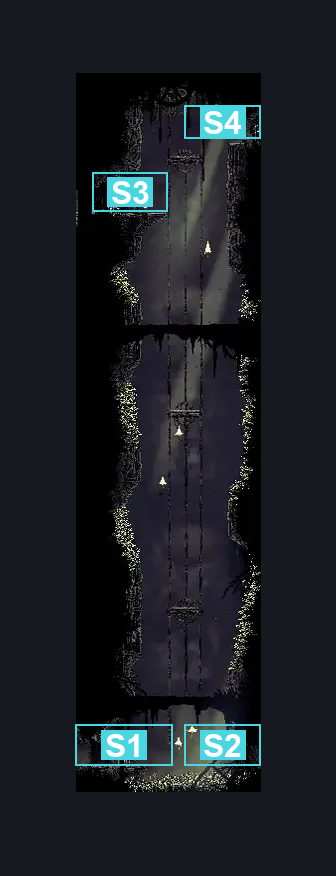

# Bilewater Upper East Column (Shadow_26)

**Game ID:** Shadow_26

**Contributors:** Herchey and Super Mario RPG

## Subrooms

| No. | Subroom | Annotated |
| --- | --- | --- |
| S1 | low left door | ✓ |
| S2 | low right door | ✓ |
| S3 | up left door | ✓ |
| S4 | up right door | ✓ |

## Room Transitions

| Alias | Name | From subroom | Destination | Destination alias | Requirements | TODO | Verification | Annotated | Notes |
| --- | --- | --- | --- | --- | --- | --- | --- | --- | --- |
| UL | upper left | up left door | [Bilewater Upper Bloatroach Tower (Shadow_01)](bilewater-upper-bloatroach-tower.md) | LR | none |  | Verified | ✓ |  |
| LL | lower left | low left door | [Bilewater Lower Bloatroach Tower (Shadow_02)](bilewater-lower-bloatroach-tower.md) | UR | none |  | Verified | ✓ |  |
| LR | lower right | low right door | [Bilewater Spike Ball Ceiling Trap Room (Shadow_11)](bilewater-spike-ball-ceiling-trap-room.md) | L | none |  | Verified | ✓ |  |
| UR | upper right | up right door | [Bilewater Mothleaf Hall (Shadow_27)](bilewater-mothleaf-hall.md) | L | none |  | Verified | ✓ |  |

## Subroom Connections

| Alias | Name | Source | Destination | Requirements | TODO | Verification | Annotated | Notes |
| --- | --- | --- | --- | --- | --- | --- | --- | --- |
| LDC | low door crossing | low left door | low right door | clawline OR sharpdart OR drifter's cloak OR run |  | Verified | ✓ |  |
| LDC | low door crossing | low right door | low left door | (ledge grab AND (faydown cloak OR easy beast pogo)) OR drifter's cloak OR clawline OR sharpdart OR run |  | Verified | ✓ |  |
| TC | the climb | low left door | up left door | cling grip AND faydown cloak |  | Verified | ✓ |  |
| TC | the climb | up left door | low left door | none |  | Verified | ✓ |  |
| UDC | up door crossing | up left door | up right door | cling grip OR scuttlebrace OR (silk soar AND (clawline OR sharpdart OR drifter's cloak OR (faydown cloak AND ledge grab))) |  | Verified | ✓ |  |
| UDC | up door crossing | up right door | up left door | clawline OR sharpdart OR faydown cloak OR drifter's cloak OR easy hunter pogo OR easy reaper pogo OR easy beast pogo OR easy witch pogo OR easy architect pogo OR easy shaman pogo |  | Verified | ✓ |  |

## Check Locations

No check locations defined.

## Room Images

### Scene

### Connections

### Checks

