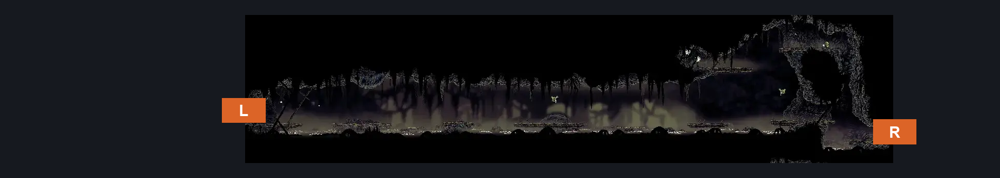
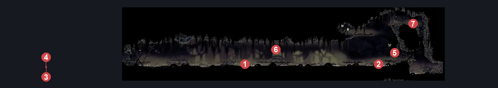

# Bilewater Upper Trap Gauntlet Hall (Shadow_12)

**Game ID:** Shadow_12

**Contributors:** Herchey and John Madden

## Subrooms

No subrooms defined.

## Room Transitions

| Alias | Name | From subroom | Destination | Destination alias | Requirements | TODO | Verification | Annotated | Notes |
| --- | --- | --- | --- | --- | --- | --- | --- | --- | --- |
| R | right |  | [Bilewater Vertical Sac Pogo Room (Shadow_19)](bilewater-vertical-sac-pogo-room.md) | UL | run OR clawline OR sharpdart OR drifter's cloak OR faydown cloak OR swim |  | Verified | ✓ | Sharpdart requires 6 uses == 24 silk, so you'd need to farm the little shits to get across with ONLY this. |
| L | left |  | [Bilewater Groal Arena (Shadow_18)](bilewater-groal-arena.md) | R | faydown cloak OR ((ledge grab OR cling grip OR silk soar) AND (run OR clawline OR sharpdart OR drifter's cloak OR swim)) |  | Verified | ✓ | Sharpdart requires 6 uses == 24 silk, so you'd need to farm the little shits to get across with ONLY this. |

## Subroom Connections

No subroom connections defined.

## Check Locations

| No. | Check | Subroom | Requirements | TODO | Verification | Location Type | Annotated | Notes |
| --- | --- | --- | --- | --- | --- | --- | --- | --- |
| 1 | Stilkin 1 |  |  |  |  | enemy | ✓ |  |
| 2 | Stilkin 2 |  |  |  |  | enemy | ✓ |  |
| 3 | Stilkin Trapper 1 |  |  |  |  | enemy | ✓ |  |
| 4 | Stilkin Trapper 2 |  |  |  |  | enemy | ✓ |  |
| 5 | Swamp Squit 1 |  |  |  |  | enemy | ✓ |  |
| 6 | Swamp Squit 2 |  |  |  |  | enemy | ✓ |  |
| 7 | Miremite 1 |  |  |  |  | enemy | ✓ |  |

## Room Images

### Connections

### Checks

### Scene

