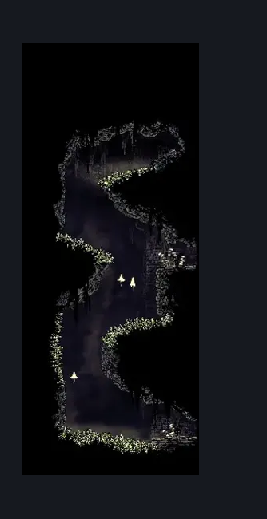
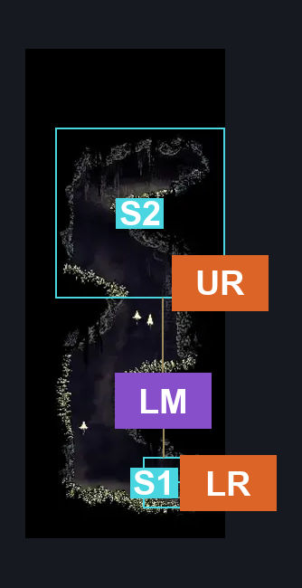
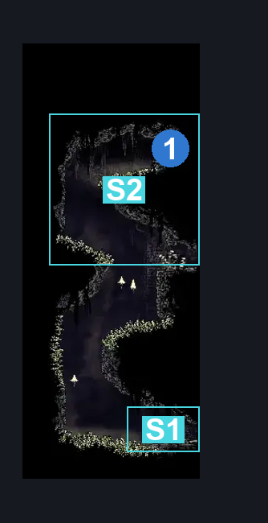

# Bilewater Upper West Column (Shadow_14)

**Game ID:** Shadow_14

**Contributors:** Herchey and his whole entire extended family

## Subrooms

| No. | Subroom | Annotated |
| --- | --- | --- |
| S1 | lower | ✓ |
| S2 | upper | ✓ |

## Room Transitions

| Alias | Name | From subroom | Destination | Destination alias | Requirements | TODO | Verification | Annotated | Notes |
| --- | --- | --- | --- | --- | --- | --- | --- | --- | --- |
| UR | upper right | upper | [Bilewater Upper Bloatroach Tower (Shadow_01)](bilewater-upper-bloatroach-tower.md) | LL | none |  | Verified | ✓ |  |
| LR | lower right | lower | [Bilewater Lower Bloatroach Tower (Shadow_02)](bilewater-lower-bloatroach-tower.md) | UL | none |  | Verified | ✓ |  |

## Subroom Connections

| Alias | Name | Source | Destination | Requirements | TODO | Verification | Annotated | Notes |
| --- | --- | --- | --- | --- | --- | --- | --- | --- |
| LM | low to up | lower | upper | cling grip AND (Faydown cloak OR enemy pogo) AND (clawline OR sharpdart) |  | Verified | ✓ | crest_pogo should be an easy or medium skip since it requires a one-hit death enemy that you need to let float up before pogoing |
| LM | low to up | upper | lower | Cling grip AND (Drifter’s cloak OR faydown cloak OR clawline OR sharpdart OR dash) |  | Verified | ✓ | Clawline, sharpdart, dash are pretty annoying to hit without a cloak, so easy/medium skips |

## Check Locations

| No. | Check | Subroom | Requirements | TODO | Verification | Location Type | Annotated | Notes |
| --- | --- | --- | --- | --- | --- | --- | --- | --- |
| 1 | Bilewater - Rosary Cache #3 | upper | Cling grip AND (faydown cloak OR enemy pogo) |  | Verified | resource | ✓ |  |

## Room Images

### Scene

### Connections

### Checks

