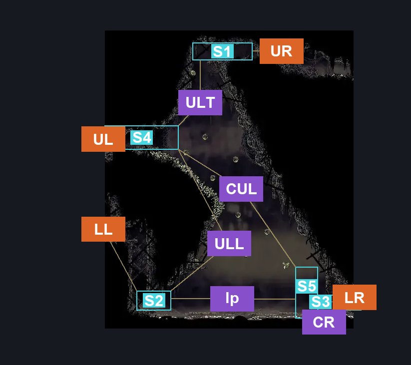
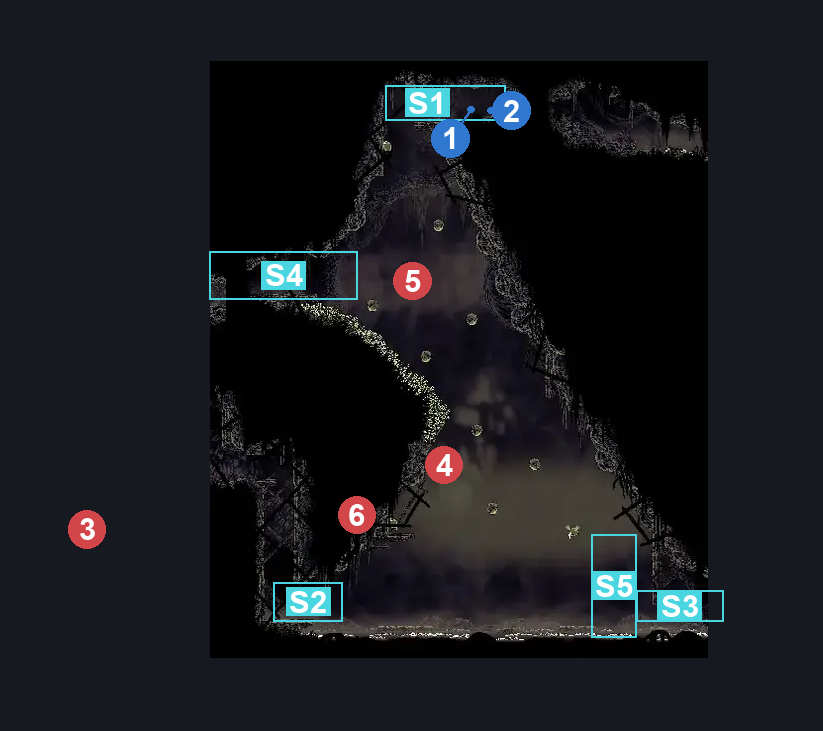
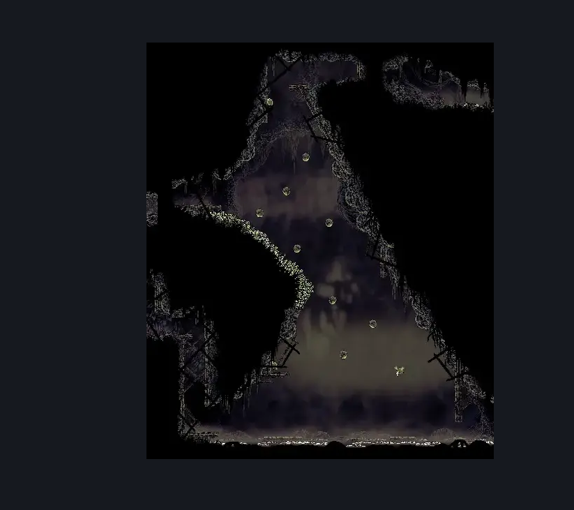

# Bilewater Vertical Sac Pogo Room (Shadow_19)

**Game ID:** Shadow_19

**Contributors:** Herchey and someone he grabbed off the street real quick

## Subrooms

| No. | Subroom | Annotated |
| --- | --- | --- |
| S1 | upper platform | ✓ |
| S2 | low left platform | ✓ |
| S3 | low right door platform | ✓ |
| S4 | up left door platform | ✓ |
| S5 | climb start wall | ✓ |

- **upper platform:** none
- **low left platform:** none
- **low right door platform:** none
- **up left door platform:** none

## Room Transitions

| Alias | Name | From subroom | Destination | Destination alias | Requirements | TODO | Verification | Annotated | Notes |
| --- | --- | --- | --- | --- | --- | --- | --- | --- | --- |
| UL | upper left | up left door platform | [Bilewater Upper Trap Gauntlet Hall (Shadow_12)](bilewater-upper-trap-gauntlet-hall.md) | R | none |  | Verified | ✓ |  |
| UR | upper right | upper platform | [Bilewater Waterfall (Shadow_24)](bilewater-waterfall.md) | L | complete THE trails end wish promised |  | Verified | ✓ | Without Trails End quest, this is inaccessible from both sides. |
| LR | lower right | low right door platform | [Bilewater Northeast Tiny Room (Shadow_25)](bilewater-northeast-tiny-room.md) | L | none |  | Verified | ✓ |  |
| LL | lower left | low left platform | [Bilewater Lower Trap Gauntlet Hall (Shadow_10)](bilewater-lower-trap-gauntlet-hall.md) | R | silk soar OR cling grip |  | Verified | ✓ |  |

## Subroom Connections

| Alias | Name | Source | Destination | Requirements | TODO | Verification | Annotated | Notes |
| --- | --- | --- | --- | --- | --- | --- | --- | --- |
| lp | lower platform crossing | low left platform | climb start wall | dash OR clawline OR swim |  | Verified | ✓ |  |
| lp | lower platform crossing | climb start wall | low left platform | dash OR clawline OR swim |  | Verified | ✓ |  |
| CR | climb wall to right | climb start wall | low right door platform | swim OR (clawline OR (sharpdart AND (ledge grab OR cling grip))) |  | Verified | ✓ | Anything other than swim is a bit narrow of a window. Easy_skip? |
| CR | climb wall to right | low right door platform | climb start wall | cling grip AND (swim OR faydown cloak) |  | Verified | ✓ | faydown is a pretty narrow window. easy_skip? |
| CUL | climb to upper left | climb start wall | up left door platform | clawline AND faydown cloak |  | Verified | ✓ |  |
| CUL | climb to upper left | up left door platform | climb start wall | drifter's cloak OR (faydown cloak AND clawline) |  | Verified | ✓ |  |
| ULL | upper left to lower left | up left door platform | low left platform | drifter's cloak OR (faydown cloak AND clawline) |  | Verified | ✓ |  |
| ULT | upper left to top | up left door platform | upper platform | faydown cloak AND cling grip AND (enemy pogo OR clawline) |  | Verified | ✓ |  |
| ULT | upper left to top | upper platform | up left door platform | drifter's cloak OR faydown cloak OR clawline OR sharpdart |  | Verified | ✓ |  |

## Check Locations

| No. | Check | Subroom | Requirements | TODO | Verification | Location Type | Annotated | Notes |
| --- | --- | --- | --- | --- | --- | --- | --- | --- |
| 1 | Bilewater - Rosary Cache #4 | upper platform | none |  | Verified | resource | ✓ |  |
| 2 | Bilewater - Rosary Cache #5 | upper platform | none |  | Verified | resource | ✓ |  |
| 3 | Stilkin Trapper 1 |  |  |  |  | enemy | ✓ |  |
| 4 | Swamp Squit 1 |  |  |  |  | enemy | ✓ |  |
| 5 | Swamp Squit 2 |  |  |  |  | enemy | ✓ |  |
| 6 | Swamp Squit 3 |  |  |  |  | enemy | ✓ |  |

## Room Images

### Connections

### Checks

### Scene

