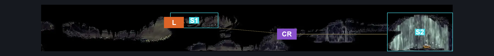
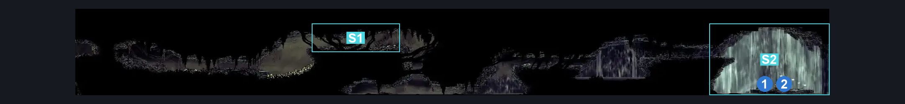
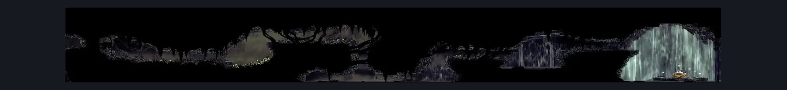

# Bilewater Waterfall (Shadow_24)

**Game ID:** Shadow_24

**Contributors:** Herchey and the girl reading this

## Subrooms

| No. | Subroom | Annotated |
| --- | --- | --- |
| S1 | left exit | ✓ |
| S2 | trails end | ✓ |

## Room Transitions

| Alias | Name | From subroom | Destination | Destination alias | Requirements | TODO | Verification | Annotated | Notes |
| --- | --- | --- | --- | --- | --- | --- | --- | --- | --- |
| L | left | left exit | [Bilewater Vertical Sac Pogo Room (Shadow_19)](bilewater-vertical-sac-pogo-room.md) | UR | none |  | Verified | ✓ | blockade on other side of this door has no impact on this direction |

## Subroom Connections

| Alias | Name | Source | Destination | Requirements | TODO | Verification | Annotated | Notes |
| --- | --- | --- | --- | --- | --- | --- | --- | --- |
| CR | crossing | left exit | trails end | faydown cloak  AND swim  AND cling grip  AND ( ledge grab OR dash OR clawline OR sharpdart ) |  | Verified | ✓ |  |
| CR | crossing | trails end | left exit | silk soar AND faydown cloak  AND swim  AND cling grip  AND ( ledge grab OR dash OR clawline OR sharpdart ) |  | Verified | ✓ | don't think you can get out without silk soar's height? |

## Check Locations

| No. | Check | Subroom | Requirements | TODO | Verification | Location Type | Annotated | Notes |
| --- | --- | --- | --- | --- | --- | --- | --- | --- |
| 1 | trails end wish granted | trails end | complete THE trails end wish promised AND needolin |  | Verified | event | ✓ |  |
| 2 | Throwing Ring | trails end | complete THE trails end wish promised |  | Verified | collectible | ✓ | Dash, clawline, and sharpdart are a bit precise and require you to get nearly the most possible height out of first and second jumps |

## Room Images

### Connections

### Checks

### Scene

