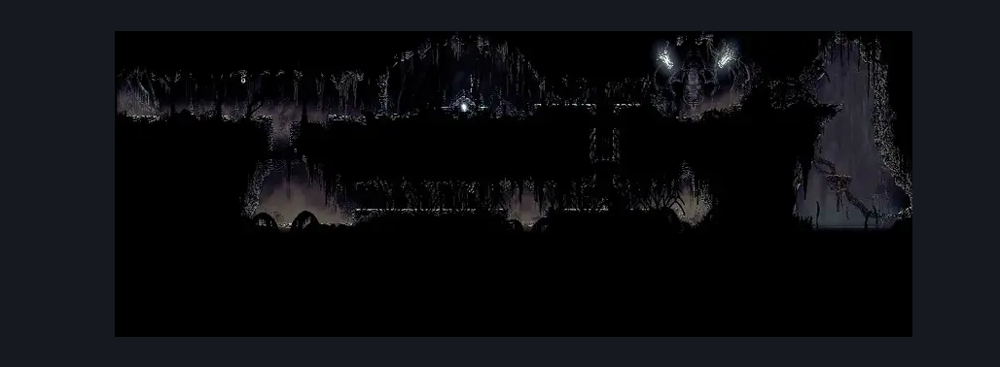
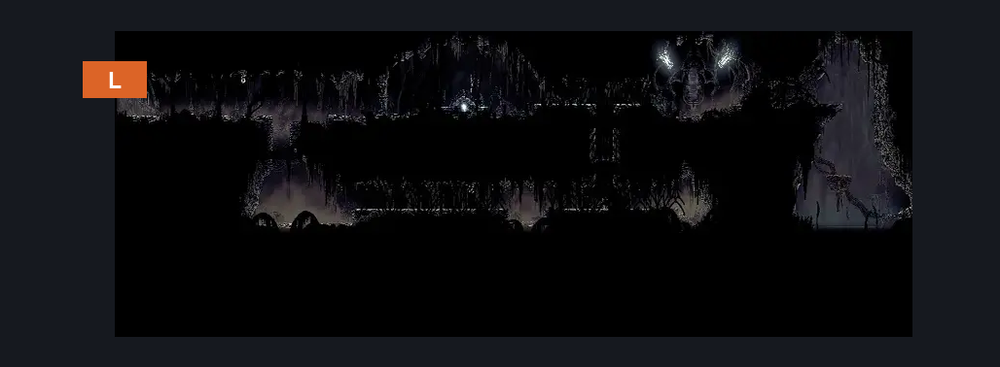
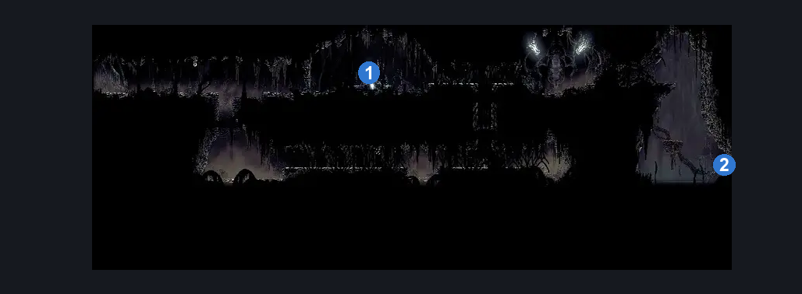

# Bilewater Weavenest Murglin (Shadow_Weavehome)

**Game ID:** Shadow_Weavehome

**Contributors:** Herchey and The Silent from StS 1 (not 2)

## Subrooms

No subrooms defined.

## Room Transitions

| Alias | Name | From subroom | Destination | Destination alias | Requirements | TODO | Verification | Annotated | Notes |
| --- | --- | --- | --- | --- | --- | --- | --- | --- | --- |
| L | left |  | [Bilewater East Column (Shadow_09)](bilewater-east-column.md) | R | needolin |  | Verified | ✓ |  |

## Subroom Connections

No subroom connections defined.

## Check Locations

| No. | Check | Subroom | Requirements | TODO | Verification | Location Type | Annotated | Notes |
| --- | --- | --- | --- | --- | --- | --- | --- | --- |
| 1 | Ruined Tool |  | (cling grip OR silk soar) AND (swim OR clawline OR drifter's cloak) |  | Verified | collectible | ✓ |  |
| 2 | Bilewater - Weaver Workshop Scroll |  | (cling grip OR silk soar) AND (swim OR clawline OR drifter's cloak) AND attack right |  | Verified | lore | ✓ | breakable wall |

## Room Images

### Scene

### Connections

### Checks

