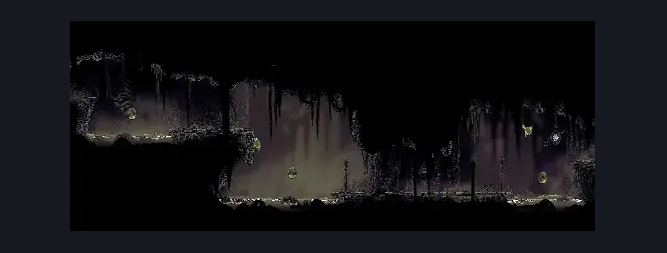
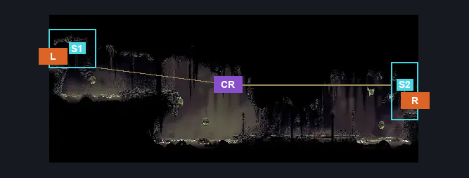
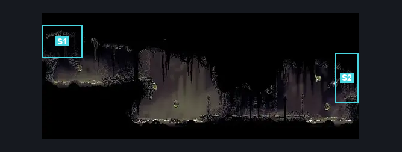

# Bilewater West Hall (Shadow_04b)

**Game ID:** Shadow_04b

**Contributors:** Herchey and the Tonight Show Band

## Subrooms

| No. | Subroom | Annotated |
| --- | --- | --- |
| S1 | left | ✓ |
| S2 | right | ✓ |

## Room Transitions

| Alias | Name | From subroom | Destination | Destination alias | Requirements | TODO | Verification | Annotated | Notes |
| --- | --- | --- | --- | --- | --- | --- | --- | --- | --- |
| L | left | left | [Bilewater Organ Entrance (Shadow_04)](bilewater-organ-entrance.md) | UR | none |  | Verified | ✓ |  |
| R | right | right | [Bilewater Lower Bloatroach Tower (Shadow_02)](bilewater-lower-bloatroach-tower.md) | LL | none |  | Verified | ✓ |  |

## Subroom Connections

| Alias | Name | Source | Destination | Requirements | TODO | Verification | Annotated | Notes |
| --- | --- | --- | --- | --- | --- | --- | --- | --- |
| CR | cross the room | left | right | (enemy pogo AND (faydown cloak OR ((clawline OR sharpdart OR dash OR drifter’s cloak) AND cling grip))) OR (silk soar AND ((drifter’s cloak AND (cling grip OR clawline OR sharpdart)) OR (clawline AND sharpdart))) |  | Verified | ✓ |  |
| CR | cross the room | right | left | Clawline OR sharpdart OR easy hunter pogo OR easy reaper pogo OR easy beast pogo OR easy shaman pogo OR (ledge grab AND (easy witch pogo OR easy architect pogo)) OR (swim AND faydown cloak) OR (silk soar AND drifter’s cloak) |  | Verified | ✓ |  |

## Check Locations

No check locations defined.

## Room Images

### Scene

### Connections

### Checks

