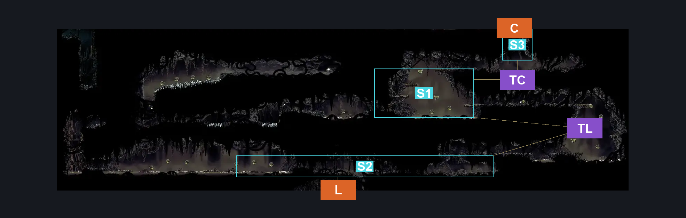
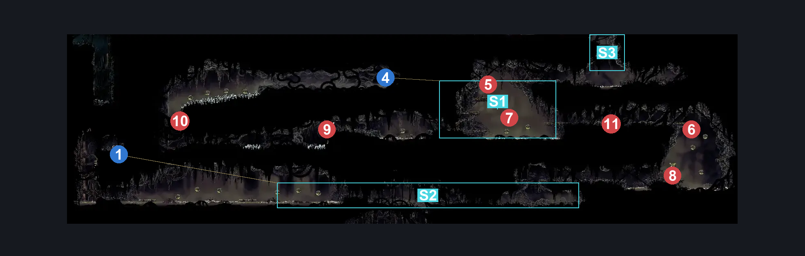
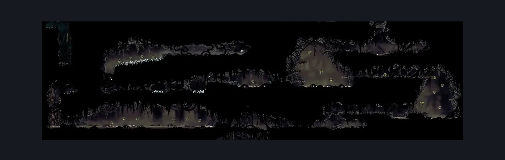

# Bilewater West Secret Rooms (Shadow_20)

**Game ID:** Shadow_20

**Contributors:** Herchey and someone else

## Subrooms

| No. | Subroom | Annotated |
| --- | --- | --- |
| S1 | top area | ✓ |
| S2 | lower area | ✓ |
| S3 | ceiling exit | ✓ |

## Room Transitions

| Alias | Name | From subroom | Destination | Destination alias | Requirements | TODO | Verification | Annotated | Notes |
| --- | --- | --- | --- | --- | --- | --- | --- | --- | --- |
| L | lower | lower area | [Bilewater Organ Entrance (Shadow_04)](bilewater-organ-entrance.md) | C | none |  | Verified | ✓ |  |
| C | ceiling | ceiling exit | [Bilewater Citadel Exit (Shadow_22)](bilewater-citadel-exit.md) | B | cling grip AND medium enemy pogo AND faydown cloak |  | Verified | ✓ | Requires an annoying enemy lure. Medium_skips. Should be one-way normally. |

## Subroom Connections

| Alias | Name | Source | Destination | Requirements | TODO | Verification | Annotated | Notes |
| --- | --- | --- | --- | --- | --- | --- | --- | --- |
| TL | top to bottom | lower area | top area | faydown cloak OR silk soar OR scuttlebrace OR cling grip |  | Verified | ✓ |  |
| TL | top to bottom | top area | lower area | none |  | Verified | ✓ |  |
| TC | top to ceiling | top area | ceiling exit | (enemy pogo OR clawline) AND (ledge grab OR cling grip OR faydown cloak) |  | Verified | ✓ |  |
| TC | top to ceiling | ceiling exit | top area | (faydown cloak AND (swim OR enemy pogo)) OR drifter's cloak OR clawline OR sharpdart |  | Verified | ✓ |  |

## Check Locations

| No. | Check | Subroom | Requirements | TODO | Verification | Location Type | Annotated | Notes |
| --- | --- | --- | --- | --- | --- | --- | --- | --- |
| 1 | Bilewater West - Memory Locket | lower area | cling grip AND (swim OR clawline OR easy hunter pogo OR easy beast pogo OR easy architect pogo OR ((easy wanderer pogo OR easy witch pogo OR easy reaper pogo) AND (dash OR faydown cloak OR drifter's cloak))) |  | Verified | collectible | ✓ |  |
| 2 | Bilewater - Rosary Cache #6 | lower area | none |  | Verified | collectible |  |  |
| 3 | Bilewater - Rosary Cache #7 | lower area | none |  | Verified | collectible |  |  |
| 4 | Twisted Bud | top area | break wall left AND break wall right AND (cling grip OR silk soar) AND (spike pogo OR enemy pogo OR clawline) AND (dash OR clawline OR sharpdart OR drifter's cloak OR spike pogo) |  | Verified | collectible | ✓ |  |
| 5 | Swamp Squit 1 |  |  |  |  | enemy | ✓ |  |
| 6 | Swamp Squit 2 |  |  |  |  | enemy | ✓ |  |
| 7 | Swamp Squit 3 |  |  |  |  | enemy | ✓ |  |
| 8 | Swamp Squit 4 |  |  |  |  | enemy | ✓ |  |
| 9 | Miremite 1 |  |  |  |  | enemy | ✓ |  |
| 10 | Miremite 2 |  |  |  |  | enemy | ✓ |  |
| 11 | Miremite 3 |  |  |  |  | enemy | ✓ |  |

## Room Images

### Connections

### Checks

### Scene

