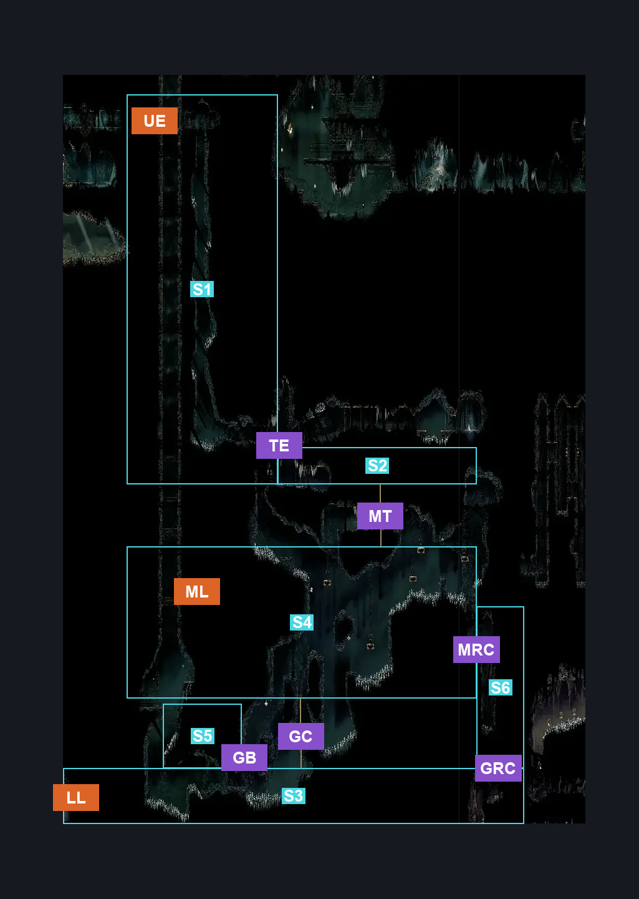
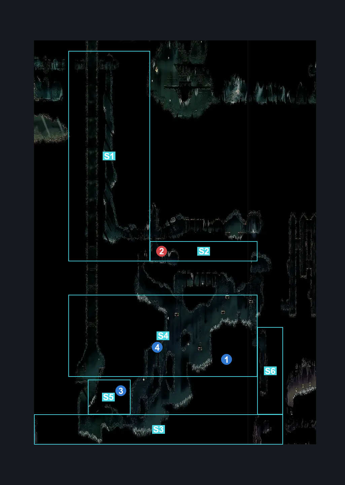
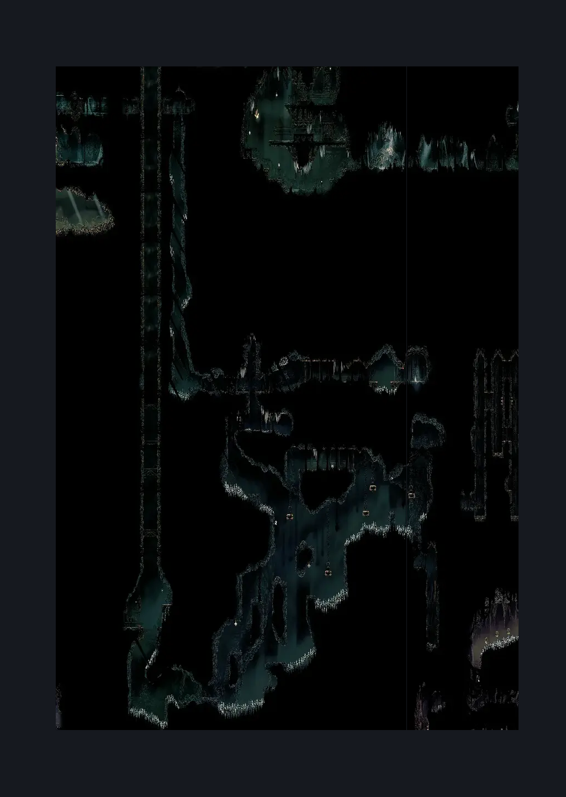

# Exhaust Organ Interior (Organ_01)

**Game ID:** Organ_01

**Contributors:** Herchey's cool "KING" hat with spikes on it

## Subrooms

| No. | Subroom | Annotated |
| --- | --- | --- |
| S1 | elevator | ✓ |
| S2 | top layer | ✓ |
| S3 | ground floor | ✓ |
| S4 | maze | ✓ |
| S5 | bench room | ✓ |
| S6 | right column | ✓ |

## Room Transitions

| Alias | Name | From subroom | Destination | Destination alias | Requirements | TODO | Verification | Annotated | Notes |
| --- | --- | --- | --- | --- | --- | --- | --- | --- | --- |
| UE | Underworks Elevator | elevator | [Underworks Exhaust Organ Transit (Library_12)](../underworks/underworks-exhaust-organ-transit.md) | EV | none |  | Verified | ✓ |  |
| ML | mid left | maze | [Exhaust Organ Exterior (Dust_09)](exhaust-organ-exterior.md) | UD | none |  | Verified | ✓ |  |
| LL | low left | ground floor | [Exhaust Organ Exterior (Dust_09)](exhaust-organ-exterior.md) | LD | none |  | Verified | ✓ |  |

## Subroom Connections

| Alias | Name | Source | Destination | Requirements | TODO | Verification | Annotated | Notes |
| --- | --- | --- | --- | --- | --- | --- | --- | --- |
| TE | top to elevator | top layer | elevator | complete Boss: Phantom |  | Verified | ✓ |  |
| TE | top to elevator | elevator | top layer | complete Boss: Phantom |  | Verified | ✓ |  |
| GC | ground to maze | ground floor | maze | complete broken elevator AND cling grip |  | Verified | ✓ |  |
| GC | ground to maze | maze | ground floor | complete broken elevator |  | Verified | ✓ |  |
| GRC | ground to right column | ground floor | right column | cling grip |  | Verified | ✓ |  |
| GRC | ground to right column | right column | ground floor | none |  | Verified | ✓ |  |
| MRC | maze to right column | maze | right column | cling grip AND faydown cloak |  | Verified | ✓ |  |
| MRC | maze to right column | right column | maze | cling grip |  | Verified | ✓ |  |
| MT | maze to top | maze | top layer | cling grip |  | Verified | ✓ |  |
| MT | maze to top | top layer | maze | cling grip |  | Verified | ✓ |  |
| GB | ground to bench room | ground floor | bench room | silk soar OR cling grip OR scuttlebrace |  | Verified | ✓ |  |
| GB | ground to bench room | bench room | ground floor | none |  | Verified | ✓ |  |

## Check Locations

| No. | Check | Subroom | Requirements | TODO | Verification | Location Type | Annotated | Notes |
| --- | --- | --- | --- | --- | --- | --- | --- | --- |
| 1 | Silk Grub Large Cocoon | maze | none |  | Verified | collectible | ✓ |  |
| 2 | Boss: Phantom | top layer | dash OR run |  | Verified | boss | ✓ |  |
| 3 | Organ Bench | bench room | cling grip |  | Verified | bench | ✓ |  |
| 4 | broken elevator | maze | attack left |  | Verified | blockade | ✓ |  |
| 5 | import enemies |  |  | TODO | Needs verification |  |  |  |

## Room Images

### Connections

### Checks

### Scene

