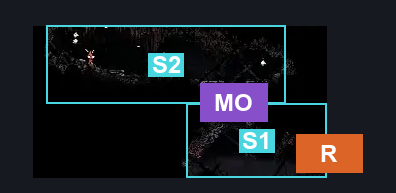
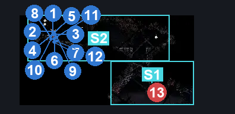
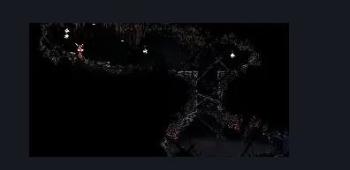

# Blasted Steps Grindle (Coral_42)

**Game ID:** Coral_42

**Contributors:** skai

## Subrooms

| No. | Subroom | Annotated |
| --- | --- | --- |
| S1 | Lower Half | ✓ |
| S2 | Upper Half | ✓ |

## Room Transitions

| Alias | Name | From subroom | Destination | Destination alias | Requirements | TODO | Verification | Annotated | Notes |
| --- | --- | --- | --- | --- | --- | --- | --- | --- | --- |
| R | Right | Lower Half | [Blasted Steps Thin Long Vertical (Coral_35)](blasted-steps-thin-long-vertical.md) | ML | Nothing |  | Verified | ✓ |  |

## Subroom Connections

| Alias | Name | Source | Destination | Requirements | TODO | Verification | Annotated | Notes |
| --- | --- | --- | --- | --- | --- | --- | --- | --- |
| MO | Middle Opening | Lower Half | Upper Half | Silk Soar OR (Faydown AND (Cling Grip OR  Scuttlebrace)) |  | Verified | ✓ |  |
| MO | Middle Opening | Upper Half | Lower Half | Nothing (Falling) |  | Verified | ✓ |  |

## Check Locations

| No. | Check | Subroom | Requirements | TODO | Verification | Location Type | Annotated | Notes |
| --- | --- | --- | --- | --- | --- | --- | --- | --- |
| 1 | Thief's Mark | Upper Half | Nothing |  | Verified | collectible | ✓ |  |
| 2 | Snitch Pick | Upper Half | Clawline |  | Verified | collectible | ✓ |  |
| 3 | Relic: Psalm Cylinder (Grindle) | Upper Half | Nothing |  | Verified | collectible | ✓ |  |
| 4 | Crafting Kit: Grindle | Upper Half | Nothing |  | Verified | collectible | ✓ |  |
| 5 | Spool Fragment: Grindle (Blasted Steps) | Upper Half | Nothing |  | Verified | collectible | ✓ |  |
| 6 | Pebb (Bone Bottom) / Grindle (Act 3) - Magnetite Brooch | Upper Half | Act 3 |  | Verified | collectible | ✓ | IF NOT Acquired from Pebb |
| 7 | Pebb (Bone Bottom) / Grindle (Act 3) - Mask Shard | Upper Half | Act 3 |  | Verified | collectible | ✓ | IF NOT Acquired from Pebb |
| 8 | Pebb (Bone Bottom) / Grindle (Act 3) - Craftmetal | Upper Half | Act 3 |  | Verified | collectible | ✓ | IF NOT Acquired from Pebb |
| 9 | Pebb (Bone Bottom) / Grindle (Act 3) - Simple Key | Upper Half | Act 3 |  | Verified | collectible | ✓ | IF NOT Acquired from Pebb |
| 10 | Mort (Pilgrim's Rest) / Grindle (Act 3) - Tool Pouch | Upper Half | Act 3 |  | Verified | collectible | ✓ | IF NOT Acquired from Mort |
| 11 | Mort (Pilgrim's Rest) / Grindle (Act 3) - Memory Locket | Upper Half | Act 3 |  | Verified | collectible | ✓ | IF NOT Acquired from Mort |
| 12 | Lumble (Blasted Steps) / Grindle (Act 3) - Magnetite Dice | Upper Half | Act 3 |  | Verified | collectible | ✓ | IF NOT Acquired from Lumble |

## Room Images

### Connections

### Checks

### Scene

