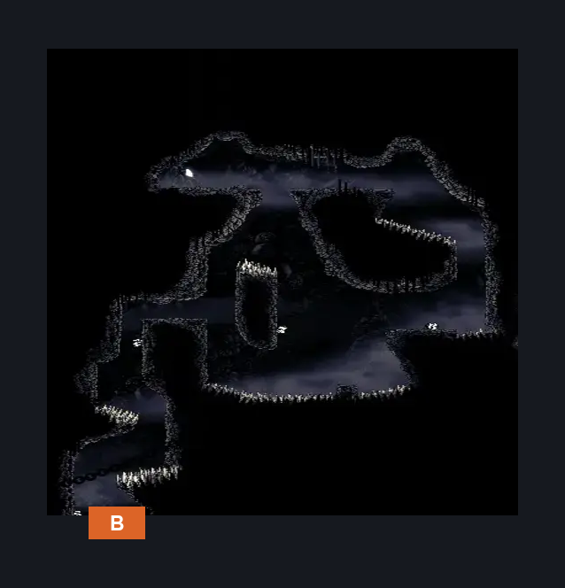
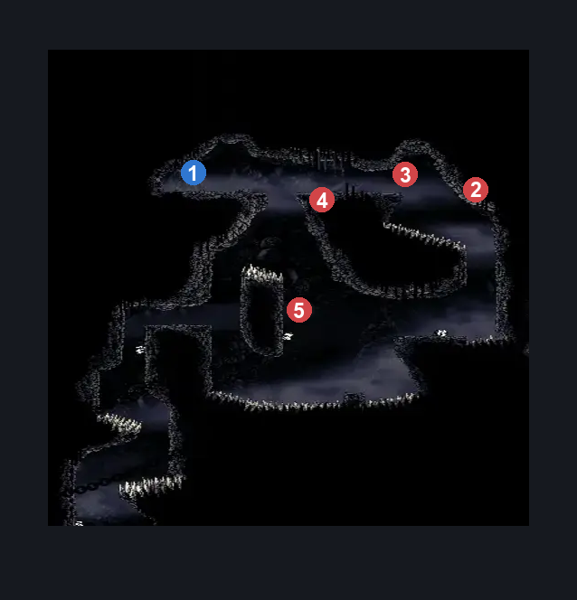
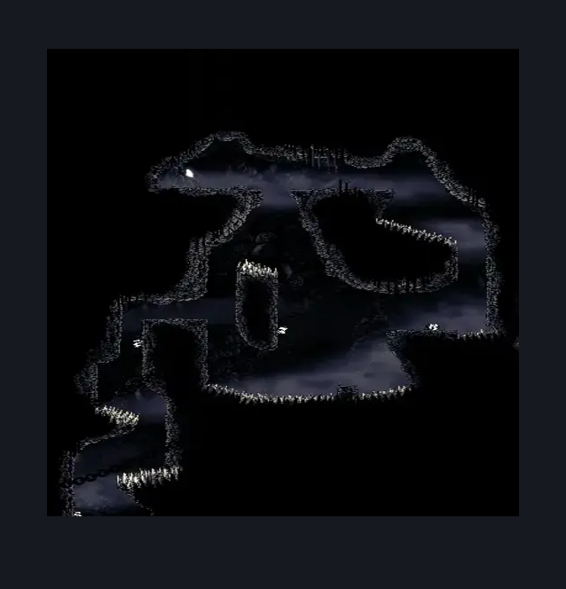

# Blasted Steps Mask Shard (Coral_19b)

**Game ID:** Coral_19b

**Contributors:** skai

## Subrooms

No subrooms defined.

## Room Transitions

| Alias | Name | From subroom | Destination | Destination alias | Requirements | TODO | Verification | Annotated | Notes |
| --- | --- | --- | --- | --- | --- | --- | --- | --- | --- |
| B | Bottom |  | [Blasted Steps Map Edge (Coral_19)](blasted-steps-map-edge.md) | TL | Nothing |  | Verified | ✓ |  |

## Subroom Connections

No subroom connections defined.

## Check Locations

| No. | Check | Subroom | Requirements | TODO | Verification | Location Type | Annotated | Notes |
| --- | --- | --- | --- | --- | --- | --- | --- | --- |
| 1 | Mask Shard: Blasted Steps |  | (Scuttlebrace AND Faydown) OR ( Proficient Movement AND Cling Grip AND Spike Pogo AND (Ledge Grab OR Easy Hazard Respawn)) |  | Verified | collectible | ✓ |  |
| 2 | Pharlid 1 |  |  |  |  | enemy | ✓ |  |
| 3 | Pharlid 2 |  |  |  |  | enemy | ✓ |  |
| 4 | Pharlid 3 |  |  |  |  | enemy | ✓ |  |
| 5 | Pharlid 4 |  |  |  |  | enemy | ✓ |  |

## Room Images

### Connections

### Checks

### Scene

