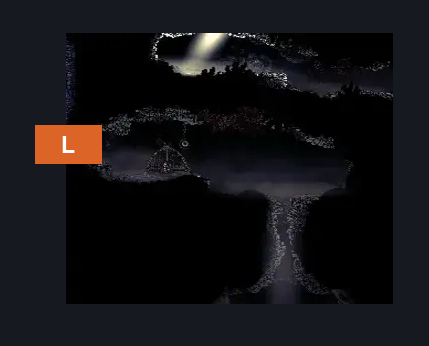
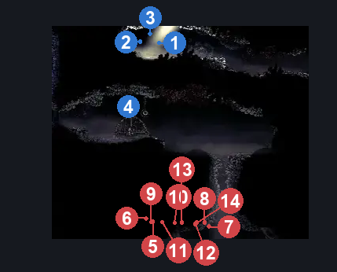
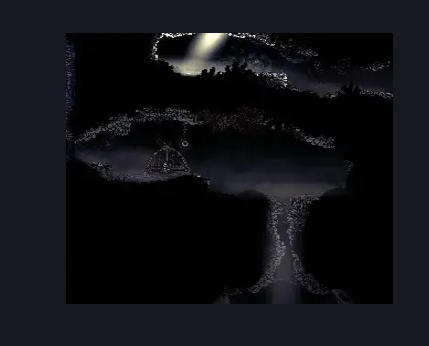

# Blasted Steps Shell / Beast Shard (Coral_36)

**Game ID:** Coral_36

**Contributors:** skai

## Subrooms

No subrooms defined.

## Room Transitions

| Alias | Name | From subroom | Destination | Destination alias | Requirements | TODO | Verification | Annotated | Notes |
| --- | --- | --- | --- | --- | --- | --- | --- | --- | --- |
| L | Left |  | [Blasted Steps Thin Long Vertical (Coral_35)](blasted-steps-thin-long-vertical.md) | MR | Nothing |  | Verified | ✓ |  |

## Subroom Connections

No subroom connections defined.

## Check Locations

| No. | Check | Subroom | Requirements | TODO | Verification | Location Type | Annotated | Notes |
| --- | --- | --- | --- | --- | --- | --- | --- | --- |
| 1 | Beast Shard: Blasted Steps |  | (Scuttlebrace AND Faydown) OR Cling Grip OR Silk Soar |  | Verified | collectible | ✓ |  |
| 2 | Shell Shard Cache: Blasted Steps #4 |  | (Scuttlebrace AND Faydown) OR Cling Grip OR Silk Soar |  | Verified | collectible | ✓ |  |
| 3 | Shell Shard Cache: Blasted Steps #5 |  | (Scuttlebrace AND Faydown) OR Cling Grip OR Silk Soar |  | Verified | collectible | ✓ |  |
| 4 | Blasted Steps - Judge Nursery Record |  | Nothing |  | Verified | lore | ✓ |  |
| 5 | Squirrm 1 |  |  |  |  | enemy | ✓ |  |
| 6 | Squirrm 2 |  |  |  |  | enemy | ✓ |  |
| 7 | Squirrm 3 |  |  |  |  | enemy | ✓ |  |
| 8 | Squirrm 4 |  |  |  |  | enemy | ✓ |  |
| 9 | Squirrm 5 |  |  |  |  | enemy | ✓ |  |
| 10 | Squirrm 6 |  |  |  |  | enemy | ✓ |  |
| 11 | Squirrm 7 |  |  |  |  | enemy | ✓ |  |
| 12 | Squirrm 8 |  |  |  |  | enemy | ✓ |  |
| 13 | Squirrm 9 |  |  |  |  | enemy | ✓ |  |
| 14 | Squirrm 10 |  |  |  |  | enemy | ✓ |  |

## Room Images

### Connections

### Checks

### Scene

