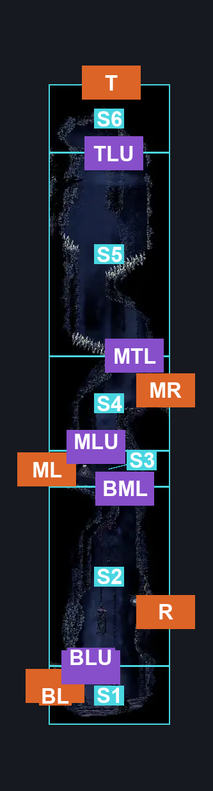
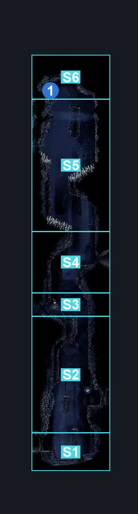
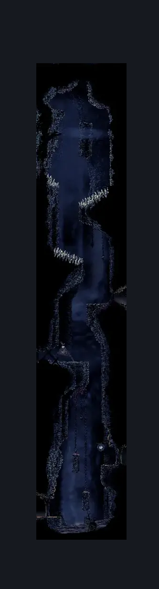

# Blasted Steps Thin Long Vertical (Coral_35)

**Game ID:** Coral_35

**Contributors:** skai

## Subrooms

| No. | Subroom | Annotated |
| --- | --- | --- |
| S1 | Bottom Third (Lower Half) | ✓ |
| S2 | Bottom Third (Upper Half) | ✓ |
| S3 | Middle Third (Lower Half) | ✓ |
| S4 | Middle Third (Upper Half) | ✓ |
| S5 | Top Third (Lower Half) | ✓ |
| S6 | Top Third (Upper Half) | ✓ |

## Room Transitions

| Alias | Name | From subroom | Destination | Destination alias | Requirements | TODO | Verification | Annotated | Notes |
| --- | --- | --- | --- | --- | --- | --- | --- | --- | --- |
| BL | Bottom Left | Bottom Third (Lower Half) | [Blasted Steps Horizontal Room with Two Sand Pits (Coral_43)](blasted-steps-horizontal-room-with-two-sand-pits.md) | R | Nothing |  | Verified | ✓ |  |
| R | Right | Bottom Third (Upper Half) | [Blasted Steps Bellway (Bellway_08)](blasted-steps-bellway.md) | L | Nothing |  | Verified | ✓ |  |
| ML | Middle Left | Middle Third (Lower Half) | [Blasted Steps Grindle (Coral_42)](blasted-steps-grindle.md) | R | Nothing |  | Verified | ✓ |  |
| MR | Middle Right | Middle Third (Upper Half) | [Blasted Steps Shell / Beast Shard (Coral_36)](blasted-steps-shell-beast-shard.md) | L | Break Wall Right OR Break Wall Left |  | Verified | ✓ |  |
| T | Top | Top Third (Upper Half) | [Sands of Karak Tall Centre Room (Coral_35b)](../sands-of-karak/sands-of-karak-tall-centre-room.md) | F | Prereq Stalactite IN Sands of Karak Tall Centre Room |  | Verified | ✓ |  |

## Subroom Connections

| Alias | Name | Source | Destination | Requirements | TODO | Verification | Annotated | Notes |
| --- | --- | --- | --- | --- | --- | --- | --- | --- |
| BLU | Bottom Lower to Upper | Bottom Third (Lower Half) | Bottom Third (Upper Half) | Cling Grip OR Medium Scuttlebrace OR Faydown OR (Silk Soar AND Ledge Grab) |  | Verified | ✓ |  |
| BLU | Bottom Lower to Upper | Bottom Third (Upper Half) | Bottom Third (Lower Half) | Nothing (Falling) |  | Verified | ✓ |  |
| BML | Bottom to Middle Lower | Bottom Third (Upper Half) | Middle Third (Lower Half) | Cling Grip OR (Scuttlebrace AND (Clawline OR Faydown OR Easy Flea Brew Stall OR Sharpdart)) OR (Silk Soar AND (Ledge Grab OR Progressive Swift Step 2 OR Faydown OR Clawline OR Flea Brew OR Sharpdart)) |  | Verified | ✓ |  |
| BML | Bottom to Middle Lower | Middle Third (Lower Half) | Bottom Third (Upper Half) | Nothing (Falling) |  | Verified | ✓ |  |
| MLU | Middle Lower to Upper | Middle Third (Lower Half) | Middle Third (Upper Half) | Cling Grip OR (Easy Scuttlebrace AND (Faydown OR Easy Flea Brew Stall OR Medium Heal Stall)) OR Silk Soar |  | Verified | ✓ |  |
| MLU | Middle Lower to Upper | Middle Third (Upper Half) | Middle Third (Lower Half) | Nothing (Falling) |  | Verified | ✓ |  |
| MTL | Middle to Top Lower | Middle Third (Upper Half) | Top Third (Lower Half) | Spike Pogo AND (Cling Grip OR Easy Scuttlebrace) |  | Verified | ✓ |  |
| MTL | Middle to Top Lower | Top Third (Lower Half) | Middle Third (Upper Half) | Nothing (Falling) |  | Verified | ✓ |  |
| TLU | Top Lower to Upper | Top Third (Lower Half) | Top Third (Upper Half) | Nothing (Jump) |  | Verified | ✓ |  |
| TLU | Top Lower to Upper | Top Third (Upper Half) | Top Third (Lower Half) | Nothing (Fall) |  | Verified | ✓ |  |

## Check Locations

| No. | Check | Subroom | Requirements | TODO | Verification | Location Type | Annotated | Notes |
| --- | --- | --- | --- | --- | --- | --- | --- | --- |
| 1 | Flea: Blasted Steps | Top Third (Upper Half) | Nothing |  | Verified | collectible | ✓ |  |

## Room Images

### Connections

### Checks

### Scene

