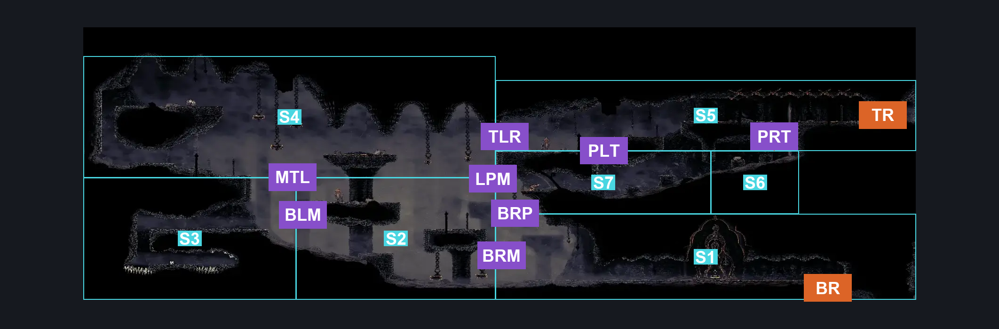
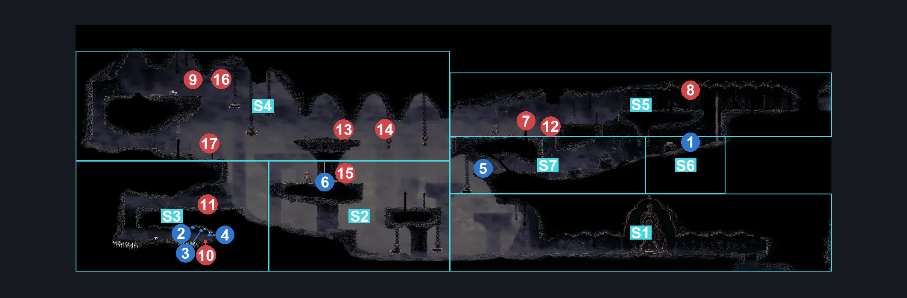
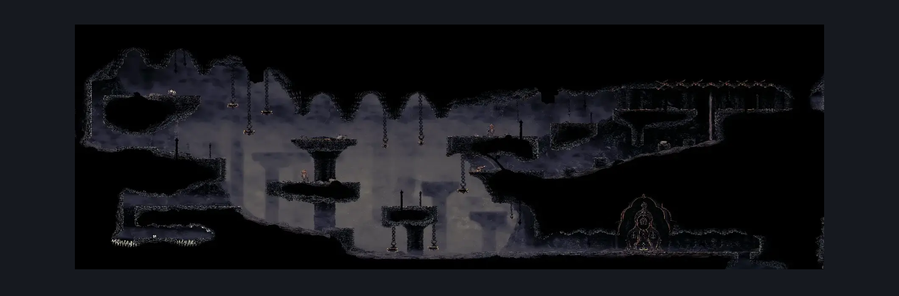

# Blasted Steps Toll Bench Bottom (Coral_02)

**Game ID:** Coral_02

**Contributors:** skai

## Subrooms

| No. | Subroom | Annotated |
| --- | --- | --- |
| S1 | Bottom Right | ✓ |
| S2 | Middle | ✓ |
| S3 | Bottom Left | ✓ |
| S4 | Top Left | ✓ |
| S5 | Top Right | ✓ |
| S6 | Top Right Pit (Right) | ✓ |
| S7 | Top Right Pit (Left) | ✓ |

## Room Transitions

| Alias | Name | From subroom | Destination | Destination alias | Requirements | TODO | Verification | Annotated | Notes |
| --- | --- | --- | --- | --- | --- | --- | --- | --- | --- |
| BR | Bottom Right | Bottom Right | [Blasted Steps Map Edge (Coral_19)](blasted-steps-map-edge.md) | TM | Nothing |  | Verified | ✓ |  |
| TR | Top Right | Top Right | [Blasted Steps Wide Long Vertical (Coral_03)](blasted-steps-wide-long-vertical.md) | BL | Nothing |  | Verified | ✓ |  |

## Subroom Connections

| Alias | Name | Source | Destination | Requirements | TODO | Verification | Annotated | Notes |
| --- | --- | --- | --- | --- | --- | --- | --- | --- |
| BRM | Bottom Right to Middle | Bottom Right | Middle | (Cling Grip AND (Progressive Swift Step 1 OR Sharpdart OR Clawline OR Flea Brew)) OR Faydown OR Easy Scuttlebrace OR Silk Soar |  | Verified | ✓ |  |
| BRM | Bottom Right to Middle | Middle | Bottom Right | Nothing (Falling) |  | Verified | ✓ |  |
| BLM | Bottom Left to Middle | Bottom Left | Middle | (Cling Grip AND (Progressive Swift Step 1 OR Sharpdart OR Clawline OR Flea Brew)) OR Faydown OR Medium Scuttlebrace OR Silk Soar |  | Verified | ✓ |  |
| BLM | Bottom Left to Middle | Middle | Bottom Left | Nothing (Falling) |  | Verified | ✓ |  |
| MTL | Middle to Top Left | Middle | Top Left | (Cling Grip AND (Progressive Swift Step 1 OR Sharpdart OR Clawline OR Flea Brew)) OR Faydown OR Easy Scuttlebrace OR Silk Soar |  | Verified | ✓ |  |
| MTL | Middle to Top Left | Top Left | Middle | Nothing (Fall) |  | Verified | ✓ |  |
| TLR | Top Left to Top Right | Top Left | Top Right | (Cling Grip AND (Progressive Swift Step 2 OR Sharpdart OR Clawline OR (Flea Brew AND (Easy Flea Brew Stall OR Easy Heal Stall OR Ledge Grab)))) OR (Faydown AND Ledge Grab) OR Easy Scuttlebrace OR Silk Soar |  | Verified | ✓ |  |
| TLR | Top Left to Top Right | Top Right | Top Left | Progressive Swift Step 2 OR Sharpdart OR Clawline OR Faydown OR (Flea Brew AND (Easy Flea Brew Stall OR Easy Heal Stall OR Ledge Grab)) |  | Verified | ✓ |  |
| PLT | Pit Left to Top Right | Top Right Pit (Left) | Top Right | Cling Grip OR Scuttlebrace OR Silk Soar OR (Faydown AND Ledge Grab AND (Easy Heal Stall OR Easy Flea Brew Stall)) |  | Verified | ✓ |  |
| PLT | Pit Left to Top Right | Top Right | Top Right Pit (Left) | Nothing (Falling) |  | Verified | ✓ |  |
| PRT | Pit Right to Top RIght | Top Right Pit (Right) | Top Right | Cling Grip OR Scuttlebrace OR (Faydown AND Ledge Grab) |  | Verified | ✓ |  |
| PRT | Pit Right to Top RIght | Top Right | Top Right Pit (Right) | Nothing (Falling) |  | Verified | ✓ |  |
| BRP | Bottom Right to Pit | Top Right Pit (Left) | Bottom Right | Nothing (Falling) |  | Verified | ✓ |  |
| BRP | Bottom Right to Pit | Bottom Right | Top Right Pit (Left) | (Prereq Top Right Pit Lever (Top Right Pit) OR (Faydown AND Ledge Grab)) AND Silk Soar |  | Verified | ✓ |  |
| LPM | Left Pit to Middle | Top Right Pit (Left) | Middle | Prereq Top Right Pit Lever OR (Easy Hunter Crest Pogo OR Easy Reaper Crest Pogo OR Easy Beast Crest Pogo OR Easy Architect Crest Pogo) OR Clawline OR Flea Brew OR Sharpdart OR Progressive Swift Step 2 OR Faydown |  | Verified | ✓ | Didn't Split Sprint/Dash |
| LPM | Left Pit to Middle | Middle | Top Right Pit (Left) | (Prereq Top Right Pit Lever AND (Ledge Grab OR Faydown)) OR Silk Soar |  | Verified | ✓ |  |

## Check Locations

| No. | Check | Subroom | Requirements | TODO | Verification | Location Type | Annotated | Notes |
| --- | --- | --- | --- | --- | --- | --- | --- | --- |
| 1 | Memory Locket: Blasted Steps | Top Right Pit (Right) | Nothing (Fall) |  | Verified | collectible | ✓ |  |
| 2 | Shell Shard Cache: Blasted Steps #1 | Bottom Left | Nothing (Fall) |  | Verified | collectible | ✓ |  |
| 3 | Shell Shard Cache: Blasted Steps #2 | Bottom Left | Nothing (Fall) |  | Verified | collectible | ✓ |  |
| 4 | Shell Shard Cache: Blasted Steps #3 | Bottom Left | Nothing (Fall) |  | Verified | collectible | ✓ |  |
| 5 | Top Right Pit Lever | Top Right Pit (Left) | Nothing |  | Verified | switch | ✓ |  |
| 6 | Garmond and Zaza Act 3 Meeting Blasted Steps | Top Left | Act 3 |  |  | event | ✓ | Need to verify subroom |
| 7 | Judge 1 |  |  |  |  | enemy | ✓ |  |
| 8 | Judge 2 |  |  |  |  | enemy | ✓ |  |
| 9 | Pilgrim Bellbearer 1 |  |  |  |  | enemy | ✓ |  |
| 10 | Pharlid 1 |  |  |  |  | enemy | ✓ |  |
| 11 | Pharlid 2 |  |  |  |  | enemy | ✓ |  |
| 12 | Pilgrim Pouncer 1 |  |  |  |  | enemy | ✓ |  |
| 13 | Pilgrim Groveller 1 |  | Normal World Spawn |  |  | enemy | ✓ |  |
| 14 | Pilgrim Pouncer 2 |  | Normal World Spawn |  |  | enemy | ✓ |  |
| 15 | Judge 3 |  | Normal World Spawn |  |  | enemy | ✓ |  |
| 16 | Pilgrim Hiker 1 |  | Normal World Spawn |  |  | enemy | ✓ |  |
| 17 | Pilgrim Hiker 2 |  | Black Thread World Spawn |  |  | enemy | ✓ |  |

## Room Images

### Connections

### Checks

### Scene

