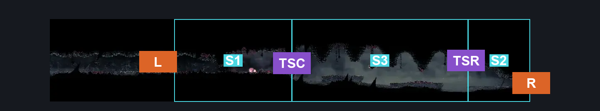
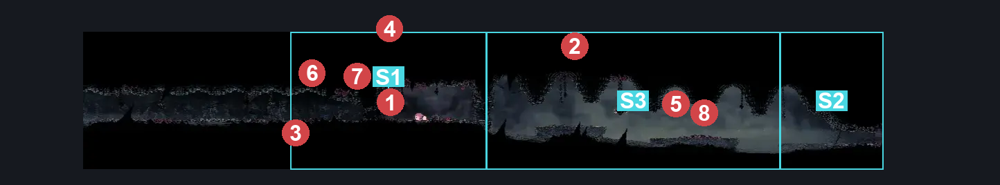
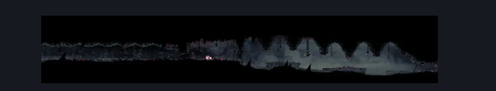

# Great Conchflies (Coral_11)

**Game ID:** Coral_11

**Contributors:** skai

## Subrooms

| No. | Subroom | Annotated |
| --- | --- | --- |
| S1 | Great Conchflies | ✓ |
| S2 | Triple Sand Pit Right | ✓ |
| S3 | Triple Sand Pit | ✓ |

## Room Transitions

| Alias | Name | From subroom | Destination | Destination alias | Requirements | TODO | Verification | Annotated | Notes |
| --- | --- | --- | --- | --- | --- | --- | --- | --- | --- |
| R | Right | Triple Sand Pit Right | [Blasted Steps Wide Long Vertical (Coral_03)](blasted-steps-wide-long-vertical.md) | ML | Nothing |  | Verified | ✓ |  |
| L | Left | Great Conchflies | [Horizontal Room with Sand Pit (Coral_11b)](horizontal-room-with-sand-pit.md) | R | defeat Boss: Great Conchflies |  | Verified | ✓ |  |

## Subroom Connections

| Alias | Name | Source | Destination | Requirements | TODO | Verification | Annotated | Notes |
| --- | --- | --- | --- | --- | --- | --- | --- | --- |
| TSC | Triple Sand Pit to Conch | Triple Sand Pit | Great Conchflies | Progressive Swift Step 1 OR Faydown OR Clawline OR Sharpdart OR ((Drifter's Cloak OR Medium Beast Crest Pogo OR (Flea Brew AND Easy Flea Brew Stall)) AND Ledge Grab) |  | Verified | ✓ |  |
| TSC | Triple Sand Pit to Conch | Great Conchflies | Triple Sand Pit | Progressive Swift Step 1 OR Faydown OR Clawline OR Sharpdart OR ((Drifter's Cloak OR Medium Beast Crest Pogo OR (Flea Brew AND Easy Flea Brew Stall)) AND Ledge Grab) |  | Verified | ✓ |  |
| TSR | Triple Sand Pit to Right | Triple Sand Pit | Triple Sand Pit Right | Progressive Swift Step 1 OR Faydown OR Clawline OR Sharpdart OR ((Drifter's Cloak OR Medium Beast Crest Pogo OR (Flea Brew AND Easy Flea Brew Stall)) AND Ledge Grab) |  | Verified | ✓ |  |
| TSR | Triple Sand Pit to Right | Triple Sand Pit Right | Triple Sand Pit | Progressive Swift Step 1 OR Faydown OR Clawline OR Sharpdart OR ((Drifter's Cloak OR Medium Beast Crest Pogo OR (Flea Brew AND Easy Flea Brew Stall)) AND Ledge Grab) |  | Verified | ✓ |  |

## Check Locations

| No. | Check | Subroom | Requirements | TODO | Verification | Location Type | Annotated | Notes |
| --- | --- | --- | --- | --- | --- | --- | --- | --- |
| 1 | Boss: Great Conchflies | Great Conchflies | Nothing |  | Verified | boss | ✓ |  |
| 2 | Driznit 1 |  |  |  |  | enemy | ✓ |  |
| 3 | Coral Conch Driller Giant 1 |  | Normal World Spawn |  |  | enemy | ✓ |  |
| 4 | Coral Conch Driller Giant 2 |  | Normal World Spawn |  |  | enemy | ✓ |  |
| 5 | Driznit 2 |  | Normal World Spawn |  |  | enemy | ✓ |  |
| 6 | Void Mass 1 |  | Black Thread World Spawn |  |  | enemy | ✓ |  |
| 7 | Driznarga 1 |  | Black Thread World Spawn |  |  | enemy | ✓ |  |
| 8 | Driznit 3 |  | Black Thread World Spawn |  |  | enemy | ✓ |  |

## Room Images

### Connections

### Checks

### Scene

