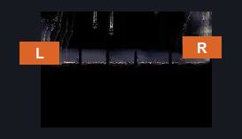
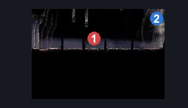
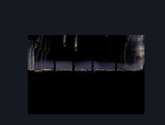

# Last Judge Arena (Coral_Judge_Arena)

**Game ID:** Coral_Judge_Arena

**Contributors:** skai

## Subrooms

No subrooms defined.

## Room Transitions

| Alias | Name | From subroom | Destination | Destination alias | Requirements | TODO | Verification | Annotated | Notes |
| --- | --- | --- | --- | --- | --- | --- | --- | --- | --- |
| L | Left |  | [Pre Last Judge Room (Coral_32)](pre-last-judge-room.md) | R | Nothing |  | Verified | ✓ |  |
| R | Right |  | [Grand Bridge (Coral_10)](../grand-gate/grand-bridge.md) | L | defeat Boss: Last Judge |  | Verified | ✓ |  |

## Subroom Connections

No subroom connections defined.

## Check Locations

| No. | Check | Subroom | Requirements | TODO | Verification | Location Type | Annotated | Notes |
| --- | --- | --- | --- | --- | --- | --- | --- | --- |
| 1 | Boss: Last Judge |  | prereq Five Bellshrines Rung AND (Progressive Swift Step 2 OR Faydown) |  | Verified | boss | ✓ | Combat Requirements |
| 2 | Five Bellshrines Rung |  | activated bellshrines 5 |  | Verified | event | ✓ |  |
| 3 | flea caravan move to fleatopia |  | after THE flea caravan move to blasted steps AND fleas 22 AND after THE reached pale lake |  | Verified | event |  |  |

## Room Images

### Connections

### Checks

### Scene

