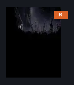
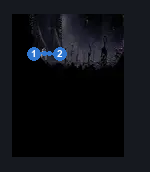
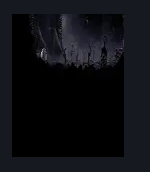

# Lumble the Lucky (Coral_33)

**Game ID:** Coral_33

**Contributors:** skai

## Subrooms

No subrooms defined.

## Room Transitions

| Alias | Name | From subroom | Destination | Destination alias | Requirements | TODO | Verification | Annotated | Notes |
| --- | --- | --- | --- | --- | --- | --- | --- | --- | --- |
| R | Right |  | [Blasted Steps Horizontal Room with Two Sand Pits (Coral_43)](blasted-steps-horizontal-room-with-two-sand-pits.md) | L | Nothing |  | Verified | ✓ |  |

## Subroom Connections

No subroom connections defined.

## Check Locations

| No. | Check | Subroom | Requirements | TODO | Verification | Location Type | Annotated | Notes |
| --- | --- | --- | --- | --- | --- | --- | --- | --- |
| 1 | Magnetite Dice |  | ( Complete Bankrupt Lumble OR Prereq Clawline Pickup IN Underworks Clawline Room OR Prereq THE cogwork dancers boss fight ) AND ( Act 1 OR Act 2 ) |  | Verified | collectible | ✓ |  |
| 2 | Bankrupt Lumble |  | None |  | Verified | event | ✓ |  |
| 3 | Lost Garmond Boss Fight |  | complete THE Hero's Call Wish Promised |  | Verified | boss |  |  |
| 4 | Hero's Call Wish Granted |  | defeat Lost Garmond Boss Fight |  | Verified | event |  |  |
| 5 | Hero's Memento |  | defeat Lost Garmond Boss Fight |  | Verified | collectible |  |  |

## Room Images

### Connections

### Checks

### Scene

