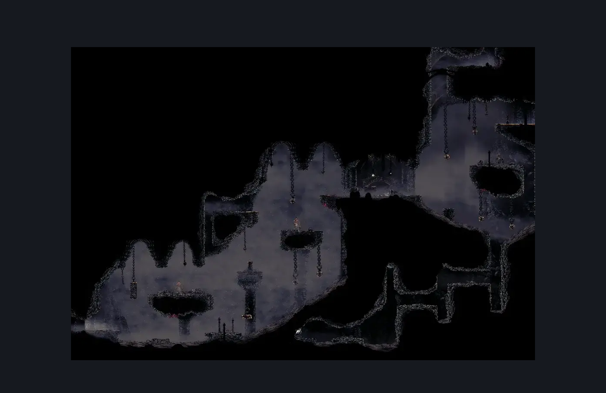
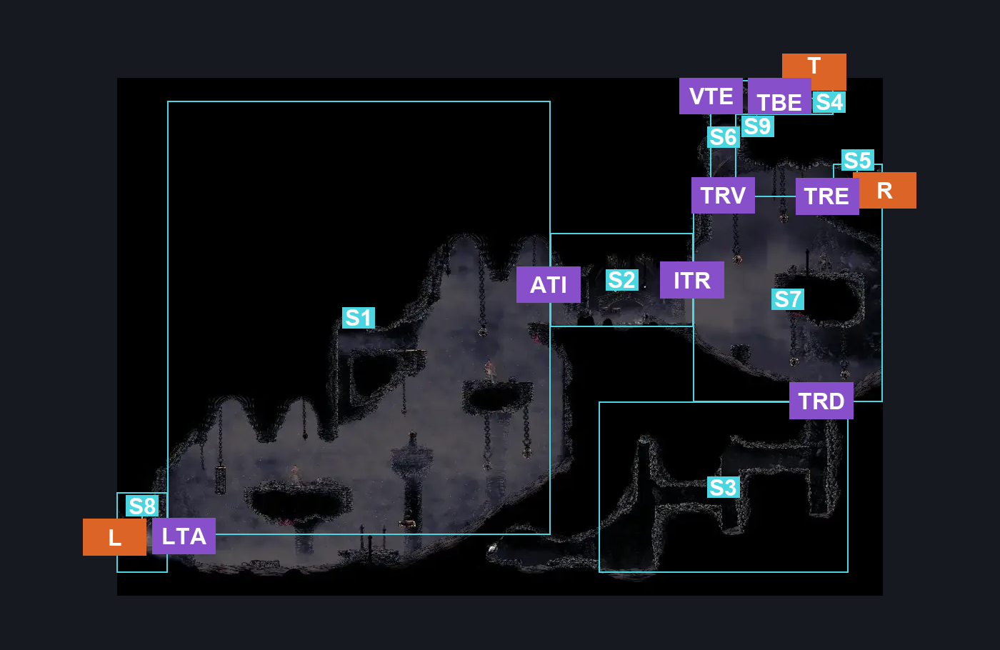
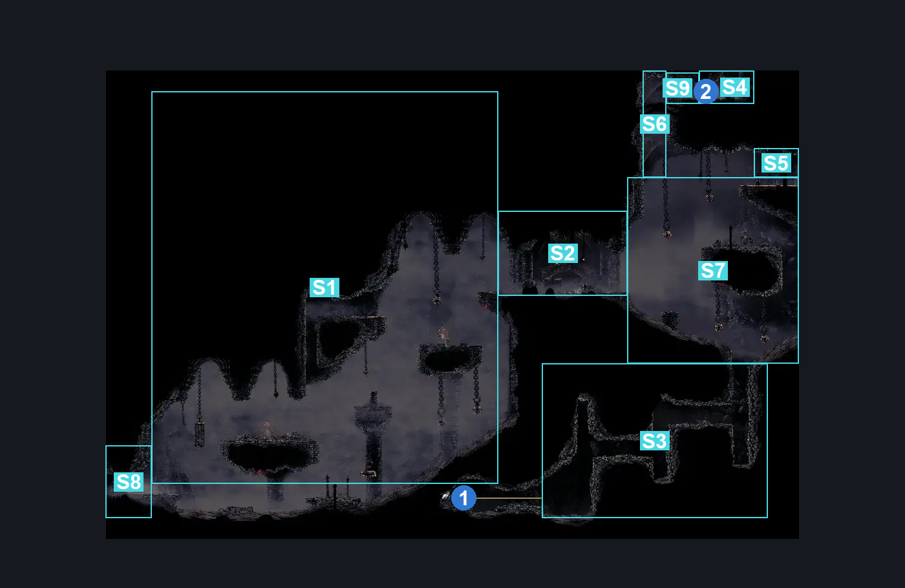

# Pre Last Judge Room (Coral_32)

**Game ID:** Coral_32

**Contributors:** skai

## Subrooms

| No. | Subroom | Annotated |
| --- | --- | --- |
| S1 | Ascension | ✓ |
| S2 | Intermission | ✓ |
| S3 | Descent | ✓ |
| S4 | Top (Entrance) | ✓ |
| S5 | Right (Entrance) | ✓ |
| S6 | Top Vertical Shaft | ✓ |
| S7 | Top Right | ✓ |
| S8 | Left (Entrance) | ✓ |
| S9 | Top (Blocked Side) | ✓ |

## Room Transitions

| Alias | Name | From subroom | Destination | Destination alias | Requirements | TODO | Verification | Annotated | Notes |
| --- | --- | --- | --- | --- | --- | --- | --- | --- | --- |
| L | Left | Left (Entrance) | [Blasted Steps Wide Long Vertical (Coral_03)](blasted-steps-wide-long-vertical.md) | TR | Nothing |  | Verified | ✓ |  |
| T | Top | Top (Entrance) | [Sands of Karak Elevator to Blasted Steps (Coral_38)](../sands-of-karak/sands-of-karak-elevator-to-blasted-steps.md) | F | Nothing |  | Verified | ✓ | Have to come from Coral_38 side |
| R | Right | Right (Entrance) | [Last Judge Arena (Coral_Judge_Arena)](last-judge-arena.md) | L | Nothing |  | Verified | ✓ |  |

## Subroom Connections

| Alias | Name | Source | Destination | Requirements | TODO | Verification | Annotated | Notes |
| --- | --- | --- | --- | --- | --- | --- | --- | --- |
| LTA | Left to Ascension | Left (Entrance) | Ascension | Progressive Swift Step 1 OR Faydown OR Clawline OR Drifter's Cloak OR Silk Soar OR Flea Brew |  | Verified | ✓ |  |
| LTA | Left to Ascension | Ascension | Left (Entrance) | ((Progressive Swift Step 1 OR Faydown OR Clawline OR Drifter's Cloak OR (Flea Brew AND Ledge Grab)) AND Cling Grip) OR Silk Soar |  | Verified | ✓ |  |
| ATI | Ascension to Intermission | Ascension | Intermission | ((Progressive Swift Step 2 OR Faydown OR Clawline OR Drifter's Cloak OR (Flea Brew AND Ledge Grab)) AND Cling Grip) OR Silk Soar |  | Verified | ✓ |  |
| ATI | Ascension to Intermission | Intermission | Ascension | Nothing (Fall) |  | Verified | ✓ |  |
| ITR | Intermission to Top Right | Intermission | Top Right | Nothing (Fall) |  | Verified | ✓ |  |
| ITR | Intermission to Top Right | Top Right | Intermission | Ledge Grab |  | Verified | ✓ |  |
| TRD | Top Right to Descent | Top Right | Descent | Nothing (Fall) |  | Verified | ✓ |  |
| TRD | Top Right to Descent | Descent | Top Right | ((Progressive Swift Step 2 OR Faydown OR Clawline OR Drifter's Cloak OR (Flea Brew AND (Ledge Grab OR Easy Hazard Respawn)))) AND Cling Grip |  | Verified | ✓ |  |
| TRV | Top Right to Top Vertical | Top Right | Top Vertical Shaft | ((Progressive Swift Step 2 OR Faydown OR Clawline OR Drifter's Cloak OR (Flea Brew AND Ledge Grab)) AND Cling Grip) OR Silk Soar |  | Verified | ✓ |  |
| TRV | Top Right to Top Vertical | Top Vertical Shaft | Top Right | Nothing (Fall) |  | Verified | ✓ |  |
| VTE | Top Vertical to Top (Entrance) | Top Vertical Shaft | Top (Blocked Side) | Cling Grip OR Silk Soar |  | Verified | ✓ |  |
| VTE | Top Vertical to Top (Entrance) | Top (Blocked Side) | Top Vertical Shaft | Nothing (Fall) |  | Verified | ✓ |  |
| TRE | Top Right to Right (Entrance) | Top Right | Right (Entrance) | ((Progressive Swift Step 2 OR Faydown OR Clawline OR Drifter's Cloak OR (Flea Brew AND Ledge Grab)) AND Cling Grip) OR Silk Soar |  | Verified | ✓ |  |
| TRE | Top Right to Right (Entrance) | Right (Entrance) | Top Right | Nothing (Fall) |  | Verified | ✓ |  |
| TBE | Top Blocked to Entrance | Top (Blocked Side) | Top (Entrance) | Clear Spiky Blockade |  | Verified | ✓ |  |
| TBE | Top Blocked to Entrance | Top (Entrance) | Top (Blocked Side) | Clear Spiky Blockade |  | Verified | ✓ |  |

## Check Locations

| No. | Check | Subroom | Requirements | TODO | Verification | Location Type | Annotated | Notes |
| --- | --- | --- | --- | --- | --- | --- | --- | --- |
| 1 | Craftmetal: Blasted Steps | Descent | Faydown OR Clawline OR Drifter's Cloak OR Sharpdart OR Medium Shaman Pogo OR (Progressive Swift Step 1 AND Ledge Grab) |  | Verified | collectible | ✓ |  |
| 2 | Spiky Blockade | Top (Entrance) | Break Wall Left |  | Verified | blockade | ✓ |  |

## Room Images

### Scene

### Connections

### Checks

