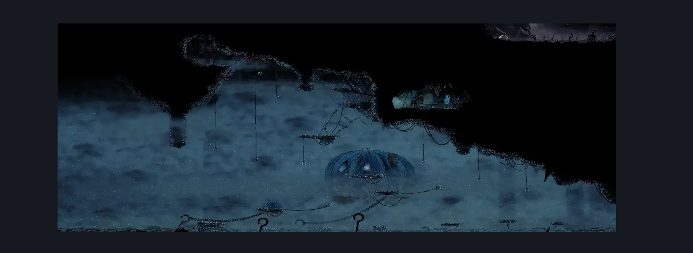
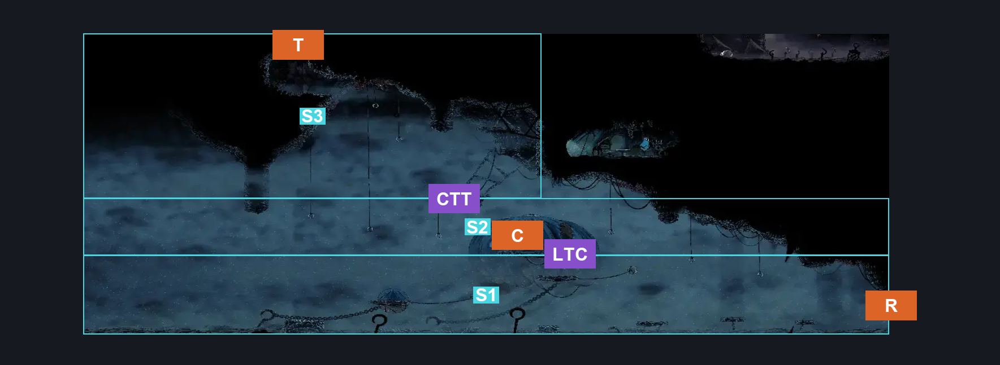
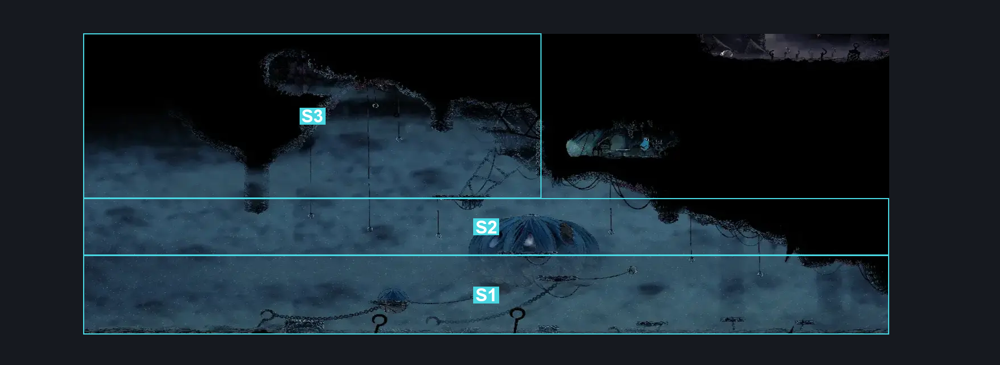

# Windy Pinstress Entrance (Coral_34)

**Game ID:** Coral_34

**Contributors:** skai

## Subrooms

| No. | Subroom | Annotated |
| --- | --- | --- |
| S1 | Lower Third | ✓ |
| S2 | Middle Third | ✓ |
| S3 | Upper Third | ✓ |

## Room Transitions

| Alias | Name | From subroom | Destination | Destination alias | Requirements | TODO | Verification | Annotated | Notes |
| --- | --- | --- | --- | --- | --- | --- | --- | --- | --- |
| R | Right | Lower Third | [Horizontal Room with Sand Pit (Coral_11b)](horizontal-room-with-sand-pit.md) | L | Nothing |  | Verified | ✓ |  |
| C | Center | Middle Third | [Windy Pinstress Room (Room_Pinstress)](windy-pinstress-room.md) | L | Nothing (Falling) |  | Verified | ✓ |  |
| T | Top | Upper Third | [Sands of Karak Entrance (Coral_25)](../sands-of-karak/sands-of-karak-entrance.md) | F | Cling Grip OR (Scuttlebrace AND Faydown) OR Silk Soar |  | Verified | ✓ |  |

## Subroom Connections

| Alias | Name | Source | Destination | Requirements | TODO | Verification | Annotated | Notes |
| --- | --- | --- | --- | --- | --- | --- | --- | --- |
| LTC | Lower to Center | Lower Third | Middle Third | Clawline OR (Silk Soar AND Progressive Swift Step 2) OR (Flea Brew AND (Faydown OR (Progressive Swift Step 2 AND Ledge Grab) OR (Easy Beast Crest Pogo AND Ledge Grab))) |  | Verified | ✓ |  |
| LTC | Lower to Center | Middle Third | Lower Third | Nothing (Falling) |  | Verified | ✓ |  |
| CTT | Center to Top | Middle Third | Upper Third | (Clawline AND (Cling Grip OR Scuttlebrace)) OR (Clawline AND Cling Grip AND (Faydown OR (Easy Beast Crest Pogo AND Ledge Grab))) |  | Verified | ✓ |  |
| CTT | Center to Top | Upper Third | Middle Third | Nothing (Falling) |  | Verified | ✓ |  |

## Check Locations

No check locations defined.

## Room Images

### Scene

### Connections

### Checks

