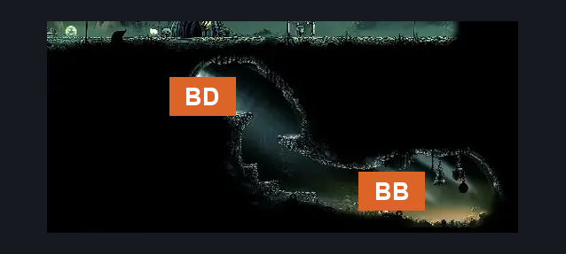
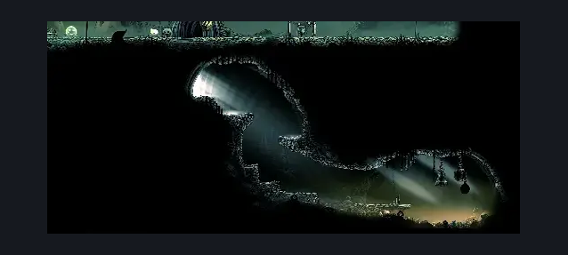

# Bone Bottom Bellway (Bellway_01)

**Game ID:** Bellway_01

**Contributors:** herounit

## Subrooms

No subrooms defined.

## Room Transitions

| Alias | Name | From subroom | Destination | Destination alias | Requirements | TODO | Verification | Annotated | Notes |
| --- | --- | --- | --- | --- | --- | --- | --- | --- | --- |
| BD | bellway door |  | [Bone Bottom Town (Bonetown)](bone-bottom-town.md) | BD | none |  | Verified | ✓ |  |
| BB | bell beast |  | [Bellway Menu](../fast-travel/bellway-menu.md) | BB | unlock bellway bone bottom |  | Verified | ✓ |  |

## Subroom Connections

No subroom connections defined.

## Check Locations

| No. | Check | Subroom | Requirements | TODO | Verification | Location Type | Annotated | Notes |
| --- | --- | --- | --- | --- | --- | --- | --- | --- |
| 1 | bellway bone bottom |  | defeat THE bell beast boss fight |  | Verified | travel |  |  |

## Room Images

### Scene

### Connections

### Checks

