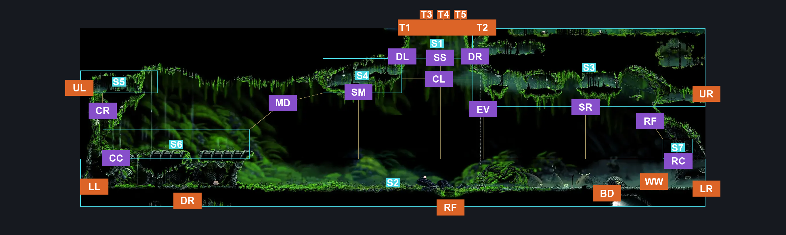
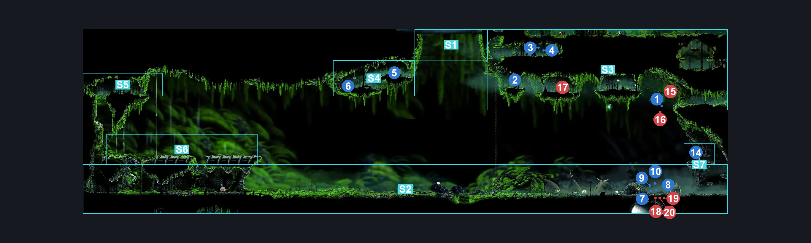
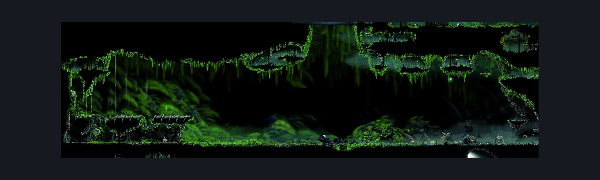

# Bone Bottom Town (Bonetown)

**Game ID:** Bonetown

**Contributors:** herounit, Super EpicGuy

## Subrooms

| No. | Subroom | Annotated |
| --- | --- | --- |
| S1 | sky | ✓ |
| S2 | ground level | ✓ |
| S3 | upper right platforms | ✓ |
| S4 | upper middle platforms | ✓ |
| S5 | upper left platforms | ✓ |
| S6 | chapel roof | ✓ |
| S7 | shakra platform | ✓ |

## Room Transitions

| Alias | Name | From subroom | Destination | Destination alias | Requirements | TODO | Verification | Annotated | Notes |
| --- | --- | --- | --- | --- | --- | --- | --- | --- | --- |
| UL | upper left | upper left platforms | [Bonegrave (Bonegrave)](bonegrave.md) | UR | none |  | Verified | ✓ |  |
| LL | lower left | ground level | [Bonegrave (Bonegrave)](bonegrave.md) | LR | clear vines holding door closed IN bonegrave |  | Verified | ✓ |  |
| DR | descend rope | ground level | [Ruined Chapel (Tut_03)](../moss-grotto/ruined-chapel.md) | AR | none |  | Verified | ✓ |  |
| RF | right floor | ground level | [Moss Grotto Center (Tut_01)](../moss-grotto/moss-grotto-center.md) | C | none |  | Verified | ✓ |  |
| BD | bellway door | ground level | [Bone Bottom Bellway (Bellway_01)](bone-bottom-bellway.md) | BD | none |  | Verified | ✓ |  |
| LR | lower right | ground level | [The Marrow Entrance (Bone_01)](../the-marrow/the-marrow-entrance.md) | LL | none |  | Verified | ✓ |  |
| UR | upper right | upper right platforms | [Mosshome Basement Passage (Bone_01b)](mosshome-basement-passage.md) | LL | none |  | Verified | ✓ |  |
| T1 | top1 | sky | [The Big Fall (Aspid_01)](the-big-fall.md) | B1 | silk soar |  | Verified | ✓ |  |
| T2 | right ceiling | upper right platforms | [The Big Fall (Aspid_01)](the-big-fall.md) | B2 | ledge grab  OR scuttlebrace  OR cling grip  OR silk soar OR dash  OR easy shaman pogo |  | Verified | ✓ | didn't want to make a tiny subroom to account for the ledge grab to get up here |
| T3 | top3 | sky | [The Big Fall (Aspid_01)](the-big-fall.md) | B3 | silk soar |  | Verified | ✓ |  |
| T4 | top4 | sky | [The Big Fall (Aspid_01)](the-big-fall.md) | B4 | silk soar |  | Verified | ✓ |  |
| T5 | top5 | sky | [The Big Fall (Aspid_01)](the-big-fall.md) | B5 | silk soar |  | Verified | ✓ |  |
| WW | wish wall | ground level | [Bone Bottom Wish Wall](../wish-menus/bone-bottom-wish-wall.md) | BB | defeat THE bell beast boss fight OR visit shellwood |  | Verified | ✓ | "IT'S NOT BELL BEAST DEFEAT OR WIDOW DEFEAT FOR BONE BOTTOM WISH WALL IT'S BELL BEAST DEFEATED OR SHELLWOOD VISITED???" - Moriko, in utter denial |

## Subroom Connections

| Alias | Name | Source | Destination | Requirements | TODO | Verification | Annotated | Notes |
| --- | --- | --- | --- | --- | --- | --- | --- | --- |
| CC | climb chapel | ground level | chapel roof | silk soar  OR cling grip  OR ( scuttlebrace AND faydown cloak ) |  | Verified | ✓ | cling grip only works by itself when the door has not been opened - this makes logic non-monotonic and needs a mod fix |
| SM | soar to middle platforms | ground level | upper middle platforms | silk soar |  | Verified | ✓ |  |
| SS | soar to sky exit | ground level | sky | silk soar |  | Verified | ✓ |  |
| SR | soar to right platforms | ground level | upper right platforms | silk soar |  | Verified | ✓ |  |
| EV | elevator | ground level | upper right platforms | activate elevator switch |  | Verified | ✓ |  |
| EV | elevator | upper right platforms | ground level | activate elevator switch |  | Verified | ✓ |  |
| CC | climb chapel | chapel roof | ground level | none (falling) |  | Verified | ✓ |  |
| CR | climb roof | chapel roof | upper left platforms | silk soar  OR cling grip  OR ( easy scuttlebrace AND faydown cloak ) OR ( hard scuttlebrace AND ( hard heal stall AND ( have crest hunter OR have crest reaper OR have crest wanderer OR have crest beast OR have crest architect ) ) ) OR ( hard scuttlebrace AND ( thread storm OR rune rage ) ) |  | Verified | ✓ | You need a very precise heal or spell boost to scuttlebrace the wall without wings, which can be done by anything but witch crest |
| CR | climb roof | upper left platforms | chapel roof | none (falling) |  | Verified | ✓ |  |
| MD | middle platform drift | upper middle platforms | chapel roof | drifters  OR clawline  OR sharpdart  OR easy beast pogo OR easy architect pogo OR ( hard shaman pogo )  OR ( ledge grab AND easy shaman pogo ) OR ( dash AND ( easy hunter pogo OR easy naked pogo ) )  OR ( dash AND ( scuttlebrace OR flea brew OR silkspeed anklets OR faydown cloak ) )  OR ( run AND flea brew ) |  | Verified | ✓ | Beast and architect can just spam pogo |
| SM | soar to middle platforms | upper middle platforms | ground level | none (falling) |  | Verified | ✓ |  |
| CL | clawline across the sky | upper middle platforms | upper right platforms | clawline  OR ( dash AND ( sharpdart OR drifters ) )  OR ( run AND sharpdart )  OR ( drifters AND ( faydown cloak OR proficient movement ) ) |  | Verified | ✓ | This is how it is currently implemented in the apworld; need to verify with SEG as it was malformed prior to correction. - hero |
| CL | clawline across the sky | upper right platforms | upper middle platforms | clawline  OR ( dash AND ( sharpdart OR drifters ) )  OR ( run AND sharpdart )  OR ( drifters AND ( faydown cloak OR proficient movement ) ) |  | Verified | ✓ | This is how it is currently implemented in the apworld; need to verify with SEG as it was malformed prior to correction. - hero |
| SR | soar to right platforms | upper right platforms | ground level | none (falling) |  | Verified | ✓ |  |
| DL | sky drift to right platforms | sky | upper middle platforms | drifters  OR clawline OR faydown OR sharpdart OR dash OR easy beast pogo OR easy hunter pogo OR easy architect pogo |  | Verified | ✓ |  |
| DR | sky drift to middle platforms | sky | upper right platforms | drifters  OR clawline OR faydown OR sharpdart OR dash OR easy beast pogo OR easy hunter pogo OR easy architect pogo |  | Verified | ✓ |  |
| SS | soar to sky exit | sky | ground level | none (falling) |  | Verified | ✓ |  |
| RC | right platform climb | ground level | shakra platform | ledge grab OR cling grip OR silk soar OR faydown |  | Verified | ✓ |  |
| RC | right platform climb | shakra platform | ground level | none (falling) |  | Verified | ✓ |  |
| RF | right platform fall | upper right platforms | shakra platform | none (falling) |  | Verified | ✓ |  |

## Check Locations

| No. | Check | Subroom | Requirements | TODO | Verification | Location Type | Annotated | Notes |
| --- | --- | --- | --- | --- | --- | --- | --- | --- |
| 1 | bone bottom mossberry | upper right platforms | none |  | Verified | collectible | ✓ |  |
| 2 | elevator switch | upper right platforms | flip switch up |  | Verified | switch | ✓ |  |
| 3 | bone bottom rosary cache 8 | upper right platforms | none |  | Verified | collectible | ✓ |  |
| 4 | bone bottom rosary cache 9 | upper right platforms | none |  | Verified | collectible | ✓ |  |
| 5 | weaver effigy camora moss grotto | upper middle platforms | none |  | Verified | collectible | ✓ |  |
| 6 | bone bottom rosary dish | upper middle platforms | none |  | Verified | collectible | ✓ |  |
| 7 | magnetite broach | ground level | ( act 1 OR act 2 ) AND spend 120 rosaries |  | Verified | collectible | ✓ | pebb's shop |
| 8 | mask shard pebbs shop grindle act 3 | ground level | ( act 1 OR act 2 ) AND spend 300 rosaries |  | Verified | collectible | ✓ | pebb's shop |
| 9 | bone bottom shop craft metal | ground level | ( act 1 OR act 2 ) AND spend 60 rosaries |  | Verified | collectible | ✓ | pebb's shop |
| 10 | simple key | ground level | ( act 1 OR act 2 ) AND spend 500 rosaries |  | Verified | collectible | ✓ | pebb's shop |
| 11 | shell shard cache bone bottom | ground level | complete THE an icon of hope wish granted |  | Verified | collectible |  |  |
| 12 | skull tyrant bone bottom boss fight | ground level | complete THE the terrible tyrant wish granted AND ( visit blasted steps  OR visit the citadel  OR visit sinners road ) |  | Verified | boss |  | may be other hidden requirements. wiki says 30% chance of spawn after reaching key areas and using a bench in the zone. |
| 13 | reach bone bottom | ground level | none |  | Verified | logic-point |  | addresses the loading zone blocker in moss grotto center ceiling that only goes away once you've been up here - remove this/requirement in moss grotto center if/when this is removed in the randomizer |
| 14 | Mister Mushroom Meeting Bone Bottom | shakra platform | after THE Mister Mushroom Meeting Moss Grotto AND Needolin |  | Verified | event | ✓ |  |
| 15 | Aknid 1 | upper right platforms | Normal World Spawn |  | Verified | enemy | ✓ |  |
| 16 | Aknid 2 | upper right platforms | Normal World Spawn |  | Verified | enemy | ✓ |  |
| 17 | Aknid 3 | upper right platforms | Normal World Spawn |  | Verified | enemy | ✓ |  |
| 18 | Snitchfly 1 | ground level | Black Thread World Spawn |  | Verified | enemy | ✓ |  |
| 19 | Snitchfly 2 | ground level | Black Thread World Spawn |  | Verified | enemy | ✓ |  |
| 20 | Snitchfly 3 | ground level | Black Thread World Spawn |  | Verified | enemy | ✓ |  |

## Room Images

### Connections

### Checks

### Scene

