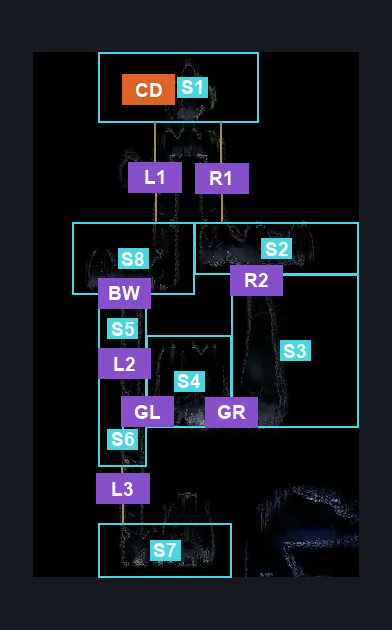
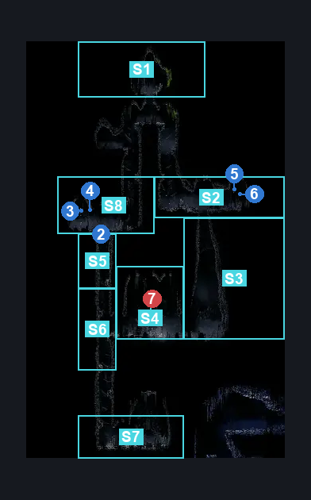
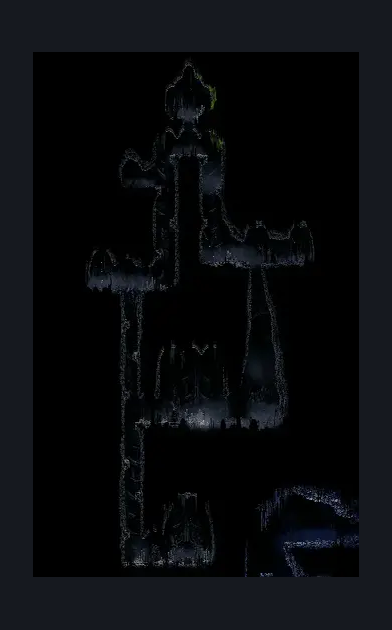

# Chapel of the Wanderer (Chapel_Wanderer)

**Game ID:** Chapel_Wanderer

**Contributors:** herounit

## Subrooms

| No. | Subroom | Annotated |
| --- | --- | --- |
| S1 | door platform | ✓ |
| S2 | upper right | ✓ |
| S3 | middle right | ✓ |
| S4 | gauntlet arena | ✓ |
| S5 | lower left shaft 1 | ✓ |
| S6 | lower left shaft 2 | ✓ |
| S7 | crest room | ✓ |
| S8 | upper left | ✓ |

## Room Transitions

| Alias | Name | From subroom | Destination | Destination alias | Requirements | TODO | Verification | Annotated | Notes |
| --- | --- | --- | --- | --- | --- | --- | --- | --- | --- |
| CD | chapel door | door platform | [Bonegrave (Bonegrave)](bonegrave.md) | CD | none |  | Verified | ✓ |  |

## Subroom Connections

| Alias | Name | Source | Destination | Requirements | TODO | Verification | Annotated | Notes |
| --- | --- | --- | --- | --- | --- | --- | --- | --- |
| R1 | right 1 | door platform | upper right | none (falling) |  | Verified | ✓ |  |
| R1 | right 1 | upper right | door platform | ledge grab OR cling grip OR faydown cloak OR silk soar |  | Verified | ✓ |  |
| R2 | right 2 | upper right | middle right | none (falling) |  | Verified | ✓ |  |
| R2 | right 2 | middle right | upper right | silk soar OR cling grip |  | Verified | ✓ |  |
| GR | gauntlet right | middle right | gauntlet arena | none (starts gauntlet) |  | Verified | ✓ |  |
| GR | gauntlet right | gauntlet arena | middle right | clear gauntlet fight |  | Verified | ✓ |  |
| GL | gauntlet left | gauntlet arena | lower left shaft 2 | clear gauntlet fight |  | Verified | ✓ |  |
| GL | gauntlet left | lower left shaft 2 | gauntlet arena | none (starts gauntlet) |  | Verified | ✓ | need to verify this with noclip, but probably doesn't matter |
| L1 | left 1 | door platform | upper left | none (falling) |  | Verified | ✓ |  |
| L1 | left 1 | upper left | door platform | ledge grab OR cling grip OR faydown cloak OR silk soar |  | Verified | ✓ |  |
| BW | break wall | lower left shaft 1 | upper left | clear one way wall |  | Verified | ✓ |  |
| BW | break wall | upper left | lower left shaft 1 | clear one way wall |  | Verified | ✓ |  |
| L2 | left 2 | lower left shaft 1 | lower left shaft 2 | none (falling) |  | Verified | ✓ |  |
| L2 | left 2 | lower left shaft 2 | lower left shaft 1 | ledge grab OR cling grip OR faydown cloak OR silk soar |  | Verified | ✓ |  |
| L3 | left 3 | lower left shaft 2 | crest room | none (falling) |  | Verified | ✓ |  |
| L3 | left 3 | crest room | lower left shaft 2 | ledge grab OR cling grip OR faydown cloak OR silk soar |  | Verified | ✓ |  |

## Check Locations

| No. | Check | Subroom | Requirements | TODO | Verification | Location Type | Annotated | Notes |
| --- | --- | --- | --- | --- | --- | --- | --- | --- |
| 1 | wanderer's crest | crest room | none |  | Verified | collectible |  |  |
| 2 | One Way Wall | lower left shaft 1 | break wall up OR break wall right |  | Verified | blockade | ✓ |  |
| 3 | bonegrave rosary cache 1 | upper left | none |  | Verified | collectible | ✓ |  |
| 4 | bonegrave rosary cache 2 | upper left | none |  | Verified | collectible | ✓ |  |
| 5 | bonegrave rosary cache 3 | upper right | none |  | Verified | collectible | ✓ |  |
| 6 | bonegrave rosary cache 4 | upper right | none |  | Verified | collectible | ✓ |  |
| 7 | gauntlet fight | gauntlet arena | none |  | Verified | gauntlet | ✓ |  |

## Notes

need see if there are other checks in here

## Room Images

### Connections

### Checks

### Scene

