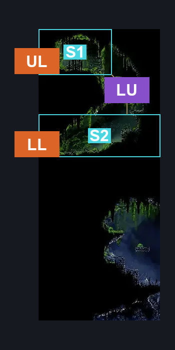
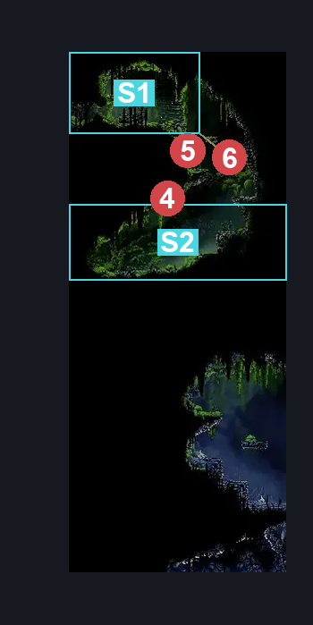
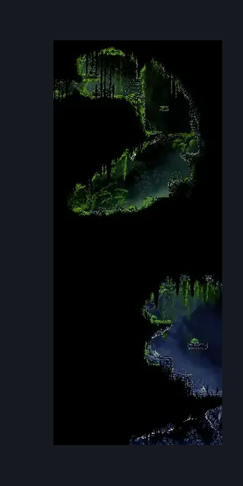

# Mosshome Basement Passage (Bone_01b)

**Game ID:** Bone_01b

**Contributors:** herounit

## Subrooms

| No. | Subroom | Annotated |
| --- | --- | --- |
| S1 | upper level | ✓ |
| S2 | lower level | ✓ |

## Room Transitions

| Alias | Name | From subroom | Destination | Destination alias | Requirements | TODO | Verification | Annotated | Notes |
| --- | --- | --- | --- | --- | --- | --- | --- | --- | --- |
| UL | upper left | upper level | [Mosshome Basement (Bone_11b)](mosshome-basement.md) | R | break wall left |  | Verified | ✓ |  |
| LL | lower left | lower level | [Bone Bottom Town (Bonetown)](bone-bottom-town.md) | UR | none |  | Verified | ✓ |  |

## Subroom Connections

| Alias | Name | Source | Destination | Requirements | TODO | Verification | Annotated | Notes |
| --- | --- | --- | --- | --- | --- | --- | --- | --- |
| LU | lower to upper | lower level | upper level | ledge grab OR cling grip OR faydown OR silk soar OR easy shaman pogo |  | Verified | ✓ |  |
| LU | lower to upper | upper level | lower level | none (falling) |  | Verified | ✓ |  |

## Check Locations

| No. | Check | Subroom | Requirements | TODO | Verification | Location Type | Annotated | Notes |
| --- | --- | --- | --- | --- | --- | --- | --- | --- |
| 1 | the marrow mosslands passage rosary cache 1 | upper level | none |  | Verified | collectible |  |  |
| 2 | the marrow mosslands passage rosary cache 2 | upper level | none |  | Verified | collectible |  |  |
| 3 | the marrow mosshome basement rosary dish | upper level | none |  | Verified | collectible |  |  |
| 4 | Aknid 1 | lower level | Normal World Spawn |  | Verified | enemy | ✓ |  |
| 5 | Aknid 2 | upper level | Black Thread World Spawn |  | Verified | enemy | ✓ |  |
| 6 | Aknid 3 | upper level | Black Thread World Spawn |  | Verified | enemy | ✓ |  |

## Room Images

### Connections

### Checks

### Scene

