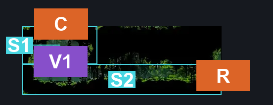
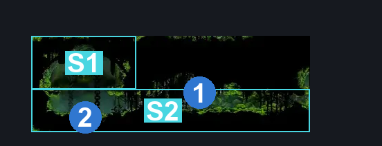
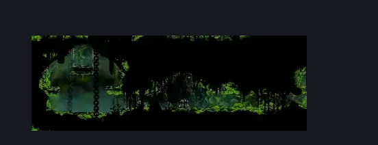

# Mosshome Basement (Bone_11b)

**Game ID:** Bone_11b

**Contributors:** herounit

## Subrooms

| No. | Subroom | Annotated |
| --- | --- | --- |
| S1 | upper level | ✓ |
| S2 | lower level | ✓ |

## Room Transitions

| Alias | Name | From subroom | Destination | Destination alias | Requirements | TODO | Verification | Annotated | Notes |
| --- | --- | --- | --- | --- | --- | --- | --- | --- | --- |
| C | ceiling | upper level | [Mosshome Lower (Bone_11)](mosshome-lower.md) | F | activate pressure plate |  | Verified | ✓ |  |
| R | right | lower level | [Mosshome Basement Passage (Bone_01b)](mosshome-basement-passage.md) | UL | none |  | Verified | ✓ |  |

## Subroom Connections

| Alias | Name | Source | Destination | Requirements | TODO | Verification | Annotated | Notes |
| --- | --- | --- | --- | --- | --- | --- | --- | --- |
| V1 | vertical 1 | lower level | upper level | ledge grab OR cling grip OR faydown OR silk soar OR easy shaman pogo |  | Verified | ✓ |  |
| V1 | vertical 1 | upper level | lower level | none (falling) |  | Verified | ✓ |  |

## Check Locations

| No. | Check | Subroom | Requirements | TODO | Verification | Location Type | Annotated | Notes |
| --- | --- | --- | --- | --- | --- | --- | --- | --- |
| 1 | bone bottom spool fragment | lower level | none |  | Verified | collectible | ✓ |  |
| 2 | pressure plate | lower level | none (stand on it) |  | Verified | switch | ✓ |  |

## Room Images

### Connections

### Checks

### Scene

