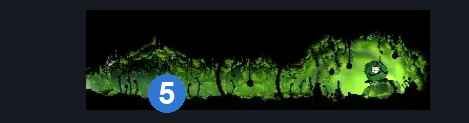
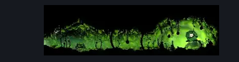

# Mosshome Druid (Mosstown_02c)

**Game ID:** Mosstown_02c

**Contributors:** herounit

## Subrooms

No subrooms defined.

## Room Transitions

| Alias | Name | From subroom | Destination | Destination alias | Requirements | TODO | Verification | Annotated | Notes |
| --- | --- | --- | --- | --- | --- | --- | --- | --- | --- |
| L | left |  | [Mosshome Upper (Mosstown_02)](mosshome-upper.md) | R | none |  | Verified | ✓ |  |

## Subroom Connections

No subroom connections defined.

## Check Locations

| No. | Check | Subroom | Requirements | TODO | Verification | Location Type | Annotated | Notes |
| --- | --- | --- | --- | --- | --- | --- | --- | --- |
| 1 | berry picking wish start |  | none |  | Verified | event |  |  |
| 2 | berry picking wish goal |  | mossberries 3 |  | Verified | event |  |  |
| 3 | druid's eye |  | complete berry picking wish goal |  | Verified | collectible |  | TRACKER POSITION WRONG AS OF v0.4.5 |
| 4 | druid's eyes |  | mossberries 7 |  | Verified | collectible |  | TRACKER POSITION WRONG AS OF v0.4.5 |
| 5 | bench |  | none |  | Verified | bench | ✓ |  |

## Room Images

### Connections

### Checks

### Scene

