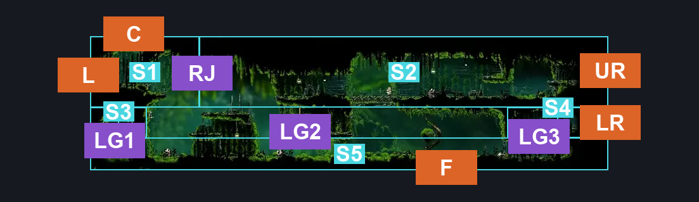
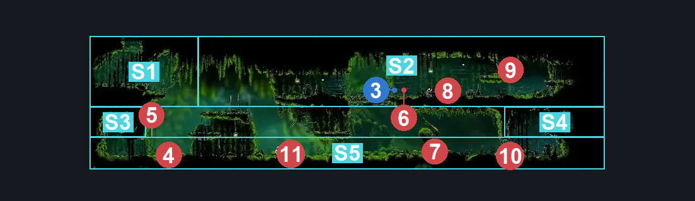
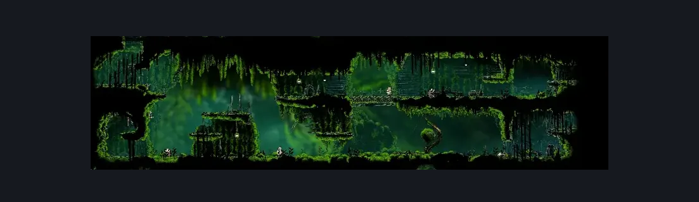

# Mosshome Lower (Bone_11)

**Game ID:** Bone_11

**Contributors:** herounit

## Subrooms

| No. | Subroom | Annotated |
| --- | --- | --- |
| S1 | upper left exit | ✓ |
| S2 | upper right level | ✓ |
| S3 | rosary alcove | ✓ |
| S4 | lower right exit | ✓ |
| S5 | ground floor | ✓ |

## Room Transitions

| Alias | Name | From subroom | Destination | Destination alias | Requirements | TODO | Verification | Annotated | Notes |
| --- | --- | --- | --- | --- | --- | --- | --- | --- | --- |
| LR | lower right | lower right exit | [The Marrow Map Shop (Bone_04)](../the-marrow/the-marrow-map-shop.md) | LL | none |  | Verified | ✓ |  |
| UR | upper right | upper right level | [The Marrow Map Shop (Bone_04)](../the-marrow/the-marrow-map-shop.md) | UL | none |  | Verified | ✓ |  |
| L | left | upper left exit | [The Big Fall (Aspid_01)](the-big-fall.md) | LR | none |  | Verified | ✓ |  |
| C | ceiling | upper left exit | [Mosshome Middle (Mosstown_01)](mosshome-middle.md) | F | activate floor exit switch IN mosshome middle |  | Verified | ✓ |  |
| F | floor | ground floor | [Mosshome Basement (Bone_11b)](mosshome-basement.md) | C | activate pressure plate IN mosshome basement |  | Verified | ✓ |  |

## Subroom Connections

| Alias | Name | Source | Destination | Requirements | TODO | Verification | Annotated | Notes |
| --- | --- | --- | --- | --- | --- | --- | --- | --- |
| RJ | running jump | upper right level | upper left exit | run  OR ( dash AND ( ledge grab OR cling grip ) ) OR faydown  OR silk soar  OR clawline  OR sharpdart  OR easy beast pogo  OR easy enemy pogo |  | Verified | ✓ |  |
| RJ | running jump | upper left exit | upper right level | none (falling) |  | Verified | ✓ |  |
| LG1 | ledge grab 1 | ground floor | rosary alcove | ledge grab  OR faydown cloak OR silk soar OR cling grip OR scuttlebrace OR easy shaman pogo |  | Verified | ✓ |  |
| LG1 | ledge grab 1 | rosary alcove | ground floor | none (falling) |  | Verified | ✓ |  |
| LG2 | ledge grab 2 | ground floor | upper right level | ledge grab  OR faydown cloak OR silk soar OR cling grip |  | Verified | ✓ |  |
| LG2 | ledge grab 2 | upper right level | ground floor | none (falling) |  | Verified | ✓ |  |
| LG3 | ledge grab 3 | ground floor | lower right exit | ledge grab  OR faydown cloak OR silk soar OR cling grip |  | Verified | ✓ |  |
| LG3 | ledge grab 3 | lower right exit | ground floor | none (falling) |  | Verified | ✓ |  |

## Check Locations

| No. | Check | Subroom | Requirements | TODO | Verification | Location Type | Annotated | Notes |
| --- | --- | --- | --- | --- | --- | --- | --- | --- |
| 1 | rosary cache bone bottom 4 | rosary alcove | none |  | Verified | collectible |  |  |
| 2 | rosary cache bone bottom 5 | rosary alcove | none |  | Verified | collectible |  |  |
| 3 | Garmond and Zaza Act 3 Meeting Bone Bottom | upper right level | Act 3 |  | Verified | event | ✓ |  |

## Room Images

### Connections

### Checks

### Scene

