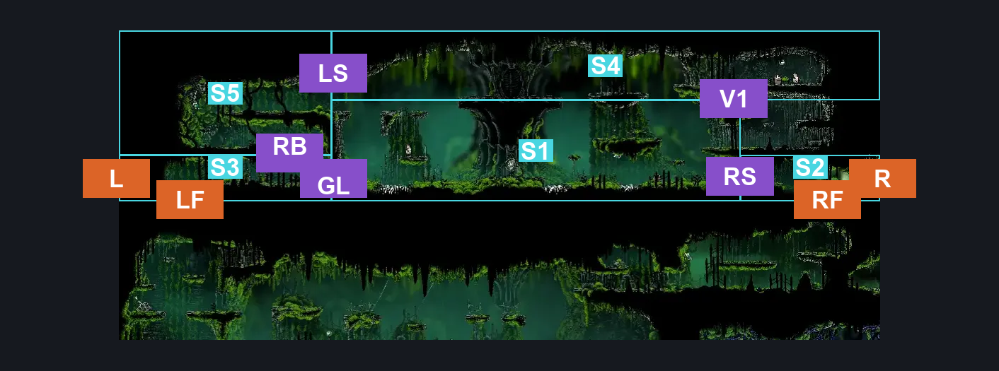
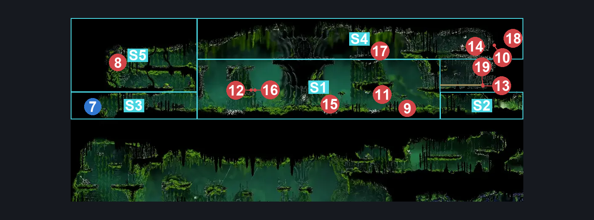
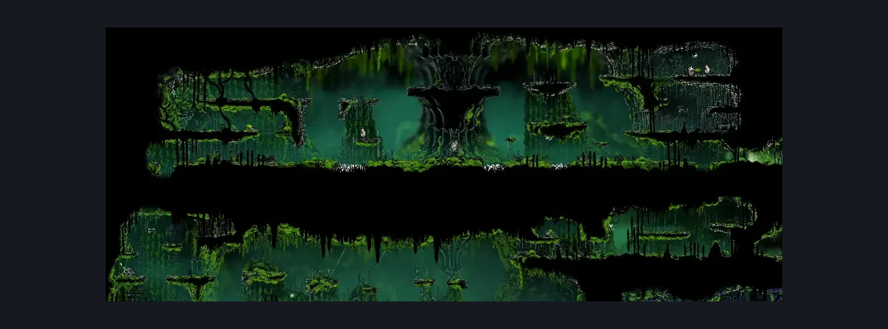

# Mosshome Upper (Mosstown_02)

**Game ID:** Mosstown_02

**Contributors:** herounit, super epicguy

## Subrooms

| No. | Subroom | Annotated |
| --- | --- | --- |
| S1 | center platforms | ✓ |
| S2 | ground right | ✓ |
| S3 | ground left | ✓ |
| S4 | spire platforms | ✓ |
| S5 | silkspear passage | ✓ |

## Room Transitions

| Alias | Name | From subroom | Destination | Destination alias | Requirements | TODO | Verification | Annotated | Notes |
| --- | --- | --- | --- | --- | --- | --- | --- | --- | --- |
| LF | left floor | ground left | [Mosshome Middle (Mosstown_01)](mosshome-middle.md) | C | none |  | Verified | ✓ |  |
| L | left | ground left | [The Big Fall (Aspid_01)](the-big-fall.md) | MR | clear left exit breakable wall |  | Verified | ✓ |  |
| RF | right floor | ground right | [Mosshome Side Room (Bone_05b)](mosshome-side-room.md) | C | none |  | Verified | ✓ |  |
| R | right | ground right | [Mosshome Druid (Mosstown_02c)](mosshome-druid.md) | L | none |  | Verified | ✓ |  |

## Subroom Connections

| Alias | Name | Source | Destination | Requirements | TODO | Verification | Annotated | Notes |
| --- | --- | --- | --- | --- | --- | --- | --- | --- |
| RS | right silk blockade | center platforms | ground right | break silk blockade |  | Verified | ✓ |  |
| RS | right silk blockade | ground right | center platforms | break silk blockade |  | Verified | ✓ |  |
| GL | left ground crossing | ground left | center platforms | ledge grab OR spike pogo OR run OR dash OR faydown OR drifters OR clawline OR sharpdart OR easy beast pogo OR easy architect charge |  | Verified | ✓ | platform above spikes make this way more complicated than it should |
| GL | left ground crossing | center platforms | ground left | ledge grab OR spike pogo OR run OR dash OR faydown OR drifters OR clawline OR sharpdart OR easy beast pogo OR easy architect charge |  | Verified | ✓ |  |
| LS | left silk blockade | spire platforms | silkspear passage | break silk blockade |  | Verified | ✓ |  |
| LS | left silk blockade | silkspear passage | spire platforms | break silk blockade |  | Verified | ✓ |  |
| RB | rope barrier | silkspear passage | ground left | clear rope platform blockade |  | Verified | ✓ |  |
| RB | rope barrier | ground left | silkspear passage | clear rope platform blockade AND ( ledge grab OR cling grip OR faydown OR silk soar OR easy shaman pogo ) |  | Verified | ✓ |  |
| V1 | vertical 1 | center platforms | spire platforms | ledge grab OR cling grip OR faydown OR silk soar OR easy shaman pogo |  | Verified | ✓ |  |
| V1 | vertical 1 | spire platforms | center platforms | none |  | Verified | ✓ |  |

## Check Locations

| No. | Check | Subroom | Requirements | TODO | Verification | Location Type | Annotated | Notes |
| --- | --- | --- | --- | --- | --- | --- | --- | --- |
| 1 | mosshome moss plaque | center platforms | none |  | Verified | lore |  |  |
| 2 | silkspear | spire platforms | none |  | Verified | collectible |  |  |
| 3 | mosshome rosary cache 3 | spire platforms | none |  | Verified | collectible |  |  |
| 4 | mosshome rosary cache 4 | spire platforms | none |  | Verified | collectible |  |  |
| 5 | frayed rosary string bone bottom silkspear passage | silkspear passage | none |  | Verified | collectible |  |  |
| 6 | rope platform blockade | silkspear passage | cut rope down OR cut rope left OR cut rope right OR cut rope up |  | Verified | blockade |  |  |
| 7 | left exit breakable wall | ground left | break wall left |  | Verified | blockade | ✓ |  |
| 8 | Aknid 1 | silkspear passage | None |  | Verified | enemy | ✓ |  |
| 9 | Pilgrim Groveller 1 | center platforms | None |  | Verified | enemy | ✓ |  |
| 10 | Pilgrim Pouncer 1 | spire platforms | None |  | Verified | enemy | ✓ |  |
| 11 | Aknid 2 | center platforms | None |  | Verified | enemy | ✓ |  |
| 12 | Pilgrim Pouncer 2 | center platforms | Normal World Spawn |  | Verified | enemy | ✓ |  |
| 13 | Pilgrim Groveller 2 | center platforms | Normal World Spawn |  | Verified | enemy | ✓ |  |
| 14 | Pilgrim Groveller 3 | spire platforms | Normal World Spawn |  | Verified | enemy | ✓ |  |
| 15 | Pilgrim Pouncer 3 | center platforms | Black Thread World Spawn |  | Verified | enemy | ✓ |  |
| 16 | Overgrown Pilgrim 1 | center platforms | Black Thread World Spawn |  | Verified | enemy | ✓ |  |
| 17 | Overgrown Pilgrim 2 | spire platforms | Black Thread World Spawn |  | Verified | enemy | ✓ |  |
| 18 | Void Mass 1 | spire platforms | Black Thread World Spawn |  | Verified | enemy | ✓ |  |
| 19 | Overgrown Pilgrim 3 | center platforms | Black Thread World Spawn |  | Verified | enemy | ✓ |  |

## Notes

known silk blockade breakers = silk spear, sharpdart, rune rage, weaver silkshot, pimpillo, and needle strikes from hunter, reaper, beast, and shaman

## Room Images

### Connections

### Checks

### Scene

