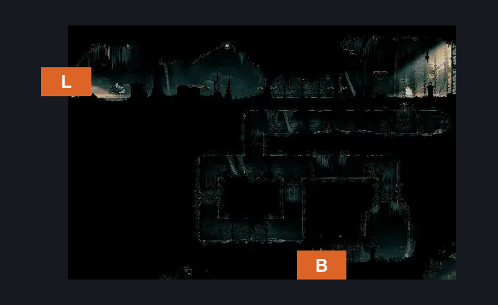
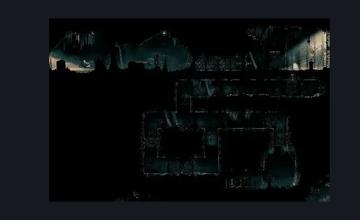

# Choral Chambers Below Dining (Song_18)

**Game ID:** Song_18

**Contributors:** samupo

## Subrooms

| No. | Subroom | Annotated |
| --- | --- | --- |
| S1 | Top |  |
| S2 | Bottom |  |

## Room Transitions

| Alias | Name | From subroom | Destination | Destination alias | Requirements | TODO | Verification | Annotated | Notes |
| --- | --- | --- | --- | --- | --- | --- | --- | --- | --- |
| L | left1 | Top | [Choral Chambers Eastern Shaft (Song_05)](choral-chambers-eastern-shaft.md) | R4 | none |  |  | ✓ |  |
| B | bot1 | Bottom | [Choral Chambers East to West (Song_27)](choral-chambers-east-to-west.md) | T | none |  |  | ✓ | one way only, cannot be traversed from the other side |

## Subroom Connections

| Alias | Name | Source | Destination | Requirements | TODO | Verification | Annotated | Notes |
| --- | --- | --- | --- | --- | --- | --- | --- | --- |
| V | Vertical | Top | Bottom | none |  |  |  | falling |
| V | Vertical | Bottom | Top | silk soar OR cling grip |  |  |  |  |

## Check Locations

No check locations defined.

## Room Images

### Scene

### Connections

### Checks

