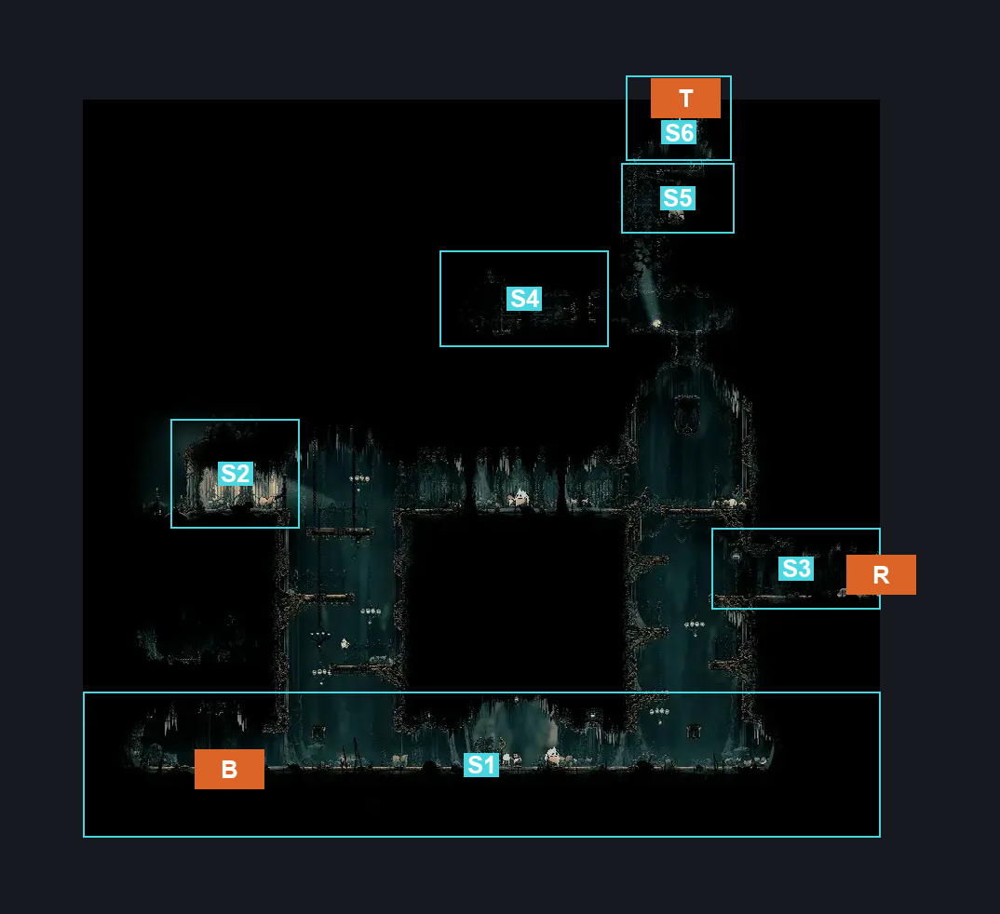
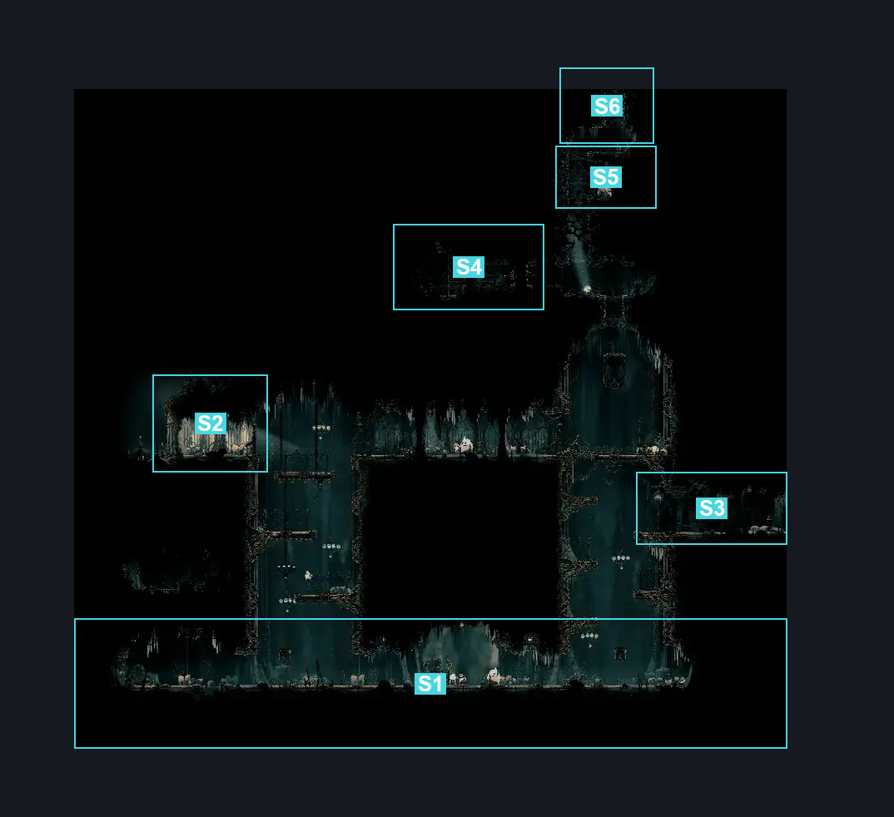
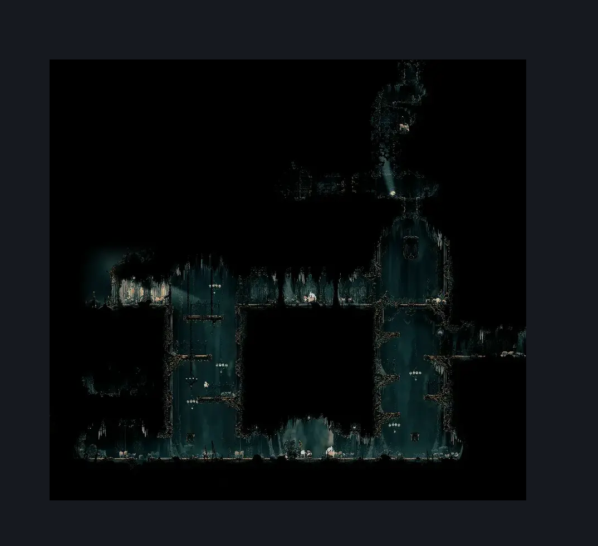

# Choral Chambers Below Ventrica (Song_01)

**Game ID:** Song_01

**Contributors:** samupo

## Subrooms

| No. | Subroom | Annotated |
| --- | --- | --- |
| S1 | Bottom | ✓ |
| S2 | Window | ✓ |
| S3 | Right Exit | ✓ |
| S4 | Side Chamber | ✓ |
| S5 | Pre Top | ✓ |
| S6 | Top | ✓ |

## Room Transitions

| Alias | Name | From subroom | Destination | Destination alias | Requirements | TODO | Verification | Annotated | Notes |
| --- | --- | --- | --- | --- | --- | --- | --- | --- | --- |
| B | bot1 | Bottom | [Grand Gate Maintenance Room (Song_01c)](../grand-gate/grand-gate-maintenance-room.md) | T | none |  |  | ✓ |  |
| T | top1 | Top | [Choral Chambers Ventrica Room (Song_01b)](choral-chambers-ventrica-room.md) | B | cling grip OR silk soar |  |  | ✓ |  |
| R | right2 | Right Exit | [Choral Chambers Outisde Underworks (Under_07b)](choral-chambers-outisde-underworks.md) | L | none |  |  | ✓ |  |

## Subroom Connections

| Alias | Name | Source | Destination | Requirements | TODO | Verification | Annotated | Notes |
| --- | --- | --- | --- | --- | --- | --- | --- | --- |
| V1 | Pre Top to Top | Pre Top | Top | cling grip OR faydown cloak |  |  |  |  |
| V2 | Side Chamber to Top | Side Chamber | Top | silk soar OR cling grip |  |  |  |  |
| V3 | Window to Side Chamber | Window | Side Chamber | silk soar OR cling grip |  |  |  |  |
| V4 | Bottom to Window | Bottom | Window | (cling grip AND (ledge grab OR clawline OR faydown cloak)) OR silk soar |  |  |  |  |
| V5 | Bottom to Right Exit | Bottom | Right Exit | faydown cloak OR (cling grip AND (ledge grab OR clawline)) OR silk soar |  |  |  |  |
| FT | Falling from Top | Top | Pre Top | none |  |  |  | falling |
| FPT | Falling from Pre Top | Pre Top | Side Chamber | none |  |  |  | falling |
| LV | Lever | Window | Right Exit | none |  |  |  | one side lever |
| SW | Side Chamber to Window | Side Chamber | Window | none |  |  |  |  |
| FW | Falling from Window | Window | Bottom | none |  |  |  | falling |
| FR | Falling from Right Exit | Right Exit | Bottom | none |  |  |  | falling |

## Check Locations

| No. | Check | Subroom | Requirements | TODO | Verification | Location Type | Annotated | Notes |
| --- | --- | --- | --- | --- | --- | --- | --- | --- |
| 1 | Rosary Cache: Choral Chambers #3 | Pre Top | none |  |  | collectible |  |  |
| 2 | Rosary Cache: Choral Chambers #4 | Pre Top | none |  |  | collectible |  |  |
| 3 | Shell Shard Cache: Choral Chambers | Side Chamber | none |  |  | collectible |  |  |
| 4 | Rosary Cache: Choral Chambers #1 | Window | none |  |  | collectible |  |  |
| 5 | Rosary Cache: Choral Chambers #2 | Window | none |  |  | collectible |  |  |

## Room Images

### Connections

### Checks

### Scene

