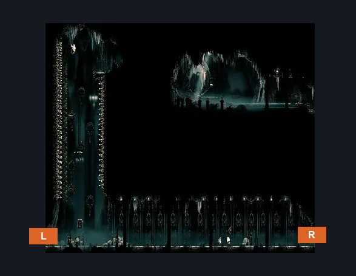
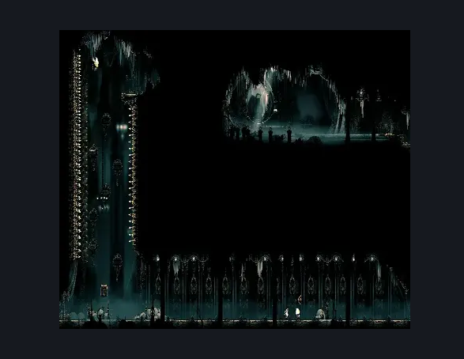

# Corridor to High Halls (Song_17)

**Game ID:** Song_17

**Contributors:** samupo

## Subrooms

No subrooms defined.

## Room Transitions

| Alias | Name | From subroom | Destination | Destination alias | Requirements | TODO | Verification | Annotated | Notes |
| --- | --- | --- | --- | --- | --- | --- | --- | --- | --- |
| R | right1 |  | [Choral Chambers Flea Shaft (Song_11)](choral-chambers-flea-shaft.md) | S3L |  |  |  | ✓ |  |
| L | left1 |  | [High Halls Entrance (Hang_01)](high-halls-entrance.md) | BR |  |  |  | ✓ |  |

## Subroom Connections

No subroom connections defined.

## Check Locations

| No. | Check | Subroom | Requirements | TODO | Verification | Location Type | Annotated | Notes |
| --- | --- | --- | --- | --- | --- | --- | --- | --- |
| 1 | import enemies |  |  | TODO | Needs verification |  |  |  |

## Room Images

### Connections

### Checks

### Scene

