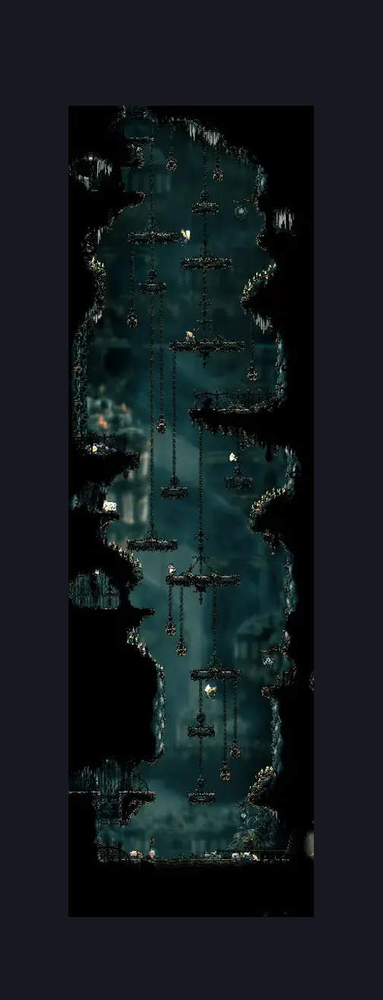
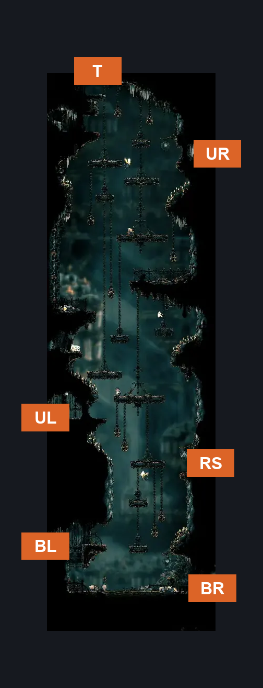

# Grand Bellway Shaft (Song_20)

**Game ID:** Song_20

**Contributors:** samupo

## Subrooms

| No. | Subroom | Annotated |
| --- | --- | --- |
| S1 | Top |  |
| S2 | Upper Right |  |
| S3 | Upper Left |  |
| S4 | Right Stage |  |
| S5 | Bottom Left |  |
| S6 | Bottom Right |  |

## Room Transitions

| Alias | Name | From subroom | Destination | Destination alias | Requirements | TODO | Verification | Annotated | Notes |
| --- | --- | --- | --- | --- | --- | --- | --- | --- | --- |
| UL | left1 | Upper Left | [Choral Chambers East to West (Song_27)](choral-chambers-east-to-west.md) | R | none |  |  | ✓ |  |
| T | top1 | Top | [Rotating Tunnel (Song_20b)](rotating-tunnel.md) | B | none |  |  | ✓ |  |
| UR | right4 | Upper Right | [Grand Bellway Library (Library_03)](../whispering-vaults/grand-bellway-library.md) | L | none |  |  | ✓ |  |
| RS | right5 | Right Stage | [Trobbio (Library_13)](../whispering-vaults/trobbio.md) | L | none |  |  | ✓ |  |
| BR | right6 | Bottom Right | [Grand Bellway (Bellway_City)](grand-bellway.md) | L | none |  |  | ✓ |  |
| BL | left2 | Bottom Left | [Grand Bellway Side Room (Song_24)](grand-bellway-side-room.md) | R | none |  |  | ✓ |  |

## Subroom Connections

| Alias | Name | Source | Destination | Requirements | TODO | Verification | Annotated | Notes |
| --- | --- | --- | --- | --- | --- | --- | --- | --- |
| F1 | Top to Upper Right | Top | Upper Right | none |  | Verified |  | falling |
| F2 | Upper Right to Upper Left | Upper Right | Upper Left | none |  | Verified |  | falling |
| F3 | Upper Left to Right Stage | Upper Left | Right Stage | none |  | Verified |  | falling |
| F4 | Right Stage to Bottom Left | Right Stage | Bottom Left | none |  | Verified |  | falling |
| F5 | Bottom Left to Bottom Right | Bottom Left | Bottom Right | none |  | Verified |  | falling |
| J5 | Bottom Right to Bottom Left | Bottom Right | Bottom Left | silk soar OR cling grip |  | Verified |  | Might be able to use enemy pogo and faydown cloak |
| J4 | Bottom Left to Right Stage | Bottom Left | Right Stage | cling grip OR silk soar |  | Verified |  |  |
| J3 | Right Stage to Upper Left | Right Stage | Upper Left | cling grip OR silk soar |  | Verified |  |  |
| J3E | Bottom Right to Upper Left | Bottom Right | Upper Left | silk soar |  | Verified |  |  |
| J2 | Upper Left to Upper Right | Upper Left | Upper Right | (cling grip AND (faydown cloak OR swift step OR clawline)) OR silk soar |  | Verified |  |  |
| J1 | Upper Right to Top | Upper Right | Top | ledge grab OR silk soar OR clawline OR faydown cloak |  | Verified |  |  |

## Check Locations

| No. | Check | Subroom | Requirements | TODO | Verification | Location Type | Annotated | Notes |
| --- | --- | --- | --- | --- | --- | --- | --- | --- |
| 1 | Lace Second Encounter | Bottom Right | none |  | Verified | event |  |  |

## Room Images

### Scene

### Connections

### Checks

