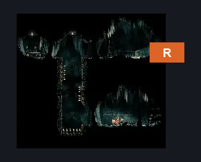
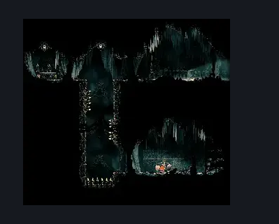

# Grand Bellway Side Room (Song_24)

**Game ID:** Song_24

**Contributors:** samupo

## Subrooms

No subrooms defined.

## Room Transitions

| Alias | Name | From subroom | Destination | Destination alias | Requirements | TODO | Verification | Annotated | Notes |
| --- | --- | --- | --- | --- | --- | --- | --- | --- | --- |
| R | right1 |  | [Grand Bellway Shaft (Song_20)](grand-bellway-shaft.md) | BL | none |  | Verified | ✓ |  |

## Subroom Connections

No subroom connections defined.

## Check Locations

| No. | Check | Subroom | Requirements | TODO | Verification | Location Type | Annotated | Notes |
| --- | --- | --- | --- | --- | --- | --- | --- | --- |
| 1 | Silkeater: Choral Chambers West |  | spike pogo OR dash OR clawline OR faydown cloak OR sharpdart OR drifter's cloak OR cling grip |  | Verified | collectible |  |  |
| 2 | Second Sentinel Encounter |  | Act 3  AND complete THE Second Sentinel Activation | TODO | Needs verification | event |  | need to verify this is the room the wiki is referring to |

## Room Images

### Connections

### Checks

### Scene

