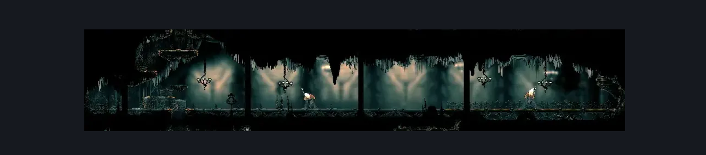
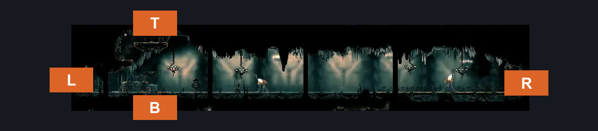

# High Halls Corridor (Hang_07)

**Game ID:** Hang_07

**Contributors:** samupo

## Subrooms

No subrooms defined.

## Room Transitions

| Alias | Name | From subroom | Destination | Destination alias | Requirements | TODO | Verification | Annotated | Notes |
| --- | --- | --- | --- | --- | --- | --- | --- | --- | --- |
| L | left1 |  | [Choral Chambers Flea Shaft (Song_11)](choral-chambers-flea-shaft.md) | S3R | one way entrance, opens from the other side |  | Verified | ✓ | one way entrance, opens from the other side |
| R | right1 |  | [Cog Dancers (Cog_Dancers)](../cogwork-core/cog-dancers.md) | L | none |  | Verified | ✓ |  |
| B | bot1 |  | [Choral Chambers Over Dininig (Song_09)](choral-chambers-over-dininig.md) | T | none |  | Verified | ✓ |  |
| T | top1 |  | [High Halls Vault (Hang_06)](../high-halls/high-halls-vault.md) | B | one way entrance, opens from the other side |  | Verified | ✓ | one way entrance, opens from the other side |

## Subroom Connections

No subroom connections defined.

## Check Locations

No check locations defined.

## Room Images

### Scene

### Connections

### Checks

