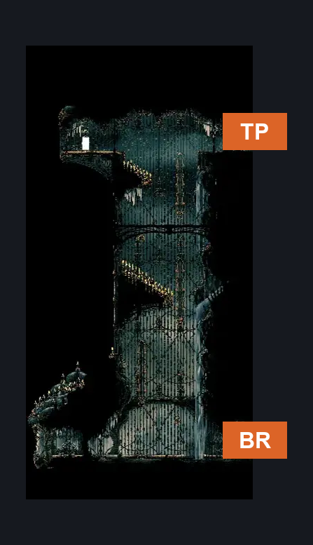
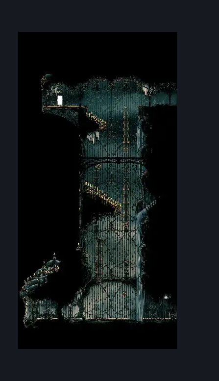

# High Halls Entrance (Hang_01)

**Game ID:** Hang_01

## Subrooms

No subrooms defined.

## Room Transitions

| Alias | Name | From subroom | Destination | Destination alias | Requirements | TODO | Verification | Annotated | Notes |
| --- | --- | --- | --- | --- | --- | --- | --- | --- | --- |
| BR | right2 |  | [Corridor to High Halls (Song_17)](corridor-to-high-halls.md) | L | none |  | Verified | ✓ |  |
| TP | right1 |  | [High Halls Small Slide (Hang_02)](../high-halls/high-halls-small-slide.md) | L | (clawline AND (spike pogo OR faydown cloak)) OR silk soar |  | Verified | ✓ |  |

## Subroom Connections

No subroom connections defined.

## Check Locations

No check locations defined.

## Room Images

### Scene

### Connections

### Checks

