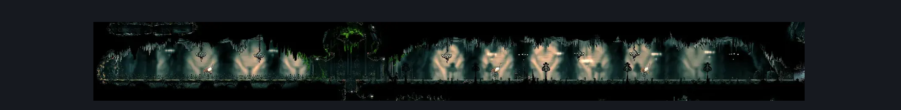

# Memorium Entrance Tunnel (Song_25)

**Game ID:** Song_25

**Contributors:** samupo, heric

## Subrooms

| No. | Subroom | Annotated |
| --- | --- | --- |
| S1 | Base |  |
| S2 | Secret Platform |  |

## Room Transitions

| Alias | Name | From subroom | Destination | Destination alias | Requirements | TODO | Verification | Annotated | Notes |
| --- | --- | --- | --- | --- | --- | --- | --- | --- | --- |
| TL | top2 | Secret Platform | [Cogwork Core Breakable Walls (Cog_10_Destroyed)](../cogwork-core/cogwork-core-breakable-walls.md) | B | none | TODO |  | ✓ |  |
| L | left1 | Base | [Cog Dancers (Cog_Dancers)](../cogwork-core/cog-dancers.md) | R | none |  | Verified | ✓ |  |
| T | top1 | Base | [Memorium Start Shaft (Arborium_01)](../memorium/memorium-start-shaft.md) | B | (silk soar OR faydown cloak) |  | Verified | ✓ |  |
| R | right1 | Base | [Songclave (Song_Enclave)](songclave.md) | TL | none |  | Verified | ✓ |  |
| B | bot1 | Base | [Rotating Tunnel (Song_20b)](rotating-tunnel.md) | T | none |  | Verified |  |  |

## Subroom Connections

| Alias | Name | Source | Destination | Requirements | TODO | Verification | Annotated | Notes |
| --- | --- | --- | --- | --- | --- | --- | --- | --- |
| V | Vertical Secret | Base | Secret Platform | act 3 AND silk soar | TODO |  |  | NEEDS LOGIC, PROBABLY ACT 3 ONLY |
| V | Vertical Secret | Secret Platform | Base | none | TODO |  |  | Not verified, most likely falling |

## Check Locations

| No. | Check | Subroom | Requirements | TODO | Verification | Location Type | Annotated | Notes |
| --- | --- | --- | --- | --- | --- | --- | --- | --- |
| 1 | Memorium entrance vines | Base | (silk soar OR faydown cloak) AND break wall up |  | Verified | blockade |  | one way wall and also logic can be improved for more skips |
| 2 | Second Sentinel Encounter | Base | complete THE Second Sentinel Activation |  | Verified | event |  |  |

## Room Images

### Connections

### Checks

### Scene

